## 2026.10.04 - Figure 3 gate mockup panels

Five preliminary panels for the Figure 3 gate document (`notes-tex/figure-3-gate/`), written by `experiments/019-simb-multimodal/scripts/fig3_mockup_panels.py`. Every drawn value is read from a committed file under `experiments/019-simb-multimodal/results/`; nothing is pulled from W&B or recomputed from raw data. The panels carry no panel letter, because each takes a different letter in each mockup; the letters are set by `experiments/019-simb-multimodal/scripts/fig3_mockup_drawio.py`, which composes the three draw.io mockups (`notes/assets/drawio/fig3-mockup-A-conditioning.drawio.svg`, `fig3-mockup-B-genotype-only.drawio.svg`, `fig3-mockup-SI.drawio.svg`) and reads the counts and ridge values of the native schematic panels from the same result files.

### P1, ceiling against the best genotype-only model

Sources: `expression_ceiling_replicate.json` (`primary_ceiling_mean_sqrt_r.ceiling`), `round_leaderboards.csv` (strand `expression`, maximum `primary_roll_max`), `proteome_ceiling_replicate.json` (`route_d_duplicate_strains.mean_ceiling`, `route_w_his3_replicate.mean_ceiling`, `observed.v14_partition_mean`, both `v14_frac_of_ceiling`), `morphology_noise_ceiling.json` (`ceiling_mean_model_features`, `observed_best.roll_max`, `fraction_of_ceiling_realized`). The expression and morphology scores are a rolling maximum of one best run, an upward-biased order statistic; the proteome score is a mean over partitions.

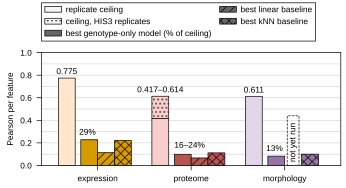

### P2, the single-deletion triangle

Sources: `proteome_morphology_covariation.json` and `expression_morphology_covariation.json` (medians over features, `n_shared_strains`, permuted nulls), the proteome and expression pair from `proteome_morphology_covariation.json["context"]` (a mean per feature), and its shared-strain count from `joint_checkpoint_readout.json["triangle"]`.

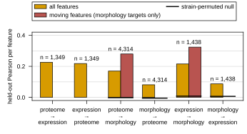

### P3, v19 paired differences

Source: `joint_checkpoint_readout.json`, `v19.tests.H1a_expression_superiority` and `v19.tests.H1b_proteome_noninferiority` (`per_partition`, `mean_diff`, `n_positive`, `p_one_sided_t`, `margin`). Eleven of twelve partitions.

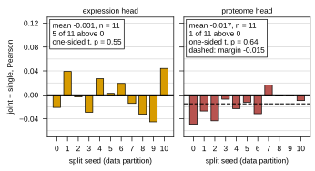

### P4, v20 conditioned minus control (PARTIAL)

Source: `joint_checkpoint_readout.json`, `v20_partial.runs` (`diff_same_epochs`, `last_epoch`). Two partitions at epochs 156 to 163; not a result.

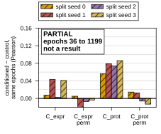

### P5, v19 timing of the proteome head

Source: `joint_checkpoint_readout.json`, `v19.runs` (`loss_min_epoch`, `proteome_roll_max_epoch`, arms `K_prot` and `K_joint`, the partitions in `v19.complete_partitions`).

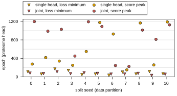

## 2026.10.04 - Revision after author review: baselines, graph effect, co-variation, status marks

The ceiling panel above now also carries the best linear and best nearest-neighbor baseline per modality, and the split axes read "split seed (data partition)": each split seed is a different train, validation and test partition run with one initialization seed. New panels, all from committed result files:

### Baselines against the model per split seed

Sources: `expression_baselines_split/seed*.json` and `baselines_split_fig3_proteome/seed*.json` (`B2_bilinear` and `B3_neighbor_average`, best embedding, `selected_on_val.val_pearson_per_feature`), and `joint_checkpoint_readout.json` `v19.runs` (arms `K_expr`, `K_prot`, the `*_window` fields). Only the seed number is shared: the baselines ran on `fig3_core` and the full `fig3_proteome` store, the v19 arms on the 1,349 strains carrying both labels.

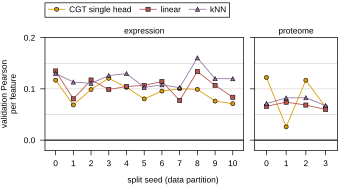

### Graph effect, pair form

Source: `graph_prior_probe.json` `pair_form`, strands `expression` and `morphology`, `t1.auc` against `t1.auc_rewired`. The file has no proteome strand.

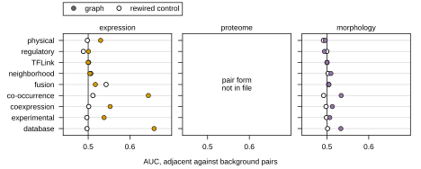

### Graph as a retrieval key

Source: `graph_retrieval_baseline.json`, rounds `v13` (expression) and `v14` (proteome), `summary.paired[graph]["val/all/minus_rewired"]` (mean, sd, n = 4 split seeds).

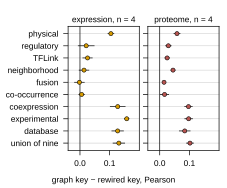

### Cross-panel gene-pair co-variation

Source: `experiments/028-knockout-expression/results/proteome_expression_covariation.json` `gene_covariation` (`spearman`, `n_genes` per pair of panels).

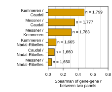

### v19 window scores per split seed

Source: `joint_checkpoint_readout.json` `v19.runs` (`expression_window`, `proteome_window`, arms `K_expr`, `K_prot`, `K_joint`) and `v19.windows`.

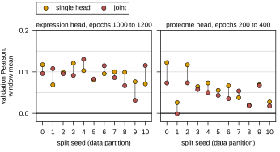

### Ceiling panel baselines

Linear: `baselines_embedding_study.json`, the largest `{expression,proteome}_B2_val.mean` over embeddings. Nearest neighbor: the larger of the largest `{expression,proteome}_B3_val.mean` there and the largest graph or ProtT5 key in `graph_retrieval_baseline.json` (`summary.keys[*]["val/all/pearson_per_feature"].mean`); morphology from `knn_embedding_probe.json` (largest `best_pearson_per_feature` over arms). No linear baseline for morphology is on file, drawn as "not yet run". The script prints which key won each maximum.

### Status marks

`fig3_mockup_drawio.py` puts the section-status glyph of `notes-tex/common/tcdoc.sty` beside each panel letter, on a draw.io layer named "mockup status marks". `FIG3_STATUS_MARKS=0` in the environment builds the figures without them.

## 2026.10.04 - Second revision: embeddings, model size, training curves, splits, LaTeX math

The supporting mockup is now two figures, `fig3-mockup-SI-1.drawio.svg` (splits and training curves) and `fig3-mockup-SI-2.drawio.svg` (representations, triangle, graph key, model size, operator). `fig3-mockup-SI.drawio.svg` is retired.

### Gene representation against baseline score

Source: `baselines_embedding_study.json` (`{expression,proteome}_{B2,B3}_val` mean, sd, n; `family`). The model's input composite is the row `model_stack`: `expression_baselines_split.py` defines it as `(fudt_upstream, calm, prot_T5_all, fudt_downstream)`, the `node_embeddings` list of `conf/cgt_expr_v13_split.yaml` that the v19 configuration inherits. The reduced panel keeps five rows by rule, each the top of its class on the mean of the four validation means.

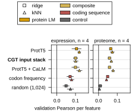

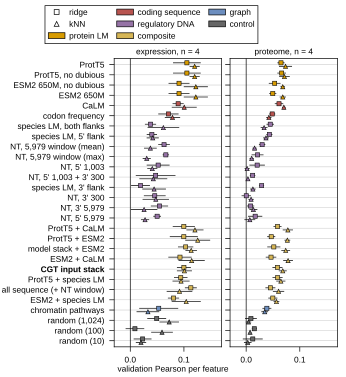

### Parameter count against score

Source: `round_leaderboards.csv` (strand `expression`; `total_param_count`, `primary_roll_max`, `is_collapsed`, `n_train_supervised`), the v19 size from `joint_checkpoint_readout.json` `v19.runs[*].total_param_count`, and v19 training strains from `split_gene_overlap_audit.json`. The score is a rolling maximum over runs of unequal length. The "145 runs, -0.129" quoted in the expression document is written by no committed script and was not reproduced.

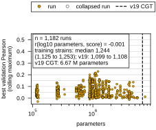

### Training curves for one split seed

Source: `joint_checkpoint_curves.csv`, written by `joint_checkpoint_readout.py` (per v19 run and epoch: `val/loss`, `val/loss_roll5`, each head's `pearson_per_feature`), with marker epochs from `joint_checkpoint_readout.json`. The split seed is chosen by rule: the complete split seed whose joint-minus-single proteome window difference is closest to the median over complete split seeds.

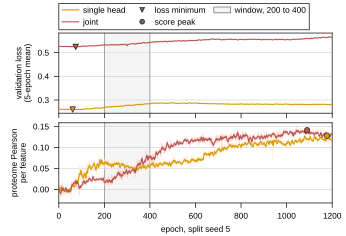

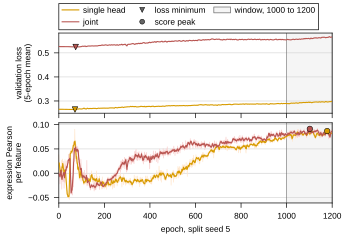

### Native schematics

The split schematic reads its counts from `split_gene_overlap_audit.json` and follows `CellDataModule._compute_and_save_index` in `torchcell/datamodules/cell.py` and the `require_modalities` filter in `train_cgt_multitask.py`. The operator schematic is typeset as LaTeX with draw.io math on, as manuscript Fig 1 does; MathJax sets math at 1.17 times the cell font size, measured on headless exports.
