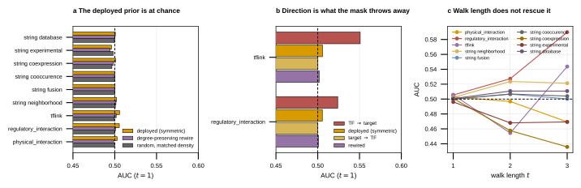

## 2026.08.27 - The graph prior is at chance, and the mask deletes the one signal there is

Script: `experiments/019-simb-multimodal/scripts/graph_prior_probe.py`
Results: `experiments/019-simb-multimodal/results/graph_prior_probe.json`
Design note it implements: [[experiments.019-simb-multimodal.graph-prior-probe]]
(specified 2026.07.26, unbuilt until now).

### What was tested

The nine graphs enter as a hard attention mask, so composing L layers makes influence(X→Y)
≈ the L-step random-walk reachability of Y from X. The entire graph channel therefore rests
on one claim: **deleting X perturbs the genes near X on graph k.**

Statistic: per deleted gene, P(a random responder is closer to X than a random
non-responder), responders = top 1% of reporters by |log2 ratio|. 0.5 = the graph says
nothing. Controls: configuration-model redraw holding degree, and matched-density random.
1,482 deleted genes x 6,169 reporters.

### Result: chance, on all nine

| graph | deployed (sym) | rewired | random | scorable |
|---|--:|--:|--:|--:|
| physical_interaction | 0.5028 | 0.4987 | 0.4998 | 1.00 |
| regulatory_interaction | 0.5055 | 0.5009 | 0.4999 | 0.98 |
| tflink | 0.5057 | 0.5017 | 0.4992 | 0.95 |
| string12_0_neighborhood | 0.5022 | 0.5014 | 0.5007 | **0.29** |
| string12_0_fusion | 0.5000 | 0.4999 | 0.4999 | **0.46** |
| string12_0_cooccurence | 0.4999 | 0.4997 | 0.5000 | **0.46** |
| string12_0_coexpression | 0.5008 | 0.4982 | 0.4966 | 1.00 |
| string12_0_experimental | 0.4961 | 0.4943 | 0.4981 | 1.00 |
| string12_0_database | 0.5007 | 0.5000 | 0.4995 | 0.75 |

Range 0.4961-0.5057; **largest excess over the degree control is +0.0046**. Top-5%
responders instead of top-1% moves nothing. Longer walks make it worse: physical, STRING
experimental and STRING coexpression all fall below 0.5 by t=3. And `scorable` shows three
graphs are SILENT on most deletions (29-75% of deleted genes have any edge at all).

### DIRECTION is the one place signal exists, and the mask throws it away

| graph | TF→target | deployed (sym) | target→TF | rewired |
|---|--:|--:|--:|--:|
| tflink | **0.5508** | 0.5057 | 0.5002 | 0.5017 |
| regulatory_interaction | **0.5239** | 0.5055 | 0.5002 | 0.5009 |

`_build_attention_mask` (equivariant_cell_graph_transformer.py) sets `head_mask[i,j]` AND
`head_mask[j,i]`, so the mask is symmetric. Symmetrizing averages a genuine directional
prior with its uninformative reverse and returns both to chance. For the seven undirected
graphs all three orientations coincide, which makes the table self-checking.

### Consequences

- **Do NOT build the `P_graph` campaign arm.** It would make the pair term a function of
  network distance on a network that does not carry that relationship. Dropped from Phase B.
- **Free the nine masked heads** (new `P_free` arm) - they are constrained toward a target
  that does not predict response.
- **Stop symmetrizing the two directed relations** in the mask builder. Evidence-backed,
  and it is a change to the mask builder rather than to the model.
- A data-side probe RULES OUT, it does not confirm. Chance means no training recovers the
  structure; it does not follow that a directed mask will help.

### Implementation notes worth keeping

- `to_scipy_sparse_array`, not a Python loop over `graph.edges()`: two graphs carry ~1M
  edges and each is rebuilt three times.
- Configuration model, not `double_edge_swap`: mixing needs ~10 swaps/edge, i.e. tens of
  millions of swaps in Python. The degree rank correlation is recorded rather than assumed.
- Only the 1,482 deleted-gene COLUMNS of A^t are needed, so the walk propagates a
  6,649 x 1,482 dense block through a sparse matrix and never densifies A^t.
- `--figure-only` redraws from the JSON without recomputing.
- Set EVERY font size explicitly. `font.size` alone leaves `axes.labelsize` etc. relative,
  and the failure is silent: type at twice the Nature minimum with labels running off panel.
