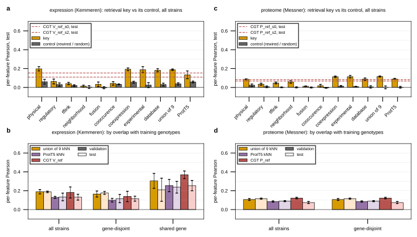

## 2026.09.18 - B4, the cell graph as a retrieval key on the trained arms' partitions

Promotes the scratchpad measurement of the expression-fit review ([[experiments.019-simb-multimodal.expression-fit-review]], inputs report) to a committed baseline beside B0 to B3 in `expression_baselines_split.py`. A parameter-free neighbor average retrieves training strains whose deleted gene has a similar interaction-graph adjacency row (cosine over the row, weights clipped at zero, applied to the per-gene train residual), k swept on validation over {1, 3, 5, 10, 25, 50} and the validation choice applied to test. Every key is scored on the v13 expression partitions (split seeds 0 to 3, the 6,127 expression genes that are cell-graph nodes) and the v14 proteome partitions (1,850 proteins, NaN handled as in the training metric) with the per-feature Pearson of the trained arms, and the CGT prediction dumps of `gh_eval_ckpt_predictions.slurm` are read through the same code path, so the CGT, the graph kNN and the ProtT5 kNN are compared under identical strains, genes, subsets and metric. Controls: a degree-preserving configuration-model rewiring of each graph and of the union (seed 7, multi-edges collapsed, 1 to 25% fewer edges), a fixed-seed 1,024-d Gaussian embedding, and the train mean (B0). Slurm job 2361 on GilaHyper (partition main, 8 CPUs, peak RSS 5.0 GB, 13 min).

Gene-disjoint means no deleted gene of the strain is deleted in any training strain; shared is the complement. There are NO exact-genotype duplicates on any seed or split. Every shared strain is a single-versus-double relation: a Sameith double whose parent single is in train, or a single whose gene is deleted in train only inside a double.

### Expression, per-feature Pearson, mean +/- sd over the four split seeds

| key | val all | val gene-disjoint | test all | test gene-disjoint |
|---|--:|--:|--:|--:|
| own profile (oracle, leaky) | 0.634 +/- 0.012 | 0.631 +/- 0.009 | 0.651 +/- 0.009 | 0.651 +/- 0.011 |
| string12_0_experimental | **0.220 +/- 0.011** | **0.194 +/- 0.015** | 0.188 +/- 0.031 | 0.175 +/- 0.028 |
| string12_0_coexpression | 0.203 +/- 0.023 | 0.176 +/- 0.016 | **0.192 +/- 0.014** | **0.179 +/- 0.012** |
| union of the nine graphs | 0.189 +/- 0.023 | 0.165 +/- 0.032 | 0.187 +/- 0.008 | 0.177 +/- 0.015 |
| string12_0_database | 0.179 +/- 0.018 | 0.163 +/- 0.019 | 0.182 +/- 0.016 | 0.182 +/- 0.013 |
| physical_interaction | 0.180 +/- 0.031 | 0.142 +/- 0.022 | 0.197 +/- 0.022 | 0.184 +/- 0.018 |
| ProtT5 embedding | 0.129 +/- 0.011 | 0.099 +/- 0.019 | 0.134 +/- 0.041 | 0.116 +/- 0.044 |
| tflink | 0.085 +/- 0.009 | 0.039 +/- 0.016 | 0.041 +/- 0.012 | 0.008 +/- 0.021 |
| regulatory_interaction | 0.082 +/- 0.031 | 0.027 +/- 0.033 | 0.063 +/- 0.025 | 0.032 +/- 0.014 |
| random embedding (control) | 0.090 +/- 0.024 | 0.012 +/- 0.007 | 0.058 +/- 0.009 | 0.003 +/- 0.013 |
| union, rewired (control) | 0.058 +/- 0.012 | 0.004 +/- 0.007 | 0.037 +/- 0.012 | 0.002 +/- 0.022 |
| experimental, rewired (control) | 0.062 +/- 0.008 | 0.013 +/- 0.011 | 0.024 +/- 0.026 | -0.011 +/- 0.019 |
| CGT V_ref_s0 dump (split 0) | 0.223 | 0.178 | 0.110 | 0.097 |
| CGT V_ref_s2 dump (split 2) | 0.140 | 0.100 | 0.153 | 0.134 |
| CGT V_concat_s0 dump (split 0) | 0.193 | 0.152 | 0.139 | 0.132 |

Cooccurence, neighborhood and fusion reach 0.02 to 0.05 with val coverage 0.24 to 0.43 (an isolated gene predicts the train mean). All nine rewired controls on gene-disjoint strains: val -0.003 to +0.020, test -0.013 to +0.024.

Paired within split seed on gene-disjoint strains (n = 4 seeds, count of positive seeds in parentheses):

| key | minus ProtT5, val | minus ProtT5, test | minus own rewiring, val | minus own rewiring, test | minus CGT V_ref, val (n = 2) | minus CGT V_ref, test (n = 2) |
|---|--:|--:|--:|--:|--:|--:|
| experimental | +0.095 +/- 0.031 (4) | +0.059 +/- 0.042 (4) | +0.181 +/- 0.004 (4) | +0.186 +/- 0.022 (4) | +0.058 +/- 0.064 (2) | +0.040 +/- 0.019 (2) |
| coexpression | +0.077 +/- 0.035 (4) | +0.062 +/- 0.041 (4) | +0.165 +/- 0.029 (4) | +0.165 +/- 0.020 (4) | +0.035 +/- 0.045 (2) | +0.054 +/- 0.025 (2) |
| union | +0.066 +/- 0.048 (4) | +0.060 +/- 0.033 (4) | +0.161 +/- 0.030 (4) | +0.174 +/- 0.010 (4) | +0.035 +/- 0.051 (1) | +0.058 +/- 0.013 (2) |
| database | +0.064 +/- 0.032 (4) | +0.066 +/- 0.033 (4) | +0.167 +/- 0.032 (4) | +0.188 +/- 0.030 (4) | +0.034 +/- 0.042 (2) | +0.058 +/- 0.012 (2) |
| physical | +0.042 +/- 0.040 (4) | +0.068 +/- 0.051 (4) | +0.126 +/- 0.018 (4) | +0.161 +/- 0.032 (4) | -0.009 +/- 0.037 (1) | +0.060 +/- 0.050 (2) |
| tflink | -0.060 (0) | -0.108 (0) | +0.027 (4) | +0.021 (4) | -0.092 (0) | -0.104 (0) |

### Proteome, per-feature Pearson over 1,850 proteins (no shared-gene strains exist, each ORF once)

| key | val | test |
|---|--:|--:|
| own profile (oracle, leaky) | 0.543 +/- 0.005 | 0.545 +/- 0.005 |
| string12_0_experimental | **0.112 +/- 0.014** | 0.114 +/- 0.013 |
| string12_0_coexpression | 0.110 +/- 0.015 | 0.113 +/- 0.008 |
| union of the nine graphs | 0.106 +/- 0.010 | **0.116 +/- 0.006** |
| string12_0_database | 0.090 +/- 0.014 | 0.088 +/- 0.013 |
| physical_interaction | 0.086 +/- 0.006 | 0.086 +/- 0.005 |
| ProtT5 embedding | 0.085 +/- 0.007 | 0.090 +/- 0.006 |
| random embedding / union rewired | 0.014 +/- 0.007 / 0.004 +/- 0.005 | 0.002 +/- 0.009 / 0.001 +/- 0.015 |
| CGT P_ref_s0 / P_ref_s2 / P_concat_s0 dumps | 0.116 / 0.128 / 0.114 | 0.067 / 0.082 / 0.082 |

Paired (n = 4): union minus ProtT5 +0.021 +/- 0.010 val (4 of 4), +0.026 +/- 0.006 test (4 of 4); union minus rewired +0.102 val, +0.115 test (4 of 4); union minus CGT P_ref (n = 2) -0.008 +/- 0.009 val (0 of 2), +0.045 +/- 0.015 test (2 of 2). Nearly every proteome key chose k = 50, the grid ceiling, so these are a lower bound for the estimator.

### Top-decile metrics, all strains, val / test

| metric | union | experimental | ProtT5 | union rewired | B0 train mean | CGT V_ref_s0 | CGT V_ref_s2 |
|---|--:|--:|--:|--:|--:|--:|--:|
| top 10% train-sd genes, per-feature | 0.267 / 0.243 | 0.296 / 0.248 | 0.168 / 0.182 | 0.081 / 0.046 | n/a | 0.306 / 0.158 | 0.198 / 0.185 |
| per-strain top 10% of abs target, raw | 0.558 / 0.537 | 0.560 / 0.534 | 0.536 / 0.520 | 0.376 / 0.345 | 0.551 / 0.529 | 0.562 / 0.517 | 0.523 / 0.523 |
| per-strain top 10% of abs target, residual | 0.249 / 0.244 | 0.256 / 0.242 | 0.198 / 0.202 | 0.014 / -0.013 | n/a | 0.233 / 0.169 | 0.162 / 0.158 |

The raw per-strain metric is dominated by the gene mean (B0 alone scores 0.55), so the residual row is the one to read. Proteome: top 10% train-sd proteins union 0.067 / 0.073, ProtT5 0.048 / 0.055, CGT P_ref 0.082 and 0.095 val, 0.047 and 0.046 test.

### Strain subsets per seed (expression)

| seed | val gene-disjoint / shared (double with a parent single in train, single inside a train double) | test |
|---|---|---|
| 0 | 134 / 21 (15, 6) of 155 | 142 / 13 (3, 10) of 155 |
| 1 | 132 / 19 (12, 7) of 151 | 138 / 12 (6, 6) of 150 |
| 2 | 141 / 14 (7, 7) of 155 | 139 / 16 (6, 10) of 155 |
| 3 | 137 / 18 (10, 8) of 155 | 139 / 16 (9, 7) of 155 |

On the double subset (val, n 7 to 15) the controls score as high as the keys (random embedding 0.41, union rewired 0.37, union 0.34, CGT V_ref_s0 0.41): a double keyed by the mean of its two genes' rows retrieves its parent single whatever the rows contain, so the shared-strain lift is a property of the partition, not of any key.

### Readings

- The scratchpad headline holds on gene-disjoint strains, which is the subset that answers the counterfactual question: the STRING-experimental and coexpression rows and the union each beat ProtT5 on 4 of 4 seeds on val and on test, and beat their own rewiring by 0.16 to 0.19, so it is the specific topology and not degree. Expression-independent graphs (experimental, physical, database) carry it without the coexpression channel.
- The scratchpad's "controls at -0.005 to +0.027" was a singles-only read. With the doubles included, the rewired and random controls reach 0.04 to 0.09 on all strains, entirely from the shared subset; every method including the CGT (0.398 shared vs 0.178 gene-disjoint on split 0) carries that lift. Quote the gene-disjoint columns.
- Against the CGT under identical conditions: on gene-disjoint validation the union key trails V_ref_s0 by 0.013 and leads V_ref_s2 by 0.065; on gene-disjoint test it leads on both dumps (+0.058 +/- 0.013, n = 2). The CGT's split-0 test sits 0.11 below its validation; the kNN shows no such gap.
- The proteome shows the same ordering at lower magnitude on a clean partition: the union key ties the CGT on validation and leads it by 0.045 on test (n = 2), and leads ProtT5 by 0.02 on 4 of 4 seeds.
- What this says about the model: the deleted gene's graph neighborhood is the strongest predictor of its deletion response that we have measured, the model receives those nine graphs, and it uses them only as an attention mask on one encoder layer while the deletion enters as one vector broadcast to every gene. The perturbation-locality round (v17, `conf/cgt_expr_v17_locality.yaml`) tests routing the deletion along the graphs inside the model.

### Caveats

- k is validation-selected and the CGT checkpoints are validation-selected, so both val columns are optimistic; the test columns are the fair comparison. Graph-minus-CGT differences rest on n = 2 dumps (splits 0 and 2); splits 1 and 3 have no dump yet.
- The estimator is the cosine-weighted average of the scratchpad, not the unweighted mean of the committed B3, and every method is scored on the 6,127 graph-node genes (42 non-node keys dropped), so the ProtT5 row here (0.129 val pooled) differs from the committed B3 cell (k = 1, 0.130 on split 0) by estimator and gene set.
- One rewiring per graph (seed 7); the sd over split seeds is not a rewiring sd.
- Shared-subset scores have n 12 to 21 and sd 0.05 to 0.12; do not order keys within them.
- string12_0_coexpression is built from public mRNA compendia and could share provenance with Kemmeren; experimental (0.194 gene-disjoint val) and database (0.163) carry the result without it.

Figure: The interaction-graph adjacency row retrieves training strains that predict a held-out deletion's response as well as the trained transformer, and degree-preserving rewiring removes the signal. (a, c) Test per-feature Pearson per retrieval key against its rewired control, dashed lines the CGT reference dumps on splits 0 and 2, mean +/- sd over four split seeds. (b, d) Union key, ProtT5 key and CGT by genotype overlap with training, validation dark, test light. Expression left, proteome right. Data `results/graph_retrieval_baseline.json`, launcher `gh_graph_retrieval_baseline.slurm`.
