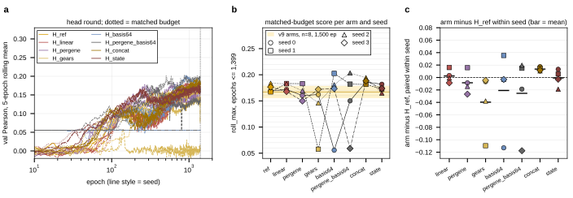

## 2026.09.12 - Head round at day two: seeds 1 to 3 (24 of 32 runs)

Script: `experiments/019-simb-multimodal/scripts/head_round_readout.py`. The six IGB `gpu`
array tasks (`2392381_2` to `_7`, slurm job ids 2392381 to 2392386, four runs per A40
card) completed between 09:54 and 11:02 CT on 2026-09-12 after 1 d 10 h to 1 d 12 h
(about 40 epochs per hour per run at four per card), all 24 runs at 1,399 epochs; synced
from the login node with `igb_login_wandb_sync.sh`, 24 uploaded, 0 failed. The two cabbi
tasks (`2392379_0` and `_1`, seed 0, eight runs) were still RUNNING at 1 d 16 h of the
2-day wall; seed 0 is not in these numbers.

Score: `roll_max` at the matched budget of 1,399 epochs, paired within seed against
`H_ref`. Incumbent band at the nearest tabulated budget (1,500): 0.1670 +/- 0.0117 (n 8).

| arm | mean roll_max (n 3) | sd | arm minus H_ref, seeds 1 / 2 / 3 | mean diff |
|---|--:|--:|---|--:|
| H_ref | 0.1758 | 0.0083 | | |
| H_linear | 0.1780 | 0.0087 | +0.016 / -0.001 / -0.009 | +0.002 |
| H_pergene | 0.1674 | 0.0167 | +0.016 / -0.014 / -0.027 | -0.008 |
| H_gears | 0.1252 | 0.0600 | -0.110 / -0.038 / -0.005 | -0.051 |
| H_basis64 | 0.1856 | 0.0151 | +0.035 / -0.003 / -0.003 | +0.010 |
| H_pergene_basis64 | 0.1481 | 0.0780 | +0.015 / +0.020 / -0.118 | -0.028 |
| H_concat | 0.1880 | 0.0064 | +0.014 / +0.011 / +0.012 | +0.012 |
| H_state | 0.1705 | 0.0049 | +0.006 / -0.019 / -0.003 | -0.005 |

- Two of 24 runs never trained: `kc8ylwp5` (H_gears seed 1) collapsed to constant output
  (val Pearson 0.000, pred sd ratio 0.000) and `pnh0q60m` (H_pergene_basis64 seed 3) sat
  on the 0.059 mean plateau for all 1,399 epochs (sd ratio 0.024). Both were already
  flagged as stuck at 14.7 h. Their arms' means carry them; the paired rows show them.
- H_concat (State SE decoder form) is the only arm above H_ref in all three seeds, by
  +0.011 to +0.014; three seeds resolve about 0.03, so this is consistent, not resolved.
- H_ref at 1,400 epochs on E_full reads 0.176, above the v9 band mean at 1,500 (0.167),
  in line with the v11 embedding-content effect; the v11 E_full run at 1,400 (Delta) is
  the direct comparison when it syncs.
- The early single-epoch peaks that favored H_state and H_pergene at 14.7 h do not
  survive `roll_max` at the matched budget: H_state -0.005, H_pergene -0.008.

Example runs:

<https://wandb.ai/zhao-group/torchcell_019_expr_v12/runs/h9yinpqo>
<https://wandb.ai/zhao-group/torchcell_019_expr_v12/runs/hbasiul1>
<https://wandb.ai/zhao-group/torchcell_019_expr_v12/runs/kc8ylwp5>
<https://wandb.ai/zhao-group/torchcell_019_expr_v12/runs/pnh0q60m>

Results: `experiments/019-simb-multimodal/results/head_round_readout.{csv,json}`. Re-run
after the cabbi pair lands to fold in seed 0.

## 2026.09.13 - Seed 0 in: H_concat +0.0135 in every seed, a small resolved effect

The cabbi pair (`2392379_0/_1`, RTX 6000) completed 2026-09-12 16:19 and 16:44 CT after
1 d 17 h; the eight runs synced with `INCLUDE_SYNCED=1` and the readout re-run on all 32.
At epochs <= 1,399: H_ref 0.1740 +/- 0.0076; H_concat 0.1876 +/- 0.0053, paired +0.017 /
+0.014 / +0.011 / +0.012 (mean +0.0135, sd 0.0026). H_linear +0.002, H_state -0.001,
H_pergene -0.008; H_basis64 seed 0 (`kjs3u9rw`) is the third plateau run (0.056), so
H_basis64 falls to -0.021 and the plateau rate is 3 of 32, all basis or cross-gene forms.
Seed-0 runs: H_ref `vahi7g0w`, H_concat `zigh98ds`.

- <https://wandb.ai/zhao-group/torchcell_019_expr_v12/runs/zigh98ds>
- <https://wandb.ai/zhao-group/torchcell_019_expr_v12/runs/vahi7g0w>
- <https://wandb.ai/zhao-group/torchcell_019_expr_v12/runs/kjs3u9rw>
