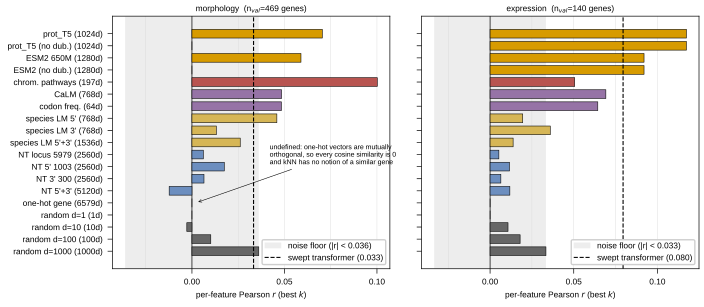

## 2026.07.26 - kNN Embedding Probe: Protein Yes, DNA No, Identity Undefined

Scripts: `experiments/019-simb-multimodal/scripts/knn_embedding_probe.py` (probe),
`experiments/019-simb-multimodal/scripts/plot_knn_embedding_probe.py` (figure)
Results: `experiments/019-simb-multimodal/results/knn_embedding_probe.json`
Figure: `notes/assets/images/019-simb-multimodal/knn_embedding_probe.svg`

### Why this exists

The `_005` sweep found every content embedding tied with `random_100` on validation. Two
incompatible readings fit that: the embeddings carry nothing, or the signal is there and
the transformer is not extracting it. A kNN readout separates them because it has **zero
learned parameters** (so it cannot memorise) and **no graph access** (so embedding geometry
is its only input).

### Method

Training genes $g\in\mathcal{T}$ carry embedding $e_g\in\mathbb{R}^d$ and target
$Y_g\in\mathbb{R}^F$ ($F=278$ CalMorph features or $6{,}169$ reporter genes). For a
held-out gene $g^*$:

$$
s_j=\cos\!\left(e_{g^*},e_{g_j}\right),\qquad
w_j=\frac{\max(s_j,0)}{\sum_{l\le k}\max(s_l,0)},\qquad
\hat{Y}_{g^*}=\sum_{j=1}^{k} w_j\,Y_{g_j}
$$

The whole $F$-vector is transferred at once. Scored with the metric the sweep ranks on,
$\frac{1}{F}\sum_f r(\hat{Y}_{:,f},Y_{:,f})$ across held-out genes, on the identical split
(`index_seed_0`, 4074/534/517), $k\in\{1,3,5,10,25,50\}$.

**Why kNN and not RF/SVR.** The traditional-ML baselines
([[paper.nature-biotech.si.traditional-ml-baselines]]) regress a **scalar** (fitness) at
$\sim\!10^5$ samples. Here the target is a **vector** from ~4,000 genes; RF/SVR would need
one model per output dimension with no parameter sharing. kNN is the vector-output analogue.

### The noise floor is NOT zero -- this is why the random ladder matters

Random vectors carry no signal by construction, so whatever they score is the metric's
noise floor at this validation size. Measured across $d\in\{1,10,100,1000\}$:

| | morphology | expression |
|---|--:|--:|
| noise floor (max \|r\| over random controls) | **0.036** | **0.033** |

`random_1000` reaches 0.036 purely because a high-dimensional random geometry selects
arbitrary neighbours and $n_{val}$ is finite. **Anything below ~0.035 is indistinguishable
from noise**, which rescopes the earlier reading that "fudt is weak but positive".

### Results (best $k$)

| axis | embedding | dim | morphology | expression |
|---|---|--:|--:|--:|
| protein LM | prot_T5 | 1024 | **0.070** | **0.117** |
| protein LM | prot_T5 (no dubious) | 1024 | 0.070 | 0.117 |
| protein LM | ESM2 650M | 1280 | 0.059 | 0.092 |
| pathway/graph | normalized_chrom_pathways | 197 | **0.100** | 0.051 |
| codon/ORF | CaLM | 768 | 0.048 | 0.069 |
| codon/ORF | codon_frequency | 64 | 0.048 | 0.064 |
| regulatory DNA | species LM 5' (fudt_upstream) | 768 | 0.046 | 0.020 |
| regulatory DNA | species LM 3' (fudt_downstream) | 768 | 0.013 | 0.036 |
| nucleotide LM | NT locus 5979 | 2560 | 0.006 | 0.005 |
| nucleotide LM | NT 5'+3' | 5120 | −0.012 | 0.012 |
| identity only | one_hot_gene | 6579 | **undefined** | **undefined** |
| control | random d=1000 | 1000 | 0.036 | 0.033 |
| anchor | train-mean | -- | 0.000 | −0.000 |

Swept transformer on the same split: morphology **0.033**, expression **0.080**.

### Four conclusions

1. **A parameter-free similarity average beats the transformer.** prot_T5 is ~2.1x the
   transformer on morphology and above it on expression. The signal is in the embeddings
   and the model is not extracting it -- so sweeping decoders and losses inside that
   architecture has been optimising the wrong thing.
2. **Protein yes, DNA no.** Every nucleotide representation -- two independent DNA models,
   three window scopes -- sits at or below the noise floor. This is not a dimensionality
   artefact: the NT vectors are 2560-5120 d against `random_100`'s 100 d. Deletion
   phenotype depends on what the protein *does*; promoter/terminator sequence governs
   *when and how much* it is expressed, which a full knockout makes moot. These embeddings
   may still matter for knockdown/CRISPRi data, and on the **readout** side of expression
   (a reporter's own promoter determining whether it responds), which this probe does not
   test -- it only uses the *perturbed* gene's embedding.
3. **The codon LM adds nothing over raw codon bias.** CaLM 0.048 vs codon_frequency 0.048
   on morphology, from 768 learned dimensions against 64 raw ones.
4. **Topology is the strongest single feature on morphology.** `normalized_chrom_pathways`
   (197 d, graph-derived) scores 0.100 -- above every sequence embedding and 3x the
   transformer. Direct support for widening the graph channel from 2 graphs to 010's 9
   ([[experiments.019-simb-multimodal.scripts.optuna_joint_sweep]], round `_006`).

### The key evidence for `learnable_embedding=False`

`one_hot_gene` is **undefined**, not merely poor. One-hot vectors are mutually orthogonal,
so every cosine similarity is exactly 0, every weight is 0, and the readout does not exist.
That is the geometric statement of the cold-start problem: an identity-only representation
has no notion of "a similar gene", so nothing can be carried to an unseen one. It is the
static stand-in for a free learnable table, and on this split only **4.8% of validation
genes** are ever perturbed in training (26/539, seed 0) -- because every strain is a single
deletion, splitting by strain *is* splitting by gene. Pinned off in `_006`.

### Caveats

- $k$ is selected on validation, so best-$k$ carries a mild optimistic bias. The ordering
  survives at fixed $k=10$ (prot_T5: 0.056 morphology, 0.091 expression -- still above the
  transformer on both).
- Expression has only $n_{val}=140$ genes, hence its wider noise floor.
- `species_lm_three_prime` and `one_hot_gene` cover 6,579 of 6,607 genes (the 28
  mitochondrial Q0* genes are absent); 0 validation strains were dropped.
- `nt_window_three_prime_5979` is absent: its `.pt` exists but loading raises
  `Invalid model_name 'window_three_prime_5979'` -- the name reaches
  `BaseEmbeddingDataset`'s check having lost its `nt_` prefix.
