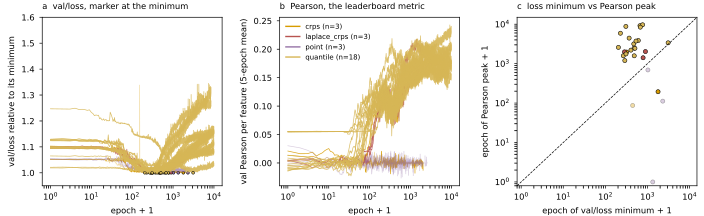

## 2026.09.06 - Where val/loss bottoms out versus where the Pearson peaks (v9)

Script: `experiments/019-simb-multimodal/scripts/loss_min_vs_pearson_peak.py`. Reads the FULL
per-epoch history of every `torchcell_019_expr_v9` run that logs the plain expression Pearson
and `val/loss`. Resumes are dropped (same rule as [[experiments.019-simb-multimodal.scripts.budget_rank_preservation]]),
runs shorter than 1,000 epochs are excluded from the statistics, collapsed runs are flagged.
Pearson is scored as the leaderboard scores it (`_roll_max`, 5-epoch centered mean, imported
from `pull_round_leaderboards.py`); the loss minimum is the raw argmin.

Outputs: `experiments/019-simb-multimodal/results/loss_min_vs_pearson_peak.{csv,json}`.

**a** `val/loss` divided by its own minimum, marker at the minimum. **b** validation Pearson
per feature, 5-epoch mean. **c** epoch of the loss minimum against epoch of the Pearson peak;
dashed line is equality. Colors are the objective (`dist`); faded markers are collapsed runs.

Findings (23 live runs; 34 with history, 4 collapsed, 7 crashed inside 40 epochs):

- The loss minimum is NOT inside 100 epochs. Median epoch of the `val/loss` minimum is 481
  (quantile: median 477, range 203 to 3,097; laplace_crps: 284 to 894). Zero of 23 live runs
  bottom out at or before epoch 100. At epoch 100 the loss is a median 4.2% above its
  eventual minimum.
- The loss then RISES for the rest of the run. Median final `val/loss` is 11.4% above the
  minimum (quantile 12.5%; the 10,000-epoch runs 8 to 31%). The objective on the validation
  split is overfitting from a few hundred epochs onward.
- The Pearson peak sits far past the loss minimum: median epoch 2,488 (quantile median
  3,270, range 1,198 to 9,682). Every live run peaks AFTER its loss minimum, and at the
  Pearson peak the loss is a median 7.1% above its minimum.
- What the long budget buys in Pearson after the loss minimum: median +0.054 (quantile mean
  0.143 at the loss minimum, 0.194 at the peak; the best run hx8pxdic 0.155 -> 0.243).

So the two metrics disagree on when training should stop, and the long-budget Pearson gains
are earned on a rising validation loss. Which of the two is the target is a decision, not a
measurement; this table sizes the gap. Note `val/loss` is the pinball loss for `quantile`,
CRPS for the others, and mse for `point`, so only the epoch structure is comparable across
`dist`, never the value.

## 2026.09.09 - Figure height

58 mm tall with a 0.17 bottom margin; at 55 mm and 0.14 the "epoch + 1" x labels were
clipped off the bottom of the exported panel, visible in the SVG render. Rerun with the
four ListMLE runs included: 27 live runs, medians unchanged (loss minimum at epoch 481,
Pearson peak at 2,433, +0.057 between them, final loss 9.0 % above its minimum).
