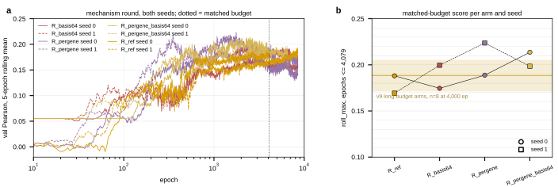

## 2026.09.08 - The mechanism round, read out at a matched budget

Script: `experiments/019-simb-multimodal/scripts/mech_round_readout.py`. Data: project
`torchcell_019_expr_v9`, IGB jobs `2369697` (seed 0, cabbi) and `2371531` tasks 2 and 3
(seed 1, one A40 node), four arms x two seeds. Outputs `results/mech_round_readout.{csv,json}`
and the figure below. Design in [[experiments.019-simb-multimodal.expression-strand-retrospective]].

**How the round ended.** All four array tasks ended in the cgroup out-of-memory handler at
host RSS 61 GB against the 60 GB request, after 3.5 to 4.6 days; in every task one of the
two packed runs was killed and the other finished 8,500 epochs. Killed: `R_ref` seed 0 at
epoch 4,139, `R_pergene_basis64` seed 0 at 4,079, `R_basis64` seed 1 at 7,018,
`R_pergene_basis64` seed 1 at 6,589. So the matched budget across the eight runs is
epochs <= 4,079. The two seed-1 runs abandoned on cabbi at epoch ~1,595 when the seed-1
half moved to the A40 node (`qfcygkvo`, `ty8eav1r`) are dropped as superseded, and the
first-attempt runs that died inside 40 epochs (the DataLoader fd exhaustion) are dropped by
the 1,000-epoch floor.

**Tagging defect found while selecting runs.** The arm script had a wave-4b `R_ref` branch
ahead of the wave-5 one, and a `case` takes its first match, so every reference run of this
round is tagged `stage-wave4b` rather than `stage-mech`. Selection here is by arm tag plus
the `cgt_expr_v9_mask` config tag. The shadowing branch is removed in the same commit.

**Scores, `roll_max` over epochs <= 4,079** (max of a centered 5-epoch rolling mean of
`val/expression/pearson_per_feature`, full per-epoch history):

| arm | seed 0 | seed 1 | mean | paired diff vs R_ref, seed 0 / seed 1 | mean diff |
|---|--:|--:|--:|--:|--:|
| `R_ref` | 0.1881 | 0.1693 | 0.1787 | | |
| `R_basis64` | 0.1746 | 0.1996 | 0.1871 | -0.0135 / +0.0303 | +0.0084 |
| `R_pergene` | 0.1888 | 0.2237 | 0.2063 | +0.0007 / +0.0544 | +0.0276 |
| `R_pergene_basis64` | 0.2136 | 0.1985 | 0.2061 | +0.0255 / +0.0292 | +0.0274 |

Incumbent band at 4,000 epochs (`short_budget_spread.json`, 8 identical runs, 500-sample
curves): 0.1883 +/- 0.0171. Both `R_ref` draws sit inside it, as they should.

**Reading.** The pair term alone is a null at this resolution: its two paired differences
disagree in sign. Both per-gene readout arms average +0.027 over the reference, and the
combined arm is positive at both seeds (+0.026, +0.029) while `R_pergene` alone is +0.001
and +0.054. The round was sized to resolve about 0.06 at two pairs, so +0.027 is below
resolution and is a direction, not a result. The one dynamic that is visible in every
curve: the per-gene readout arms reach their peak early (epochs 1,198 to 2,585) and then
fall (final Pearson 0.137 and 0.170 for `R_pergene` against peaks of 0.189 and 0.224),
while the reference and basis arms are still flat or rising at 8,500. The per-gene readout
buys its gain early and gives some of it back; whether that is overfitting of the extra
per-gene parameters is a hypothesis, not measured.

