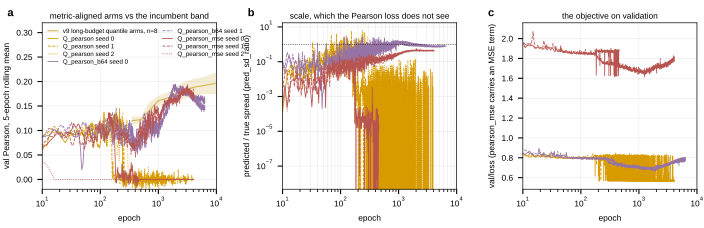

## 2026.09.08 - The metric-aligned round at day two: collapse is the rule at batch 32

Script: `experiments/019-simb-multimodal/scripts/pearson_round_readout.py`. Data: project
`torchcell_019_expr_v9`, IGB cabbi jobs `2378262` / `2378267` (packed, `Q_pearson` and
`Q_pearson_mse`, seeds 0-2) and `2378268` (solo, `Q_pearson_b64`, seeds 0-1), synced from the
login node at 2026-09-08 16:40 CT with the runs at 1.9 of 5 days. **Every number is partial**;
the JSON's `read_at` is the read time and the CSV's `n_epochs` is the epoch reached. Design in
[[experiments.019-simb-multimodal.expression-strand-retrospective]].

| run | arm | seed | epoch | roll_max @ epoch | last | on the floor from | pred/true spread at end |
|---|---|--:|--:|--:|--:|--:|--:|
| `zaul43n1` | `Q_pearson` | 0 | 3,902 | 0.145 @ 215 | 0.000 | 584 | 0.000 |
| `kspeoljg` | `Q_pearson` | 1 | 3,886 | 0.133 @ 151 | 0.000 | 2,203 (flickers above 0.02 until then, near zero from ~250) | 0.000 |
| `p2qq2525` | `Q_pearson` | 2 | 3,021 | 0.137 @ 242 | 0.000 | 680 | 0.000 |
| `hsauh7al` | `Q_pearson_mse` | 0 | 3,899 | 0.137 @ 138 | 0.000 | 360 | nan |
| `ppc2pyv5` | `Q_pearson_mse` | 1 | 3,888 | 0.194 @ 3,193 | 0.168 | alive | 0.43 |
| `4ei42tb1` | `Q_pearson_mse` | 2 | 3,023 | 0.035 @ 5 | 0.000 | 14 | nan |
| `7ylecrjz` | `Q_pearson_b64` | 0 | 6,051 | 0.194 @ 1,926 | 0.163 | alive | 0.80 |
| `wb2xocf2` | `Q_pearson_b64` | 1 | 6,049 | 0.186 @ 2,419 | 0.138 | alive | 0.73 |

"On the floor" is the first epoch from which the 5-epoch rolling mean of the validation
Pearson stays under 0.02. Incumbent band (8 identical quantile runs): 0.1883 +/- 0.0171 at
4,000 epochs, 0.1917 +/- 0.0177 at 6,000.

**What collapsed and how.** All three batch-32 pure-Pearson runs peak at epochs 150 to 240
between 0.13 and 0.145, then fall to the floor within a few hundred epochs; their predicted
spread (`pred_sd_ratio`) drops from about 0.3 to 1e-7 at the same time, so the network's
outputs go constant per gene. Their `val/loss` stays near 0.56 throughout, because the loss
drops constant columns as invalid and scores only the columns still varying: the objective
reads 1 - 0.44 on a handful of genes while the metric reads 0 on all of them. The measured
failure mode named in the design ("all columns constant, loss stuck at the connected zero")
is what happened, except the loss does not even read zero. `Q_pearson_mse` at weight 1.0
collapsed at seed 2 by epoch 14 and at seed 0 by epoch 360; seed 1 is alive at 0.194 and
still rising at 3,888, inside the incumbent band. The MSE anchor is not a reliable guard.

**What did not collapse.** Both batch-64 pure-Pearson runs, solo on a card, are alive at
6,050 epochs with predicted spread 0.73 to 0.80 and `roll_max` 0.194 and 0.186, on the
incumbent band at 6,000. Both peaked around epochs 1,900 to 2,400 and have drifted down
since (last values 0.163 and 0.138). Hypothesis (untested): the difference from batch 32 is
that each gene's in-batch correlation is taken over twice as many strains, which changes
how many columns the loss drops; batch size and packing are confounded in this design (the
b64 runs are also the only solo runs), so it may equally be a throughput or a
nondeterminism difference.

**Reading, partial.** Training directly on the metric does not beat the quantile head at
any budget measured so far, and at batch 32 it is unstable in 5 of 6 runs. The two live b64
runs are level with the incumbent's replicate mean at 6,000 epochs and not above it. The
question the round was launched for, whether the metric's late rise is generalization gap
or objective disagreement, is answerable only on the live runs and only after the wall.

