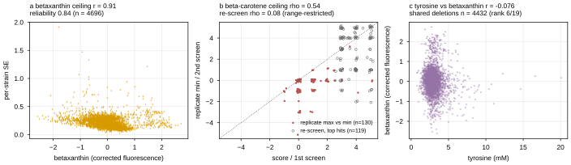
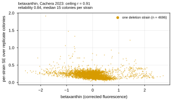
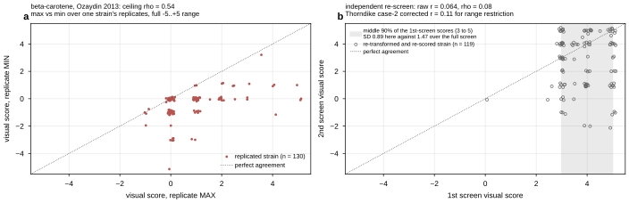

## 2026.07.25 - Reproducibility ceilings for betaxanthin and beta-carotene

Script: `experiments/019-simb-multimodal/scripts/pigment_noise_ceiling.py`
Results: `experiments/019-simb-multimodal/results/pigment_noise_ceiling.json`

Companion to `morphology_noise_ceiling.py` / `expression_noise_ceiling.py`, for the two
Track-A production targets of [[plan.cgt-metabolism.2026.07.25]]. The two targets need
*different* ceilings because they are different kinds of measurement.

### Betaxanthin (Cachera 2023) - ceiling r = 0.914

Quantitative CRI-SPA corrected fluorescence, reported as a mean over n colonies with a
per-record SE, so `Var(noise) = SE^2` is known per strain and the broad-sense reliability
argument applies directly.

| quantity | value |
| --- | ---: |
| records | 4,735 (4,696 with a finite SE) |
| n_replicates min / median / max | 1 / 15 / **44** |
| Var(values across strains) | 0.33960 |
| mean(SE^2) | 0.05583 |
| reliability | **0.8356** |
| **ceiling (max achievable Pearson)** | **0.9141** |

The 39 records with `n_replicates == 1` carry `SE = NaN` (`std/sqrt(n)` is undefined for a
single colony) and are excluded from the noise estimate rather than imputed.

**Correction to the plan note:** it states "per-record SE, n up to 16". The actual
replicate count runs to **44** (median 15); 16 is the mode, not the maximum.

### Beta-carotene (Ozaydin 2013) - ordinal, so the ceiling is RANK agreement

A subjective colony-colour score on -5..+5. Pearson is the wrong object; the question is
whether independent scorings agree on the ORDER of strains.

| estimate | n | Spearman | Pearson |
| --- | ---: | ---: | ---: |
| **`visual_score` (max) vs `visual_score_min`** (PRIMARY) | 130 | **0.5435** (p = 2.4e-11) | 0.4457 |
| independent re-screen, SI sheet `2ndRoundOfTransformations` | 119 | 0.0754 (p = 0.42) | 0.0637 |
| re-screen, range-restriction corrected (Thorndike case 2) | 119 | - | 0.1050 |

Only 130 of 4,474 rows are replicated (`n_replicates` 1 -> 4,344, 2 -> 128, 3 -> 2), and
max-vs-min of one replicate set is biased in both directions (coupled, so inflating; the
widest possible split, so deflating). It is not a clean split-half reliability.

The re-screen is a genuine test-retest but was run on **selected top hits**: 1st-screen
scores are bunched in 3..5 (sd 0.892) against a full-screen sd of 1.475, and the mean
drifted 3.82 -> 2.74 between screens. Its raw rho is deflated by range restriction, not
only by scorer disagreement - hence the correction, which is an estimate with assumptions,
not a measurement.

**Either way the honest read is that beta-carotene is a low-reliability target.** Even the
generous 0.54 is far below betaxanthin's 0.91, and the independent re-screen suggests it
could be much lower. This matters for interpretation: a null Delta on beta-carotene is
consistent with "acetyl-CoA/GGPP are unmeasured" AND with "the target is barely
reproducible", and this measurement cannot separate those.

### Mulleder 2016 - no within-dataset ceiling exists

`n_replicates = 1` and `metabolite_level_se = None` for every strain. The external check
is instead the mechanistic premise of the transfer experiment, over the 4,432 deletions
shared with the betaxanthin screen:

| amino acid | Pearson vs betaxanthin | Spearman |
| --- | ---: | ---: |
| methionine | +0.1401 | +0.1269 |
| aspartate | +0.1267 | +0.0873 |
| arginine | -0.1175 | -0.0772 |
| threonine | +0.1107 | +0.0923 |
| glutamate | -0.0887 | -0.0673 |
| **tyrosine** | **-0.0762** (p = 3.9e-07) | **-0.0792** |

**Tyrosine ranks 6th of 19 by |r|, and its sign is NEGATIVE.** The marginal
tyrosine-betaxanthin relationship is weak and not distinguished from its 18 siblings. That
does not refute the transfer hypothesis - a marginal correlation is not a conditional one,
and a multitask model can exploit structure a scalar correlation misses - but it is the
honest prior, recorded before the runs rather than after.

## 2026.08.30 - Split into one figure per pigment

Round-2 review comment [83]: the combined figure carried a betaxanthin panel while sitting
in the beta-carotene section, so a reader met a target that section is not about. The
script now writes three figures instead of one. The combined figure is unchanged in
content and keeps its name, so nothing that references it breaks; the two new ones can be
placed in the sections that argue from them. All three carry 8 pt bold lowercase panel
letters at the top left, drawn with `torchcell.utils.panel_label`.

Betaxanthin reliability, one panel, `betaxanthin_noise_ceiling`:

Beta-carotene reliability, two panels, `beta_carotene_noise_ceiling`. Panel a is the
primary ceiling (replicate max vs min, unrestricted strains). Panel b is the independent
re-screen, and the shaded band is the middle 90 % of its 1st-screen scores, which is what
makes the range restriction behind the low raw value visible rather than asserted: those
strains carry sd 0.89 against 1.47 over the full screen.

