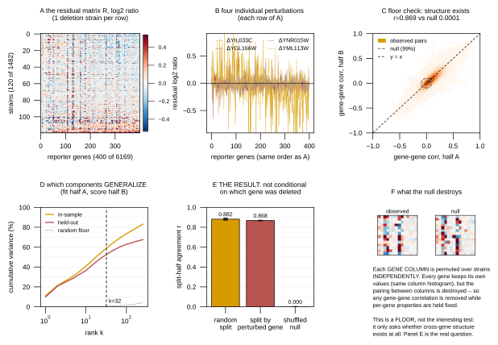

## 2026.07.28 - Residual covariance: reproducible, but NOT conditional

Generated by `experiments/019-simb-multimodal/scripts/plot_residual_covariance.py`
(CPU only). Data: `experiments/019-simb-multimodal/results/residual_covariance_plots.json`.

### Why this exists

`residual_covariance_diagnostic.py` gated the `energy` arm by showing residual gene-gene
correlation is **reproducible**. It did not ask whether that correlation is **conditional on
the perturbation**, and that second question decides what a joint head can actually buy:

$$\Sigma = D + VV^\top \quad\text{is GLOBAL — it enters the predictive distribution, never } \mu.$$

Since the ranked metric `pearson_per_feature` is computed from `DistHead.point()` = $\mu$, a
global $\Sigma$ **cannot** move it. Any `energy_rank` ablation judged on that metric returns a
null by construction.

### Results

| statistic | value |
|---|---|
| split-half agreement, random split (20 reps) | **0.882 ± 0.008** |
| split-half agreement, split by perturbed-gene PC1 | **0.868** |
| within-gene-shuffled null | 0.0001 |
| difference (random − by-gene) | +0.014 (**+1.7 sd**) |
| participation-ratio effective rank | 32.8 |
| cumulative variance at k=32 | 59.1% |

**Panel A** — the correlation pattern replicates almost perfectly on held-out strains
(r = 0.869 against a null of 0.0001). The structure is unambiguously real.

**Panel B** — it is genuinely high-dimensional: rank 32 holds 59% of it, and k=8 (the old
default) only 37.6%.

**Panel C — the new result.** Splitting strains so the two groups perturb genes that are far
apart in prot_T5 space (0.65 sd separation) degrades agreement by only **1.7 sd** of the
random-split spread. The residual covariance is therefore essentially the **same matrix
regardless of which gene was deleted**.

### Consequence

The dependence is **gene-intrinsic** — co-expression modules, array/batch structure — not
perturbation-specific. So:

- A single global $\Sigma = D + VV^\top$ is the *right* model; there is no conditional
  covariance structure a fancier head could capture.
- It improves the predictive **distribution** and should show up in the **energy score** and
  in calibration — not in `pearson_per_feature`.
- The `_007` observation that `energy_rank` 32 ≈ 0 on the ranked metric (0.0485 vs 0.0476) is
  therefore **expected**, and is not evidence against the joint head. Judging it requires a
  proper scoring rule, which is why `val_loss` is now captured in the sweep's `user_attrs`.

### 2026.07.28 revision -- data panels + cross-validated spectrum

Redesigned after review. Three changes:

1. **The null is now shown, not asserted** (Panel F): a side-by-side of an observed vs
   shuffled sub-block, plus the statement of what the permutation does. Each GENE COLUMN is
   permuted over strains INDEPENDENTLY -- not whole rows, which would preserve everything.
   Panel C is relabelled a **floor check**: "is there any cross-gene structure at all", to
   which the answer was always going to be yes, because yeast has a general expression
   program (regulons, ribosomal co-regulation, stress response). Panel E is the real test.
2. **Panels A + B show the actual data** -- the residual matrix R, and four individual
   deletion profiles, so the object the covariance is computed from is visible.
3. **Panel D is now CROSS-VALIDATED.** With S=1,482 strains and F=6,169 genes, `F/S ~ 4.2`,
   so the sample correlation matrix is rank-deficient and its in-sample eigenvalues are
   inflated by sampling noise. Fitting components on half A and scoring them on half B
   separates real structure from overfit:

| k | in-sample | held-out | gap | random floor |
|---|---:|---:|---:|---:|
| 8 | 37.6% | 34.0% | 3.6 | 0.13% |
| **32** | **59.1%** | **52.7%** | **6.4** | 0.52% |
| 64 | 68.3% | 59.6% | 8.7 | 1.04% |
| 128 | 76.0% | 64.2% | 11.8 | 2.07% |

Held-out variance is **still rising at k=128**, so extra rank does capture real structure --
the components are not noise. But the marginal return halves with each doubling (+6.9 points
for 32->64, +4.6 for 64->128) while the parameter cost `F x k` doubles: 197k at k=32, 395k at
k=64, 790k at k=128, against a model whose TOTAL size is ~517k. So k=64 is a defensible arm
to test; k=128 would make Sigma larger than the entire rest of the model.

### Gotcha found while making this figure

`torchcell.graph.graph` calls `plt.style.use(...)` **at module import**, which overwrites
`font.size` 6 → 16. Any plotting script that imports a torchcell data module and sets
rcParams at the top of the file silently gets 2.67x-too-large text. Apply the style at PLOT
time (`_apply_plot_style()` here), after all imports.
