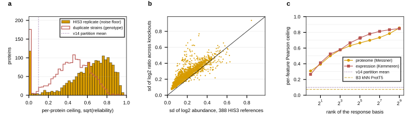

## 2026.09.17 - Where the v14 proteome round sits against what the label allows

Script: `experiments/019-simb-multimodal/scripts/proteome_ceiling_replicate.py`. Results: `experiments/019-simb-multimodal/results/proteome_ceiling_replicate.json`. Reads the raw Messner matrix from the mirror (`yeast5k_noimpute_wide.csv`, 1,850 proteins, 388 HIS3 columns, 4,699 knockout columns), log2, ratio to the HIS3 mean per protein, the form the loader stores.

Estimand as in [[experiments.019-simb-multimodal.scripts.expression_ceiling_replicate]]: per protein, a perfect predictor of the reproducible effect scores sqrt(reliability) against the measured value. Two of the routes were first measured on 2026.09.15 in [[experiments.019-simb-multimodal.scripts.expression_ceiling_all]] (duplicate strains 0.40, WT decomposition 0.70); this script recomputes them from the raw matrix and adds the plate ANOVA and the rank-k curve.

| route | what it bounds | reliability (mean) | ceiling (mean) | v14 0.099 as a fraction |
|---|---|---|---|---|
| W, 388 HIS3 replicates against the 4,699 knockouts | one measurement's noise inside Messner | 0.43 | 0.61 (median 0.67) | 16% |
| D, 149 duplicate-strain pairs (145 ORFs deleted twice or three times, 99% on different plates) | a genotype's reproducible effect inside Messner | 0.21 | 0.42 (median 0.44) | 24% |
| Z, Zelezniak 2018 on 89 shared deletions | what transfers across studies | 0.09 (median) | 0.29 | 34% |

Per strain, a duplicate pair's two profiles correlate at a median 0.03 across proteins (route D), the same order as Messner against Kemmeren (0.04) and Zelezniak against Messner (0.08): a knockout's whole-profile shape does not reproduce, only per-protein effects across strains do, and those at reliability 0.2. Plate explains a median 1% of any protein's knockout variance (57 plates, one-way ANOVA), so the plate-median correction did its job and plate is not what separates route W from route D.

Rank-k ceiling on the 4,537 strains x 1,654 proteins complete-case matrix (90/10 strains, train-basis SVD, 0.8% entries mean-filled): rank 1 gives 0.31, rank 4 0.50, rank 16 0.63, rank 64 0.70, rank 512 0.86; Kemmeren's curve from `lowrank_output_ceiling.json` is 0.27 / 0.53 / 0.73 / 0.78 / 0.86 at the same ranks. The proteome carries less of its variance in its top directions (rank 64 holds 56% of fit variance against 77% for expression), which is what a 57% single-measurement noise share looks like.

Where v14 sits: the partition means at the matched epoch 814 (roll_max, `v14_proteome_readout.json`) are 0.114 / 0.084 / 0.112 / 0.085, mean 0.099; at fixed epochs 500 to 800 the 16-run mean is 0.079 (sd 0.014). Against route D that is 19 to 24% of the ceiling; the v13 expression reference sits at 0.156 / 0.775 = 20% of its replicate ceiling at epoch 3,700. The model is not further from its ceiling on the proteome than on expression; the ceiling is lower.

Caveat on route D: the duplicated ORFs are strains "of different origins" (loader note), so a pair can differ by more than growth and measurement, which makes 0.42 a lower bound on the within-study genotype ceiling; route W is the upper bound.
