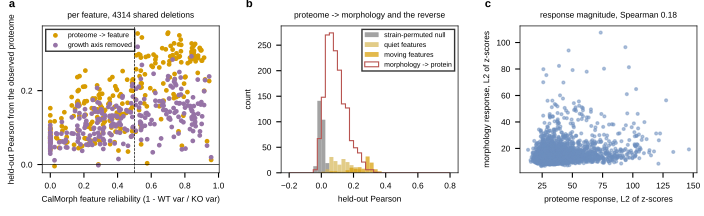

## 2026.09.27 - Does the knockout proteome carry morphology, and on which features

Asked before launching the joint rounds. On the 4,314 deletions measured in both Messner
2023 (1,652 proteins quantified in at least 90 percent of them) and CalMorph (the 278
features the morphology model uses, `results/morphology_feature_ceiling.csv`), out-of-fold
ridge with the penalty chosen on an inner split, five folds over strains, against a
strain-permuted null. Results in `results/proteome_morphology_covariation.json`.

| read | statistic | value |
|---|---|---|
| observed proteome to each CalMorph feature | median held-out Pearson, 278 features | 0.169 (IQR 0.10 to 0.25, max 0.36) |
| the 116 features that move under deletion (reliability at least 0.5) | median | 0.280 (26 percent above 0.3) |
| the 162 quiet features | median | 0.126 (none above 0.3) |
| strain-permuted null | median | -0.002 (max 0.05) |
| first principal component projected out of both sides, moving features | median | 0.145 (max 0.32) |
| observed morphology to each protein | median over 1,652 proteins | 0.081 (max 0.33), null -0.005 |
| response magnitude, proteome against morphology L2 norms | Spearman over 4,314 strains | 0.178, p 4e-32 |
| first PCs of the two panels | absolute Pearson | 0.09 |

For comparison the same read from the observed proteome to expression is 0.226 per gene
(review of 2026-09-27, report 01). So the proteome relates to morphology at least as
strongly as to expression, and on the reliable features more strongly: the ten
best-predicted features are nuclear size and shape, actin region size, and cell and bud
size on stage A1B, at 0.33 to 0.36. About half of that is the shared slow-growth axis
(removing each panel's first component takes the moving-feature median from 0.28 to
0.15), and half survives it. The first components themselves are nearly uncorrelated
(0.09), so the shared axis is not simply the same direction on both sides. A deletion that
moves the proteome tends to move morphology, weakly (0.18).

Not measured here: whether any of this reaches a genotype-only trunk. The linear subspace
test that bounded proteome-to-expression transfer at +0.006 has not been run for
morphology. The manuscript abstract's morphology figure of about 0.62 from the genotype
is NOT substantiated by data the group trusts (author, 2026-09-27; earlier morphology
reads carried mistakes), so no comparison against it is made here. Hypothesis (untested):
if anything transfers to a genotype-only morphology head, it is on the moving features.

