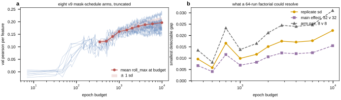

## 2026.09.03 - The replicate spread is smaller at short budgets, not larger

Script: `experiments/019-simb-multimodal/scripts/short_budget_spread.py`
Results: `experiments/019-simb-multimodal/results/short_budget_spread.json`

### Why this was run

Every power number in the launch plan rests on the replicate spread of 0.0222, measured on
the eight identical-config runs at 9,900 epochs. Delta caps a job at two days, which at the
measured packed throughput is roughly 3,000 epochs, so a Delta design would have had to
assume that spread carries over. It does not, and the assumption was testable for free:
those eight runs each logged a full validation curve, so truncating the curve and rescoring
costs no training at all.

### What was measured

Each replicate's score at budget E is the roll_max of its validation curve restricted to
epochs at or below E, the same statistic the leaderboard uses, applied to a prefix.
`_roll_max` is imported from `pull_round_leaderboards.py` rather than reimplemented, so it
cannot drift from the leaderboard's definition.

| budget | mean | sd | min | max | main effect 32v32 | cell 16v16 | arm 8v8 |
|---|---|---|---|---|---|---|---|
| 1,000 | 0.1609 | 0.0099 | 0.1485 | 0.1780 | 0.0069 | 0.0098 | 0.0138 |
| 1,500 | 0.1670 | 0.0117 | 0.1536 | 0.1839 | 0.0082 | 0.0116 | 0.0165 |
| 2,000 | 0.1745 | 0.0151 | 0.1547 | 0.1950 | 0.0106 | 0.0150 | 0.0212 |
| 2,800 | 0.1821 | 0.0175 | 0.1629 | 0.2085 | 0.0123 | 0.0174 | 0.0245 |
| 4,000 | 0.1883 | 0.0171 | 0.1663 | 0.2145 | 0.0120 | 0.0169 | 0.0240 |
| 6,000 | 0.1917 | 0.0177 | 0.1663 | 0.2222 | 0.0124 | 0.0175 | 0.0247 |
| 9,900 | 0.1965 | 0.0222 | 0.1663 | 0.2382 | 0.0155 | 0.0219 | 0.0310 |

### Two readings, and they point the same way

**The spread grows with budget.** It more than doubles from 0.0099 at 1,000 epochs to
0.0222 at 9,900. The 0.0222 figure the launch plan uses is therefore the worst case in the
range, not a constant, and a short-budget round sits in a quieter regime than the one the
power table was written for.

**The mean barely moves.** It rises 0.0356 across a tenfold increase in compute, from
0.1609 to 0.1965. Eighty-two percent of the final score is present at epoch 1,000.

Together these say a short budget is not a compromise for a comparison, it is a better
instrument: nearly all of the signal at less than half the noise. The late epochs buy the
upper tail of the distribution, which is what raises a headline maximum and what inflates
the variance, and they buy almost nothing for a contrast between arms.

### What it changes

A 64-run design at a 2,000-epoch budget resolves a main effect to 0.0106 rather than the
0.0155 assumed at 9,900. That is enough slack to add a fourth factor at no cost to the main
effects, since every factor in a `2^k` design is still estimated from 32 runs against 32.
It also fits in about one day at the measured packed throughput rather than two.

### Caveats

- The spread is measured on ONE configuration, the incumbent. A smaller trunk or a random
  embedding may carry different variance, which the design assumes away in the usual manner.
- Scoring at 2,000 epochs asks which arm is ahead at 2,000 epochs. An arm that starts slowly
  and wins at convergence would be missed. The mean's flatness bounds how much that can
  matter but does not eliminate it.
- W&B history is downsampled to 500 points per run, so a truncated curve carries fewer
  samples and the rolling window spans more epochs per step. This is why the budget grid is
  coarse.
