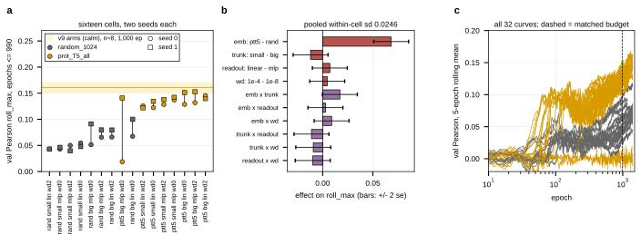

## 2026.09.08 - The v10 generalization-gap grid, read out

Script: `experiments/019-simb-multimodal/scripts/v10_grid_factorial.py`. Data: project
`torchcell_019_expr_v10`, Delta job `21830323`, 16 cells x 2 seeds = 32 runs, one per GPU.
Outputs `results/v10_grid_factorial.{csv,json}` and the figure below. Design and
cell encoding in [[experiments.019-simb-multimodal.expression-strand-retrospective]].

**Budget.** Three of the eight array tasks hit the two-day wall (tasks 2, 4, 7 timed out at
epochs 990 to 1,198; the other five completed 1,400). Every contrast is at the matched
budget of epochs <= 990, the smallest final epoch across the grid, computed from the data.
Scoring rule: `roll_max`, the max of a centered 5-epoch rolling mean of
`val/expression/pearson_per_feature`, full per-epoch history.

**Main effects at epochs <= 990, all 32 runs** (pooled within-cell replicate sd 0.0246 on
16 df, se per effect 0.0087):

| factor | level 0 | mean | level 1 | mean | effect | t |
|---|---|--:|---|--:|--:|--:|
| embedding | random_1024 | 0.0606 | prot_T5_all | 0.1287 | +0.0682 | +7.8 |
| trunk | L=6 h=90 | 0.1007 | L=2 h=45 | 0.0886 | -0.0120 | -1.4 |
| readout | MLP | 0.0911 | linear | 0.0982 | +0.0072 | +0.8 |
| weight decay | 1e-8 | 0.0924 | 1e-4 | 0.0969 | +0.0046 | +0.5 |

Two-way interactions: embedding x trunk +0.0172 (t +2.0), every other one |t| < 1.3.

**One run never left the chance band.** `te8272kk` (cell 1, prot_T5 / L=6 / MLP / wd 1e-8,
seed 0) sits at 0.019 at its best and -0.007 at epoch 1,399 with nmse 1.010, while its
seed-1 twin `l4uw0g1e` is the grid's best single run (0.1685 full-run, 0.1408 matched).
That one pair contributes most of the pooled variance: dropping it, the within-cell sd is
0.0122 (15 df, se 0.0044), the embedding effect is +0.0755 (t +17), the trunk effect
-0.0175 (t -4.0), and embedding x trunk +0.0127 (t +2.9). Readout and weight decay stay
null either way (|effect| < 0.008).

**Against the incumbent.** The eight identical-config incumbent runs (calm embeddings,
`short_budget_spread.json`, read from 500-sample curves) score 0.1609 +/- 0.0099 at 1,000
epochs. The best v10 cell by mean is cell 13 (prot_T5 / L=6 / linear / wd 1e-4) at 0.1426,
and the best single run 0.1527 (cell 9 seed 1, at 990). Neither grid level of the embedding
factor is the incumbent's `calm`, by design (matched width 1024, content contrast), so the
grid says content matters by 0.07 and does not say calm vs ProtT5; the healthy cell-1 run
(the incumbent with ProtT5 in place of calm) at 0.141 vs 0.161 is one draw against eight
and is not a resolved gap.

**Reading.** Of the four factors chosen to act on the train-validation gap, only the
embedding content moves the score at this budget, and it moves it by 3x the replicate sd.
Trunk depth is a small effect in the direction of the bigger trunk, sharpened by ProtT5.
Readout width and weight decay at 1e-4 are measured nulls at a resolution of about 0.02
(2 se, all runs). The short random-embedding cells with weight decay 1e-4 (cells 10 and
14) peak at epoch 115 to 125 and decay, the only cells whose matched peak is not at the
budget edge.

