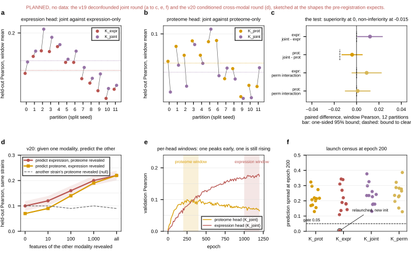

## 2026.09.27 - Wireframe of the joint-round figure panels

Nothing here is measured. The script sketches the six panels the deconfounded joint round
(v19, `conf/cgt_expr_v19_joint_clean.yaml`) and the conditioned cross-modal round (v20)
are expected to produce, at the shapes the pre-registration expects, so the figure can be
placed in `notes/assets/drawio/Fig3-options.drawio` before any run exists. When the rounds
land, the readout scripts replace every sketch with run data and this file is retired.
Design and evidence: `notes-tex/019-simb-multimodal-expression/sections/5-joint-plan.tex`.

- **a** expression head, K_expr against K_joint, one pair per partition, window mean over
  epochs 1,000 to 1,200
- **b** proteome head, K_prot against K_joint, window mean over epochs 200 to 400
- **c** the pre-registered test as a forest: expression superiority against 0, proteome
  non-inferiority against -0.015, and the permuted-label interaction on both heads
- **d** v20: held-out Pearson against how much of the other modality is revealed, with the
  genotype-only floor and the shuffled-strain null
- **e** the two heads' validation curves with the per-head windows shaded
- **f** the launch census: prediction spread at epoch 200 per run, the 0.05 gate, relaunches

