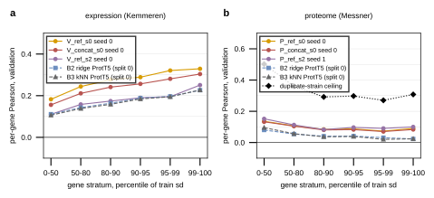

## 2026.09.17 - Per-gene Pearson by train-variance stratum, model against the linear baselines, validation and test

The question: is the model any better at the genes that actually move than at the thousands that barely change? The script scores the per-gene prediction dumps of six best-validation checkpoints (three v13 expression runs, three v14 proteome runs, written by the evaluation path of `train_cgt_multitask.py` through [[experiments.019-simb-multimodal.scripts.gh_eval_ckpt_predictions]]) by stratum of per-gene standard deviation over the TRAIN strains of the run's own partition, against the B2 bilinear ridge and B3 kNN baselines refit on that partition with the cells selected by [[experiments.019-simb-multimodal.scripts.expression_baselines_split]], on validation and on test. The proteome panel carries the duplicate-strain ceiling per stratum (route D of [[experiments.019-simb-multimodal.scripts.proteome_ceiling_replicate]]).

Gene set: the per-gene head predicts only the phenotype keys that are nodes of the cell graph, so the 42 expression keys absent from the genome gene set (`SNR10`, Ty-element and dubious ORFs, median train sd 0.295 against 0.149 for the panel) are dropped from every column here; the metric's denominator is 6,127, the published ceiling's 6,169. The dump's own all-gene value at the checkpoint is above the rolling-mean readout of the same run because it is one epoch, not a 5-epoch mean.

Expression (v13, `V_ref_s0` seed 0, checkpoint epoch 3,783), validation then test:

| stratum (train sd pct) | val model | val B2 | val B3 | test model | test B2 | test B3 |
|---|---|---|---|---|---|---|
| 0-50 | 0.183 | 0.111 | 0.106 | 0.091 | 0.066 | 0.039 |
| 50-80 | 0.244 | 0.143 | 0.138 | 0.114 | 0.087 | 0.045 |
| 80-90 | 0.277 | 0.164 | 0.159 | 0.138 | 0.114 | 0.059 |
| 90-95 | 0.289 | 0.188 | 0.184 | 0.154 | 0.134 | 0.070 |
| 95-99 | 0.321 | 0.196 | 0.195 | 0.161 | 0.151 | 0.072 |
| 99-100 | 0.329 | 0.226 | 0.227 | 0.168 | 0.179 | 0.075 |
| all | 0.223 | 0.134 | 0.130 | 0.110 | 0.085 | 0.046 |
| top 10% | 0.306 | 0.195 | 0.193 | 0.158 | 0.145 | 0.071 |

`V_concat_s0` seed 0: val 0.193 all, 0.304 top 1%; test 0.139 all, 0.206 top 1% (B2 test 0.085 / 0.179). `V_ref_s2` seed 0 (split 2): val 0.140 all, 0.251 top 1%; test 0.153 all, 0.209 top 1% (B2 test 0.110 / 0.189, B3 test 0.124 / 0.203).

Proteome (v14, `P_ref_s0` seed 0, epoch 181):

| stratum | val model | val B2 | val B3 | test model | test B2 | test B3 | ceiling |
|---|---|---|---|---|---|---|---|
| 0-50 | 0.136 | 0.080 | 0.096 | 0.081 | 0.070 | 0.113 | 0.50 |
| 50-80 | 0.107 | 0.054 | 0.056 | 0.058 | 0.052 | 0.078 | 0.36 |
| 80-90 | 0.081 | 0.040 | 0.037 | 0.050 | 0.043 | 0.056 | 0.29 |
| 90-95 | 0.087 | 0.041 | 0.039 | 0.050 | 0.038 | 0.064 | 0.30 |
| 95-99 | 0.073 | 0.031 | 0.020 | 0.042 | 0.033 | 0.062 | 0.27 |
| 99-100 | 0.090 | 0.023 | 0.024 | 0.053 | 0.032 | 0.084 | 0.31 |
| all | 0.116 | 0.064 | 0.071 | 0.067 | 0.059 | 0.092 | 0.42 |

`P_concat_s0` seed 0: val 0.114 all, test 0.082 (B3 test 0.092). `P_ref_s2` seed 1: val 0.128 all, test 0.082 (B3 test 0.083).

What it says:

- Expression: the score RISES with the gene's train variance, from 0.18 on the quiet half to 0.33 on the top percentile on split 0, and the model leads both baselines in every stratum on validation. The lead is not a loud-gene effect: it is 0.07 to 0.10 in every stratum, and the baselines climb the same slope. On the top percentile the model reaches 0.33 of a replicate ceiling of about 0.82 (the per-stratum expression ceilings are in the agent-06 review, 0.755 for the quiet half to 0.84 for the top decile), so the realized fraction goes from a quarter on quiet genes to two fifths on loud ones.
- Expression test: split 0's test draw is hard for every method (model 0.110, B2 0.085 against val 0.223 / 0.134), split 2's is easy (model 0.153 against val 0.140). Split 0 is the easiest of twelve validation draws and a below-average test draw for the parameter-free baselines too ([[experiments.019-simb-multimodal.scripts.expression_baselines_split]], twelve seeds), so the validation-to-test drop is the partition, not the model. On test the model's lead over B2 narrows to 0.02 to 0.05 and over B3 to 0.03 to 0.06.
- Proteome: the opposite slope. The model is best on the quiet half (0.14 to 0.15) and worst on the loud proteins (0.07 to 0.10), and the duplicate-strain ceiling falls the same way (0.50 to 0.27 to 0.31): the proteins that vary most across strains are the ones whose variation replicates least. On validation the model leads B3 by 0.03 to 0.06 in every stratum. On TEST it does not: all three checkpoints score 0.067 to 0.082 against B3 kNN ProtT5 at 0.083 to 0.092 on the same strains. This is the first proteome test read and it says the v14 validation lead over the kNN does not transfer to test on splits 0 and 2 at the best-validation checkpoint.

Caveats: one checkpoint per run (the best-validation epoch, an order statistic over the run); three runs per panel; the proteome ceiling is a per-protein reliability over 149 duplicate pairs, so its per-stratum values carry wide intervals; B2 and B3 here are refit on the 6,127-gene set, so they differ slightly from the committed baseline tables.

Results: `experiments/019-simb-multimodal/results/variance_stratified_pearson.json`.
