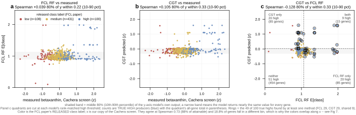
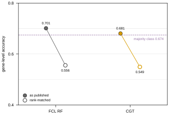
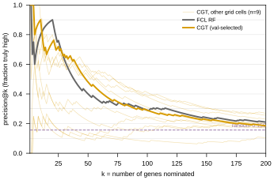
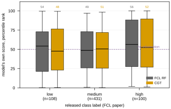
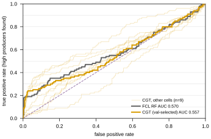
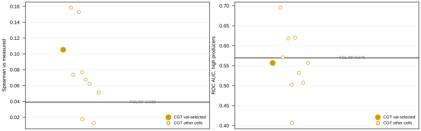
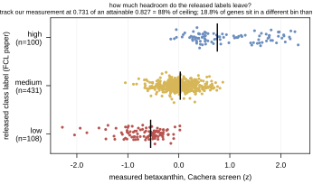
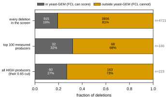
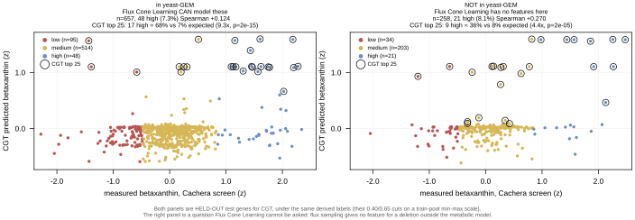

## 2026.07.27 — Read this before quoting any comparison number

Note crumbs so the head-to-head can be run cold. The protocol is fixed **before** we have a
model, so it is not chosen after seeing our number.

| what | where |
| --- | --- |
| split builder | `experiments/020-cachera-betaxanthin/scripts/build_merzbacher_split.py` |
| split output | `results/merzbacher_nested_split.json` |
| baseline analysis | `experiments/020-cachera-betaxanthin/scripts/analyze_merzbacher_baseline.py` |
| baseline output | `results/merzbacher_baseline_analysis.json` |
| their archive (sha256-pinned) | `$DATA_ROOT/data/merzbacher2025_fcl/` |

### What their deposit gives us — far more than the paper implies

The manuscript reports no split and an inconsistent test N (Fig 4b 659, Table S6 649, 20 % of
811 = 162). The Zenodo **code** deposit (10.5281/zenodo.15518666 → record 15761895) has:

| file | what it gives us |
| --- | --- |
| `data/yeast_production_test_split.csv` | the exact 640-ORF test set |
| `data/yeast_production_validation_split.csv` | same genes + released `label` 0/1/2 + CV `fold` |
| `training/yeast_training_production.py` | the exact binning rule |
| `figures/fig4/fig4b.csv` | per-fold accuracy, macro-F1, **MCC**, class-2 accuracy |
| `figures/fig4/fig4c_*.csv` | **per-gene, per-flux-sample predictions + class scores** |

Only the 49 MB code archive is mirrored; `data.zip` is 23 GB of flux samples we do not need.

### THEIR TRUE BASELINE — from their own shipped predictions

Aggregated to gene level by majority vote over each deletion's flux samples, exactly as their
`tools/knockout_voting.py` does. Best model, `RandomForestClassifier_Resampled`:

| true ↓ / pred → | low | **medium** | high |
| --- | --: | --: | --: |
| low (109) | 6 | **101** | 2 |
| medium (431) | 2 | **424** | 5 |
| high (100) | 0 | **82** | 18 |

- gene-level accuracy **0.700**, majority-class rate **0.673**
- **607 of 640 genes called medium — 94.8 %**
- **18 of 100 high producers found**
- majority predictor gets 431/640; theirs gets 448/640. **The entire margin is 17 genes.**

**They computed MCC and did not report it.** From `fig4b.csv`:

| model | accuracy | MCC | high-producer acc |
| --- | --: | --: | --: |
| RandomForest | 0.698 | **0.232** | 0.181 |
| RandomForest_Balanced | 0.698 | 0.233 | 0.117 |
| LogisticRegression | 0.515 | **0.041** | 0.233 |
| LinearSVC_Resampled | 0.445 | **0.031** | 0.273 |

MCC 0.23 is weak but **not zero** — there is real signal, concentrated in the majority class.
Be fair in any writeup: they claim "promising accuracy", not a significant gain.

**The decisive structural point:** every model that finds more high producers has *worse*
overall accuracy, because the only way to call more highs is to stop calling everything
medium. **Accuracy actively selects against the capability the task is about.**

### The recipe, fixed in advance

1. **Ground truth = THEIR RELEASED LABELS**, never labels we re-derive. Their rule min-max
   scales to [0,1] then cuts at 0.40 / 0.65, so the cuts depend on the observed extremes.
   Applied to our (larger) copy of the same screen it gives 107/476/56 against their
   109/431/100 — 81.2 % agreement, and **we call barely half as many high producers**. Same
   rule, same screen, different classes. Re-deriving would compare different tasks.
2. **Bin OUR predictions with thresholds fitted on the TRAIN split only.** Fitting on test
   leaks the class distribution, which on a 67 %-majority problem is most of the answer.
3. **Primary metrics are imbalance-immune**: Spearman, and top-*k* enrichment on high
   producers. Report **MCC** next to accuracy — they had it, so we should show it.
4. **Also report accuracy + per-class + high-producer recall**, so the comparison lands on
   their terms too.
5. **State the fraction of genes we call medium.** If ours is also ~95 %, we reproduced their
   failure mode rather than beat it, and must say so.

### Reconciliations to carry into any writeup — report, never resolve silently

- **639 of 640** of their test genes are in our test split. The one missing is `YBR011C` =
  **IPP1**, which is **essential** ([SGD S000000215](https://www.yeastgenome.org/locus/S000000215),
  null inviable). No haploid deletion collection contains *ipp1Δ*, so no screen could have
  measured it — **their test set contains a gene with no possible deletion phenotype.**
- **`PPA1` is an alias of both IPP1 and VMA16.** The screen has ONE `PPA1` row; their split
  has BOTH YBR011C and YHR026W as separate test genes. At least one of their test entries
  plausibly carries **VMA16's** value scored as if it were IPP1. Our screen-local
  disambiguation (`PPA1`→VMA16, `FEN1`→ELO2) is documented in the split builder, with the
  reasoning recorded so it can be re-derived if its premises change.
- **640 vs the paper's 811** — a 171-gene gap the Methods do not count ("sampling failed to
  converge").
- **Their validation folds appear drawn from the same 640 genes as their test list**
  (`yeast_training_production.py:124-143`), which would mean model selection touched test
  data. FLAGGED, not claimed — confirming needs `yeast_single_knockouts.npz` from the 23 GB
  archive.
- Our Cachera build is **stale** w.r.t. the name resolver (issue #195). The split is built
  from the RAW screen + resolver so it does not inherit that, but **training data still
  will** until a rebuild.

### What we can report that they cannot

- **Regression at all.** They tried and abandoned it — *"challenging with the limited number
  of knockouts at the high and low ends."* Our betaxanthin noise ceiling is **r = 0.914**
  (reliability 0.836, median 15 replicates), so regression is available to us.
- **The ~3,900 non-metabolic deletions.** FCL has no flux cone for a gene outside Yeast9, so
  it cannot make a prediction at all. We predict all ~4,700. That is a category difference,
  not a tie-break.

### Where our model stood when the sweeps were paused

`020-cachera-betaxanthin`, study `betaxanthin_002`, 33/40 trials before cancellation:
**val Pearson 0.430** — 47 % of the 0.914 ceiling — with `prot_T5_all` / learnable **False** /
`crps` / L=2 / hidden 90 / λ 6.5e-5 / decayed / yeo-johnson. The top-5 configs agreed closely,
so it is a plateau rather than a lucky trial. Companion arms: `021-ozaydin-beta-carotene`
(Spearman 0.223) and `022-mulleder-metabolome` (0.180, up from a historical ≤ 0.025).

Related: [[plan.cgt-metabolism-flux-layer.2026.07.26]] ·
[[plan.simb-2026-multimodal-cgt.2026.07.21]]

## 2026.08.02 - CGT vs Flux Cone Learning on the Cachera betaxanthin screen

**Naming, because the two get conflated.** *Cachera* is the genome-wide betaxanthin DELETION
SCREEN -- the data, ~4,700 single deletions, and the ground truth for both models. *Flux Cone
Learning* (FCL) is Merzbacher et al.'s METHOD, which learns from flux samples drawn through a
genome-scale metabolic model; `RandomForest_Resampled` is its best variant and is what "FCL
RF" means throughout. The comparison is **CGT vs FCL, both scored on the Cachera screen** --
not "us vs Cachera".

All figures regenerate from
`experiments/020-cachera-betaxanthin/scripts/plot_merzbacher_comparison.py`, built from the
10 finished Delta `020_v4` cells (`$DATA_ROOT/test-predictions/`) and the FCL paper's shipped
`figures/fig4/fig4c_*.csv`. **Every number quoted below is written to
`results/merzbacher_comparison_figures.json`** by that same run, so a re-render's movement
shows up as a diff on that file rather than silently changing what this note claims -- which
matters here, because the source directory grows as Delta cells land.

- **639 genes** carry their label, a CGT prediction and a raw screen value. Their 640th
  (IPP1/YBR011C) is essential -- no deletion strain exists, so no screen could measure it.
- **FCL model = RandomForest_Resampled**, the best of their four (the others read 0.56-0.64
  gene-level against RF's 0.700).
- **CGT = ONE cell, selected by VALIDATION** (`s09_L6_maskon_lr0.0001_yj`, val 0.3639), never
  by its score on their test genes.
- **THE SELECTION IS ASYMMETRIC, AND IT FAVOURS THEM.** Ours is the val-selected cell, which
  Fig 5 and Fig 6 show costs us real ground (four cells beat FCL on AUC; the val-selected one
  does not). Theirs is the best of four models, and the justification above -- "the others read
  0.56-0.64 against RF's 0.700" -- is a TEST-set number. Their own folds compound it: the
  earlier section flags that their validation folds appear drawn from the same 640 genes as
  their test list. So wherever the two land level, we are level with an opponent picked with
  more information than we allowed ourselves.
- **Provenance asserted:** our re-derivation of their deployed gene-level vote reproduces
  their published accuracy (0.7011 vs 0.700) or the script exits.

### TL;DR

1. **The published accuracy comparison is empty.** 0.701 vs a 0.674 majority rate, achieved
   by calling 95 % of genes medium. Rank-matched, both models fall to ~0.55. (Fig 2)
2. **Both models DO have real signal, concentrated at the top of the ranking.** ~5x enrichment
   in the top 10-25 genes, p <= 1e-05 -- and essentially nothing across the bulk. (Fig 3, 4)
3. **CGT and their RF are roughly tied where both can be measured**, and disagree about which
   genes (rank correlation -0.128). (Fig 1, 3, 5)
4. **The real difference is COVERAGE, not accuracy.** yeast-GEM covers only **915 of the
   4,721** deletions in the screen (19.4 %), and **163 of the 223 high producers (73 %) lie
   outside it** -- FCL has no features for any of them. CGT scores those genes and finds high
   producers there at 4.4x enrichment (p = 2e-05). (Fig 8, 9)

---

### Fig 1 -- per-gene spread (639 points)

**Fig 1. Both models emit a nearly constant value; the two disagree about which genes.** 80 %
of FCL's genes fall inside an E[class] band of 0.22 on a 0-2 scale, 80 % of CGT's inside 0.33
z-units. CGT's prediction is drawn on the MEASUREMENT's own scale (both are z-scored
betaxanthin), so the middle panel shows the compression directly: the cloud is a flat
horizontal band rather than rising with the measurement. Colour is the FCL paper's released
class label, x is OUR copy of the same screen. "80 % of y within 0.22" is the WIDTH of the
shaded band -- how far apart the 10th and 90th percentiles of that panel's y-axis model are,
in that axis's own units.

**Why the blue (true high) points sit at E[class] ~ 1, which is the MEDIUM class value.** This
is the finding, not a mislabelling. FCL's deployed call is medium for **606 of 639 genes
(94.8 %)**, and of the 100 true-high genes it calls **82 medium, 18 high, 0 low**; 74 of those
100 sit below E[class] 1.1. So the median true-high gene receives an essentially medium
expectation, which is what puts the blue cloud at 1.

| released label | n | mean E[class] | median | p90 |
| --- | --: | --: | --: | --: |
| low | 108 | 0.965 | 0.952 | 1.074 |
| medium | 431 | 0.972 | 0.932 | 1.102 |
| **high** | 100 | **1.095** | **0.958** | **1.410** |

What the medians hide is that true-high does carry a longer upper TAIL (p90 1.410 against
1.074 / 1.102) -- the same tail signal Fig 3's precision@k picks up. The signal is real, it is
confined to the tail, and it does not move the bulk.

No `y = x` reference line is drawn. It previously appeared on the middle panel only, that
being the one panel whose axes are the same quantity in the same units; it was removed because
a reference line on one panel of three reads as an inconsistency, and the compression it
pointed at is already carried by the shaded band and the title.

| pair | Pearson | Spearman |
| --- | --: | --: |
| measured vs FCL RF | +0.243 | **+0.039** |
| measured vs CGT | +0.294 | **+0.105** |
| FCL RF vs CGT | +0.108 | **-0.128** |

Pearson exceeds Spearman on both model rows because each gets a few extreme genes right and is
otherwise flat. In RANK the two models are ANTI-correlated -- and by more than "slightly":
with n=639 the null SE on a rank correlation is 0.040, so **-0.128 is z = -3.2**. It is also
not what shared signal would produce: two models correlating with the truth at +0.105 and
+0.039 would, through the truth alone, correlate with each other at about **+0.004**. So the
sign is not noise around zero, and something orders the two rankings in systematic opposition.
**No mechanism is claimed** -- we have not tested one, and the disagreement itself is
independently visible in panel c, where the two methods recover 29 high producers each and
share only 9.

**Panel c -- of the 100 TRUE high producers, which does each method actually find?** Both
sides are rank-matched into the same 100 high slots, so "called high" is a like-for-like set on
each axis; the dashed lines are the two cutoffs. Counts on the panel are over the BLUE
(true-high) set, with the quadrant's all-gene total in parentheses as the denominator.

| quadrant | true high | all genes |
| --- | --: | --: |
| both find it | **9** | 15 |
| CGT only | **20** | 85 |
| FCL RF only | **20** | 85 |
| neither | 51 | 454 |

| | true high found |
| --- | --: |
| FCL RF alone | 29 / 100 |
| CGT alone | 29 / 100 |
| **shared** | **9** |
| **union of both** | **49 / 100** |

**The two methods are COMPLEMENTARY, not interchangeable.** Each recovers 29 of the 100 high
producers -- identical recall, 0.290, which is why every aggregate in this note has them tied
-- but they share only 9, so their union reaches 49. Recall is near-additive because the two
are finding largely DIFFERENT genes. That is an argument for running both, and it is invisible
in any summary statistic; it is the same fact the -0.128 rank correlation reports, made
concrete at the level of the decision someone would actually act on.

The 51 that neither finds is the honest ceiling on this comparison: **half the high producers
are missed by both methods.**

Rings mark the 49 recovered genes. Names are not printed on the panel -- they would bury the
cloud -- and instead go to `results/merzbacher_high_call_disagreement_<ts>.csv` (columns
`gene`, `released_label`, `call` in {`both`, `only_rf`, `only_cgt`}, `fcl_rf_e_class`,
`cgt_predicted_z`); filter `released_label == 2` for the true-high rows.

Caveat carried from `rank_bins`: the 108/431/100 marginal is ORACLE information handed to both
sides. It is imposed identically on each, so this disagreement comparison is sound as a
RELATIVE statement; the absolute membership of either top-100 is not a deployable call.

### Fig 2 -- why the accuracy comparison is degenerate

**Fig 2. Accuracy above the majority line is the conservative-majority strategy, not
discrimination -- for both models.** RF's 0.701 clears the 0.674 majority rate by 0.027 by
calling 95 % of genes medium; CGT's absolute binning sits at 0.681 doing the same. Forced to
the true class marginal, RF drops to 0.556 and CGT to 0.549. Evidence, not a result.

### Fig 3 -- precision@k for high producers

**Fig 3. Both models are strongly enriched at the top of their ranking.** Of the top k genes
each nominates, the fraction truly high; random is 0.156.

| model | k=10 | k=25 | k=50 |
| --- | --: | --: | --: |
| FCL RF | 8 (5.1x, p=1e-05) | 19 (4.9x, p=8e-12) | 20 (2.6x, p=1e-05) |
| CGT | **9** (5.8x, p=4e-07) | 18 (4.6x, p=1e-10) | **24** (3.1x, p=2e-08) |

Nine of CGT's top ten are genuine high producers. The two models track each other closely and
both approach the base rate by k=150. The nine unselected CGT cells span 0.10-0.65 at k=50 --
cell choice matters more than the CGT-vs-RF gap.

### Fig 4 -- score by class, as percentile rank

**Fig 4. Neither model orders the classes across the bulk of the population.** Percentile rank
puts two models with incomparable units on one axis; a separating model shows three stepping
boxes.

| model | low | medium | high |
| --- | --: | --: | --: |
| FCL RF | 54 | 49 | 56 |
| CGT | 48 | 51 | 52 |

**Read this WITH Fig 3, not instead of it.** A median is a bulk statistic and the top 25 genes
are 4 % of the population, so it barely moves. Together the two figures say the signal is real
and confined to the tail -- not that there is none.

### Fig 5 -- ROC for high-producer detection

**Fig 5. Threshold-free, and on the val-selected cell it goes marginally to FCL: AUC 0.570 vs
CGT's 0.557.** Both near the 0.500 chance line, because AUC integrates over the whole ranking
where neither model has much.

**But four of the ten CGT cells DO beat FCL, and the best beats it clearly:**

| CGT cell | AUC | val pearson |
|---|--:|--:|
| `s08_L6_maskon_lr0.0001_zs` | **0.695** | 0.3528 |
| `s05_L2_maskoff_lr0.0001_yj` | 0.620 | 0.3326 |
| `s01_L2_maskon_lr0.0001_yj` | 0.618 | 0.2989 |
| `s04_L2_maskoff_lr0.0001_zs` | 0.571 | 0.3345 |
| **FCL RF** | **0.570** | -- |
| `s09` (val-selected) | 0.557 | **0.3639** |

Note what this exposes: `s08` is the RUNNER-UP on validation (0.3528 vs `s09`'s 0.3639 -- a
0.011 gap, well inside noise) and has an AUC 0.14 higher. **Validation pearson does not track
test AUC**, so the val-selected cell landing below FCL here is close to a coin flip rather
than a finding. 0.695 is the max over ten cells and cannot be quoted as "CGT's AUC" -- but
"CGT's AUC is 0.557, below FCL" is equally unsafe in the other direction. The honest statement
is that this metric does not separate the two methods at the resolution we have.

### Fig 6 -- how much is cell selection?

**Fig 6. The spread across grid cells is wider than the gap between models.** CGT cells span
0.013-0.158 Spearman (8 of 10 beat RF's 0.039) and 0.406-0.695 AUC (4 of 10 beat RF's 0.570,
and the val-selected cell is not among them -- though the 4th, `s04`, clears it by 0.0014,
0.5709 against 0.5696, so read it as 3 clearly plus a tie). Four low points are the lr=1e-3 cells
that collapsed to a constant predictor. Any single-number claim is dominated by which cell is
quoted, which is why the cell is fixed by validation in advance.

### Fig 7 -- do their labels track our copy of the screen?

**Fig 7. This is a HEADROOM bound on the scoring, not a claim that the FCL paper binned
anything wrongly.** Their labels are a correct application of their own rule; the rule
min-max scales production, and their (smaller) copy of the screen has different extremes than
ours, so the same rule lands its cuts in slightly different places. Neither labelling is
"right" -- theirs is the released ground truth and we score against it. The question the
figure answers is how much of the residual error any model is charged with is really label
disagreement.
Spearman 0.731 against a ceiling of 0.827 (a 3-level ordinal cannot reach 1.0 against a
continuous variable because of its own ties, so the raw number is uninterpretable alone) --
**88 % of attainable, i.e. the labels track our measurement well.** The residual: **18.8 % of
genes sit in a different bin than our values would give**, so a model that predicted OUR
measurement perfectly would still be marked wrong on ~19 % of genes. That is the ceiling
every number in this note sits under.

### Fig 8 -- how little of the screen a flux-based method can reach

**Fig 8. yeast-GEM covers 19 % of the screen and misses 73 % of its high producers.** Measured
data only -- no model, no prediction. yeast-GEM contains 1,161 genes, of which **915 appear in
the Cachera screen: 19.4 % of its 4,721 deletions**. A flux-based method has features for
those and for nothing else.

| population | in yeast-GEM | outside |
|---|--:|--:|
| every deletion in the screen | 915 (19%) | **3,806 (81%)** |
| top 100 measured producers | 32 (32%) | **68 (68%)** |
| all HIGH producers (their 0.65 cut) | 60 (27%) | **163 (73%)** |

**The counter-point, stated honestly because it is real:** metabolic genes ARE enriched among
high producers -- 26.9 % of the highs against 19.4 % of the screen, a **1.4x enrichment**,
exactly what the biology predicts. It is nowhere near enough to matter. They are such a small
share of the genome that the large majority of high producers still sits outside the model.
Restricting to metabolism buys a 1.4x concentration and costs three quarters of the hits.

This is what motivates a genome-scale model rather than a metabolism-only one, and Fig 9 asks
whether CGT actually delivers on that reach.

### Fig 9 -- the capability gap: metabolic vs non-metabolic genes

**Fig 9. CGT predicts high betaxanthin producers among deletions the flux-based method cannot
represent.** Held-out test genes split by yeast-GEM membership, identical derived labels on
both sides (their 0.40/0.65 cuts on a train-pool min-max scale). Circled = CGT's top 25.

| | in yeast-GEM | NOT in yeast-GEM |
| --- | --: | --: |
| genes | 657 | 258 |
| true high (derived) | 48 (7.3%) | 21 (8.1%) |
| CGT Spearman vs measured | +0.124 | **+0.270** |
| CGT top 25: high found | 17 (68%) | 9 (36%) |
| enrichment over base rate | 9.3x, p=2e-15 | **4.4x, p=2e-05** |
| **Flux Cone Learning prediction** | available | **none possible** |

the FCL paper's test set is **639/640 (99.8 %) inside yeast-GEM**; of our other test genes only
**21/294 (7.1 %)** are. That is what the constraint looks like in practice: flux sampling
yields no feature for a deletion the metabolic model does not contain, so FCL's output for
those genes is not poor, it is undefined.

CGT's rank correlation reads *higher* on the non-metabolic set (+0.270 vs +0.124), but that
particular comparison is **marginal and should not be leaned on**: the two are measured on
different, non-overlapping gene sets, and a Fisher r-to-z on two independent samples gives
**z = 2.07, p = 0.039**. Read it as "CGT is at least as good outside the metabolic model as
inside it", not as evidence that it is better there.

What does NOT depend on that test is the claim the figure exists to make: on genes FCL has no
features for, CGT's top 25 is enriched for true high producers **4.4x over the base rate
(p = 2e-05)**. Both panels' enrichments are strongly significant on their own.

**Caveats, and they matter for how hard this can be pushed.** (i) Labels for the non-GEM genes
are DERIVED by us -- the FCL paper never labelled them -- so both panels use our derivation and
the comparison to make is panel-vs-panel, not panel-vs-their-paper. (ii) n=258 with 21
positives is modest; the interval on 4.4x is wide. (iii) "FCL cannot model these" is a
STRUCTURAL claim about flux-sample features, not an experiment we ran on their code.

---

### Method notes

**Can their side be ranked?** Yes -- they release more than classes. `fig4c_*.csv` carries
`score0/score1/score2` (P(low)/P(med)/P(high), summing to 1.0) for 124 flux samples per gene
across 640 genes, aggregating to 558 distinct gene-level values via
`E[class] = p_med + 2*p_high`. Two checks: TIES ARE INERT (82 genes share a value, but over
200 random permutations accuracy moves 0.5563 +- 0.0008 and high recall not at all); and THE
AGGREGATION IS NOT LOAD-BEARING, the one used being the most generous to them -- `E[class]`
0.5556/0.290, `p_high - p_low` identical, `p_high` alone 0.5446/0.280.

**The rank-matched numbers use an ORACLE class marginal.** Counts come from the TRUE TEST
labels (108/431/100), so both models are handed the marginal of the answer. The sibling
`evaluate_merzbacher_head_to_head.py` uses the TRAIN-POOL marginal (107/504/28) and is
leak-free. Same marginal on both sides, so the RELATIVE claim holds; the ABSOLUTE values are
not deployable accuracy:

| marginal | RF acc | CGT acc | RF hi-rec | CGT hi-rec |
| --- | --: | --: | --: | --: |
| test counts (oracle, used here) | 0.5556 | 0.5493 | 0.290 | 0.290 |
| train-pool counts (leak-free) | 0.6228 | 0.6166 | 0.190 | 0.190 |

RF leads by ~0.006 either way, high recall identical either way. The pool expects 28 high
producers where the test set holds 100: their test genes are enriched for extremes.

**Diagnostics not carried as figures** -- regenerate with `--all`; they are current as of
this render and sit alongside the others as `merzbacher_diag_*`: class distribution,
per-class recall, rank-matched confusion matrices. Rank-matched, CGT reaches 0.29 recall on
high producers vs their published 0.18 and 0.19 on low vs 0.06, paid for in medium recall
(0.70 vs 0.98); the rank-binned labels agree on only 52 % of genes.

**Caveat on MCC.** The 0.205 quoted elsewhere is their PER-FLUX-SAMPLE MCC; they never
published a gene-level MCC. Accuracy and high-producer recall are gene-level on both sides.

**Status.** 10 of 24 Delta `020_v4` cells finished; wave C (L=4) just started. Re-running the
rsync and the scripts picks up the rest, and the CGT points can move.

**Slide set:** Fig 8 **and Fig 9** are the argument (coverage, not accuracy) -- Fig 8 is the
gap, Fig 9 is CGT delivering inside it; neither carries it alone. Fig 2 + Fig 3 set it up --
the published metric is empty, but both models do find high producers at the top. Fig 4 and
Fig 6 are the qualifiers.

## 2026.08.15 - Audit of the comparison, and a results file for every quoted number

The 2026.08.02 section was re-derived from the source data independently of the script that
drew it -- every figure recomputed from `$DATA_ROOT/test-predictions/` and their
`fig4c_*.csv`. **The numbers hold.** The 639-gene population and its 108/431/100 marginal, all
six Fig 1 correlations, every precision@k and its hypergeometric p, Fig 9's 657/258 split with
48/21 derived highs and 17/9 in the top 25, and the 915/4,721 coverage all reproduce exactly.

**The leakage question is the one that mattered, and it is clean.** Fig 9's right panel is 258
genes, essentially all of them from the 294 test records OUTSIDE the pinned FCL 639 -- so had
those come from the training pool, the note's strongest claim would have been measured on
training data. They do not. `merzbacher_nested_split.json` has zero overlap between `test` and
`train_val_pool`, and `CellDataModule` (`torchcell/datamodules/cell.py`, the
`pinned_test_indices` block) removes the pinned records from train and val before the ratio
split assigns the remainder. The extra 294 are ordinary held-out test genes.

Corrected in place above, with what was wrong:

| where | was | now |
| --- | --- | --- |
| TL;DR 2 | `p < 1e-06` | `p <= 1e-05` -- FCL at k=10 is 1e-05, shown in Fig 3's own table |
| Fig 6 | "only 3 of 10 beat RF's 0.570" | 4 of 10, contradicting Fig 5's "four"; the 4th clears by 0.0014 and is called a tie |
| Fig 9 caption | bolded "**Fig 8.**" | "**Fig 9.**" -- it duplicated Fig 8's label |
| Fig 1 table | Pearson +0.244 | +0.243 (0.24347) |
| Fig 9 | "+0.270 vs +0.124, *higher*" | qualified: Fisher r-to-z gives z=2.07, p=0.039, marginal |
| Fig 1 | "slightly ANTI-correlated" | z = -3.2, and shared signal predicts only +0.004 |
| setup | -- | the selection asymmetry, which favours FCL, now stated where the models are introduced |

**Every quoted number now lands in `results/merzbacher_comparison_figures.json`**, written by
`plot_merzbacher_comparison.py` on the same run that draws the figures, recording what each
figure DREW rather than recomputing it elsewhere. Two of the note's columns had no source in
the script at all before this -- Fig 1's Pearson column and Fig 3's hypergeometric p-values
were side calculations. The file also carries the Fig 9 difference test, the per-cell AUC
margins, and the population reconciliation (933 test records = 639 pinned + 294 other, of
which 21 are in yeast-GEM). It is deliberately unstamped: `git diff` on it is how a re-render
with more Delta cells becomes visible instead of silently moving what this note claims.

One latent fragility, recorded but not a present error: Fig 8 derives "high" from the
FULL-SCREEN min-max while Fig 9 uses the TRAIN-POOL min-max. Today they coincide exactly
(both -2.600/2.704 -- the screen's extreme genes both sit in the pool), so the two figures
agree. A future split that moved an extreme gene into test would separate them silently, so
the scale is now recorded in the JSON under `fig8_screen_coverage._scale`.
