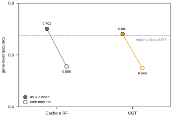
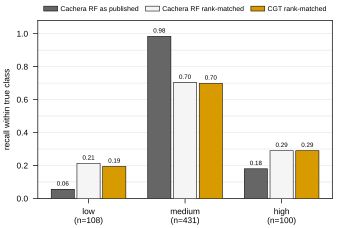
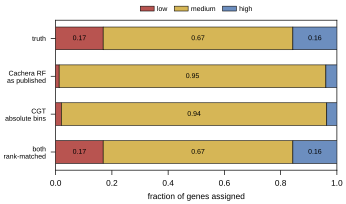
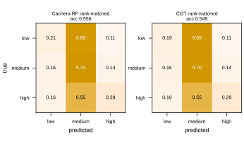

## 2026.07.27 — Read this before quoting any comparison number

Note crumbs so the head-to-head can be run cold. The protocol is fixed **before** we have a
model, so it is not chosen after seeing our number.

| what | where |
| --- | --- |
| split builder | `experiments/020-cachera-betaxanthin/scripts/build_merzbacher_split.py` |
| split output | `results/merzbacher_nested_split.json` |
| baseline analysis | `experiments/020-cachera-betaxanthin/scripts/analyze_merzbacher_baseline.py` |
| baseline output | `results/merzbacher_baseline_analysis.json` |
| their archive (sha256-pinned) | `$DATA_ROOT/data/merzbacher2025_fcl/` |

### What their deposit gives us — far more than the paper implies

The manuscript reports no split and an inconsistent test N (Fig 4b 659, Table S6 649, 20 % of
811 = 162). The Zenodo **code** deposit (10.5281/zenodo.15518666 → record 15761895) has:

| file | what it gives us |
| --- | --- |
| `data/yeast_production_test_split.csv` | the exact 640-ORF test set |
| `data/yeast_production_validation_split.csv` | same genes + released `label` 0/1/2 + CV `fold` |
| `training/yeast_training_production.py` | the exact binning rule |
| `figures/fig4/fig4b.csv` | per-fold accuracy, macro-F1, **MCC**, class-2 accuracy |
| `figures/fig4/fig4c_*.csv` | **per-gene, per-flux-sample predictions + class scores** |

Only the 49 MB code archive is mirrored; `data.zip` is 23 GB of flux samples we do not need.

### THEIR TRUE BASELINE — from their own shipped predictions

Aggregated to gene level by majority vote over each deletion's flux samples, exactly as their
`tools/knockout_voting.py` does. Best model, `RandomForestClassifier_Resampled`:

| true ↓ / pred → | low | **medium** | high |
| --- | --: | --: | --: |
| low (109) | 6 | **101** | 2 |
| medium (431) | 2 | **424** | 5 |
| high (100) | 0 | **82** | 18 |

- gene-level accuracy **0.700**, majority-class rate **0.673**
- **607 of 640 genes called medium — 94.8 %**
- **18 of 100 high producers found**
- majority predictor gets 431/640; theirs gets 448/640. **The entire margin is 17 genes.**

**They computed MCC and did not report it.** From `fig4b.csv`:

| model | accuracy | MCC | high-producer acc |
| --- | --: | --: | --: |
| RandomForest | 0.698 | **0.232** | 0.181 |
| RandomForest_Balanced | 0.698 | 0.233 | 0.117 |
| LogisticRegression | 0.515 | **0.041** | 0.233 |
| LinearSVC_Resampled | 0.445 | **0.031** | 0.273 |

MCC 0.23 is weak but **not zero** — there is real signal, concentrated in the majority class.
Be fair in any writeup: they claim "promising accuracy", not a significant gain.

**The decisive structural point:** every model that finds more high producers has *worse*
overall accuracy, because the only way to call more highs is to stop calling everything
medium. **Accuracy actively selects against the capability the task is about.**

### The recipe, fixed in advance

1. **Ground truth = THEIR RELEASED LABELS**, never labels we re-derive. Their rule min-max
   scales to [0,1] then cuts at 0.40 / 0.65, so the cuts depend on the observed extremes.
   Applied to our (larger) copy of the same screen it gives 107/476/56 against their
   109/431/100 — 81.2 % agreement, and **we call barely half as many high producers**. Same
   rule, same screen, different classes. Re-deriving would compare different tasks.
2. **Bin OUR predictions with thresholds fitted on the TRAIN split only.** Fitting on test
   leaks the class distribution, which on a 67 %-majority problem is most of the answer.
3. **Primary metrics are imbalance-immune**: Spearman, and top-*k* enrichment on high
   producers. Report **MCC** next to accuracy — they had it, so we should show it.
4. **Also report accuracy + per-class + high-producer recall**, so the comparison lands on
   their terms too.
5. **State the fraction of genes we call medium.** If ours is also ~95 %, we reproduced their
   failure mode rather than beat it, and must say so.

### Reconciliations to carry into any writeup — report, never resolve silently

- **639 of 640** of their test genes are in our test split. The one missing is `YBR011C` =
  **IPP1**, which is **essential** ([SGD S000000215](https://www.yeastgenome.org/locus/S000000215),
  null inviable). No haploid deletion collection contains *ipp1Δ*, so no screen could have
  measured it — **their test set contains a gene with no possible deletion phenotype.**
- **`PPA1` is an alias of both IPP1 and VMA16.** The screen has ONE `PPA1` row; their split
  has BOTH YBR011C and YHR026W as separate test genes. At least one of their test entries
  plausibly carries **VMA16's** value scored as if it were IPP1. Our screen-local
  disambiguation (`PPA1`→VMA16, `FEN1`→ELO2) is documented in the split builder, with the
  reasoning recorded so it can be re-derived if its premises change.
- **640 vs the paper's 811** — a 171-gene gap the Methods do not count ("sampling failed to
  converge").
- **Their validation folds appear drawn from the same 640 genes as their test list**
  (`yeast_training_production.py:124-143`), which would mean model selection touched test
  data. FLAGGED, not claimed — confirming needs `yeast_single_knockouts.npz` from the 23 GB
  archive.
- Our Cachera build is **stale** w.r.t. the name resolver (issue #195). The split is built
  from the RAW screen + resolver so it does not inherit that, but **training data still
  will** until a rebuild.

### What we can report that they cannot

- **Regression at all.** They tried and abandoned it — *"challenging with the limited number
  of knockouts at the high and low ends."* Our betaxanthin noise ceiling is **r = 0.914**
  (reliability 0.836, median 15 replicates), so regression is available to us.
- **The ~3,900 non-metabolic deletions.** FCL has no flux cone for a gene outside Yeast9, so
  it cannot make a prediction at all. We predict all ~4,700. That is a category difference,
  not a tie-break.

### Where our model stood when the sweeps were paused

`020-cachera-betaxanthin`, study `betaxanthin_002`, 33/40 trials before cancellation:
**val Pearson 0.430** — 47 % of the 0.914 ceiling — with `prot_T5_all` / learnable **False** /
`crps` / L=2 / hidden 90 / λ 6.5e-5 / decayed / yeo-johnson. The top-5 configs agreed closely,
so it is a plateau rather than a lucky trial. Companion arms: `021-ozaydin-beta-carotene`
(Spearman 0.223) and `022-mulleder-metabolome` (0.180, up from a historical ≤ 0.025).

Related: [[plan.cgt-metabolism-flux-layer.2026.07.26]] ·
[[plan.simb-2026-multimodal-cgt.2026.07.21]]

## 2026.08.01 - Head-to-head vs Cachera/Merzbacher on their 639 test genes

Four standalone figures from `experiments/020-cachera-betaxanthin/scripts/plot_merzbacher_comparison.py`,
built from the 10 finished Delta `020_v4` cells (`$DATA_ROOT/test-predictions/`) and their
shipped `figures/fig4/fig4c_*.csv`. Scored on the 639 genes carrying their label, a CGT
prediction, and a raw screen value (their 640th, IPP1/YBR011C, is essential -- no deletion
strain exists, so no screen could measure it).

**Only their RandomForest_Resampled is shown** -- the other three Fig 4b models are strictly
worse on their own gene-level numbers (0.56-0.64 vs RF's 0.700). **CGT is one cell**, selected
by VALIDATION (`s09_L6_maskon_lr0.0001_yj`, val pearson 0.3639), never by its score on their
test genes: with ~10 cells at sigma ~ 0.03, picking on test would be worth ~2 sigma of free
improvement.

Provenance: our re-derivation of their deployed gene-level vote reproduces their published
accuracy (0.7011 vs 0.700), asserted in the script rather than assumed.

### Fig 1 -- the published accuracy advantage is a majority-class artifact

Their RF's 0.701 clears the 0.674 majority rate by calling **95 % of genes medium**; CGT's
absolute binning sits at 0.681 doing the same thing (94 % medium, and it never calls a single
gene low). Force both sides to the true class marginal and RF drops to 0.556, CGT to 0.549.
**Accuracy above the majority line is the conservative-majority strategy, not discrimination
-- for both models.**

### Fig 3 -- per-class recall: CGT finds more high producers

Rank-matched, CGT reaches **0.29 recall on high producers against their published 0.18**, and
0.19 on low against their 0.06 -- paid for in medium recall (0.70 vs 0.98). Rank-matching
their RF costs them the same way and lands them at the same 0.29, which is why both binnings
are shown for both models.

### Fig 2 -- predicted class distribution

### Fig 4 -- confusion matrices, both sides rank-matched

The two confusion matrices are near-identical (0.556 vs 0.549) but the models are NOT making
the same predictions: their gene-level score correlates with CGT's at **r = 0.108** and the
rank-binned labels agree on only **52 %** of genes. Two differently-wrong models of equal
strength -- which is what makes an ensemble worth testing.

**Can their side really be ranked?** Yes -- they release more than classes.
`fig4c_*.csv` carries `score0/score1/score2` (P(low)/P(med)/P(high), summing to 1.0) for each
of 124 flux samples per gene across 640 genes, which aggregates to 558 distinct gene-level
values. Two checks before relying on it: (1) TIES ARE INERT -- 82 genes share a value and tie
order is arbitrary, but over 200 random permutations their accuracy moves 0.5563 +- 0.0008 and
high recall not at all; (2) THE AGGREGATION IS NOT LOAD-BEARING, and the one used is the most
generous to them -- `E[class]` 0.5556/0.290, `p_high - p_low` identical, `p_high` alone
0.5446/0.280.

**Why both sides can be rank-matched.** Their models emit classes; CGT emits a regression
value, and binning it with their absolute cuts charges CGT for calibration as well as for
ordering. Rank-matching only CGT would be rigged -- forcing the true marginal is information
their classifier never had. Their `fig4c_*.csv` ships per-flux-sample class PROBABILITIES with
`knockout_name`, so their model also has a continuous gene-level score
(`E[class] = p_med + 2*p_high`, averaged over a gene's flux samples). The same rule is applied
to both.

**Caveat on MCC.** The 0.205 quoted elsewhere is their PER-FLUX-SAMPLE MCC; they never
published a gene-level MCC. Accuracy and high-producer recall are gene-level on both sides and
are the clean comparisons.
