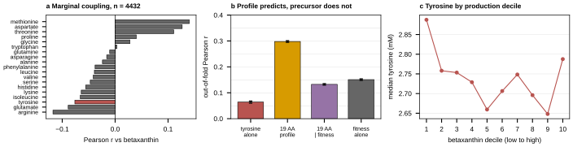

## 2026.08.26 - Is betaxanthin coupled to the free amino-acid pool

Script: `experiments/023-metabolome-betaxanthin-joint/scripts/betaxanthin_amino_acid_predictivity.py`
Results: `experiments/023-metabolome-betaxanthin-joint/results/betaxanthin_amino_acid_predictivity.json`
plus `betaxanthin_amino_acid_marginals.csv`.

### The question

`conf/igb_bx_aa.yaml` spends an allocation on whether a `mulleder19` auxiliary head moves
the betaxanthin metric, on the mechanistic premise that betalains derive from L-tyrosine.
This asks the prior question directly from the two measured screens, with no model:
does a deletion's free amino-acid pool carry information about how much betaxanthin that
same deletion makes. 4,432 deletions carry both.

### Answer: the PROFILE does, the PRECURSOR does not

| predictor of betaxanthin | out-of-fold Pearson r | n |
|---|--:|--:|
| tyrosine alone (the precursor) | 0.064 | 4,432 |
| **19 amino acids jointly** | **0.298** | 4,432 |
| single-mutant fitness alone | 0.151 | 3,708 |
| 19 amino acids | 0.176 | 3,708 |
| 19 amino acids + fitness | 0.200 | 3,708 |
| 19 amino acids, fitness regressed out of both | 0.133 | 3,708 |
| 19 amino acids, on the 724 with NO fitness record | **0.455** | 724 |

Ridge, 5 folds, 3 shuffles; spread across shuffles <= 0.022 everywhere.

- Tyrosine's marginal correlation is **-0.076** (p = 3.9e-07), NEGATIVE, ranking 6th of 19
  by absolute value. Strongest is methionine +0.140, then aspartate +0.127, arginine
  -0.118. No amino acid exceeds |r| = 0.15. The marginals reproduce
  `experiments/019-simb-multimodal/results/pigment_noise_ceiling.json` exactly; the script
  ASSERTS that rather than assuming it.
- Correcting for the betaxanthin side's known reliability (0.836) raises these by 1.094.
  Mulleder has `n_replicates = 1` and no SE, so its reliability is unmeasurable and the
  full disattenuation is unknown. **0.298 is a floor, not an estimate.**
- The 724 deletions with no Costanzo KanMX record have betaxanthin sd 0.914 against 0.464
  for the rest. Most of the signal lives in that high-variance population.
- Panel (c): the tyrosine-by-decile relationship is **non-monotone** (highest in the LOWEST
  production decile, falls, rises again at the top), which is why the linear correlation
  reads near zero. The axis spans 2.65-2.89 mM, about 9% of the median.

**Hypothesis (untested):** the Cachera background carries ARO4-K229L and ARO7-G141S,
feedback-resistant alleles that release the shikimate pathway from the control shaping the
Mulleder pools, so free tyrosine in an unengineered strain need not be what limits flux in
an engineered one. Nothing here tests that.

### Consequence for the planned replication

`igb_bx_aa.yaml`'s tyrosine-only arm is now predicted to be the NULL arm and the
19-amino-acid arm the live one, which is a sharper prediction than the config was written
against. Keep tyrosine as a negative control, not as the headline contrast.

Measured separately (see
[[experiments.019-simb-multimodal.phenotype-strand-retrospective]]): adding the metabolome
head to the betaxanthin head currently COSTS -0.0265 +- 0.0159 over five comparable 023
grid cells. The coupling is in the data; the current head does not use it.

