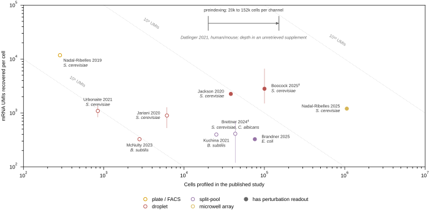
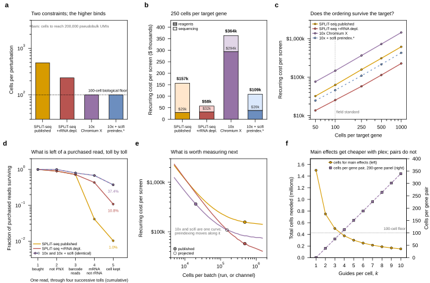

> **2026.08.20 — this content now lives in a typeset document.**
> `notes-tex/024-perturb-seq-costing/` → `main.pdf` (build with `make` in that directory).
> The tex version is restructured to the six-section plan, adds the Yao 2024
> compressed-Perturb-seq analysis, and carries visible provenance flags. Treat the
> tex as the deliverable; this note is retained below as the working record.
> **Recommendation:** once the tex has been reviewed, shrink the prose below to a
> summary paragraph so there is only one copy of each number.

## 2026.08.24 - Where this note came from

The precursor is [[experiments.024-perturb-seq-costing.spc-capseq-design-sketch]], written on
2026.08.14 as a design sketch for reading a pooled CRISPRi screen out of
semipermeable capsules. It was graduated out of `scratch.*` on 2026.08.24 and
kept as written, because it records what was believed before any costing existed.

The review reaches a different conclusion, and the difference is the point.
The sketch assumed capsules; the review costs the two chemistries that have
actually been run in a microbe, split-pool and droplet, and demotes SPC to the
Outlook section because a capsule cannot be aliquoted and small molecules leak
through a 30 nm pore. What survived unchanged is the framing: the estimand is a
perturbation-by-gene matrix rather than a hit list.

## 2026.08.18 - Method Review and Costing for Microbial Perturb-seq

Companion design sketch: [[experiments.024-perturb-seq-costing.spc-capseq-design-sketch]] (Atrandi SPC +
CapSeq route). This note covers the **commodity, benchtop route** -- split-pool and
droplet -- and prices it end to end.

**All tables also render standalone (landscape, one per block, for screenshotting):**
[[experiments.024-perturb-seq-costing.tables]] -> `notes/assets/pdf-output/experiments.024-perturb-seq-costing.tables.pdf`

**Generating scripts** (every number below is regenerated by these; nothing is
hand-authored):

- `experiments/024-perturb-seq-costing/scripts/method_data.py` -- literature constants
- `experiments/024-perturb-seq-costing/scripts/cost_data.py` -- Brettner + Gaisser line items
- `experiments/024-perturb-seq-costing/scripts/uiuc_core_data.py` -- UIUC Carver rates
- `experiments/024-perturb-seq-costing/scripts/read_structure.py` -- read configurations
- `experiments/024-perturb-seq-costing/scripts/cost_model.py` -- the scenario engine
- `experiments/024-perturb-seq-costing/scripts/cost_per_cell_table.py` -- cost-per-cell tables
- `experiments/024-perturb-seq-costing/scripts/plot_method_landscape.py`, `plot_economics.py`

**Sources** -- sha256-verified artifacts from the `torchcell-library` mirror via `tc-lit`:

- `brettnerUltraHighthroughputMassively2024` -- yeast SPLiT-seq, the cost breakdown
- `jarianiNewProtocolSinglecell2020` -- 10x + in-droplet zymolyase, mRNA per cell
- `nadal-ribellesRiseSinglecellTranscriptomics2024` -- yeast scRNA-seq review
- `urbonaiteYeastoptimizedSinglecellTranscriptomics2021` -- table-top yeastDrop-Seq
- `brandnerPooledSinglecellCRISPRa2025` -- mapSPLiT, pooled CRISPRi/a in bacteria
- `gaisserHighthroughputSinglecellTranscriptomics2024` -- microSPLiT protocol + costs
- `sunGenomescaleCRISPRiScreening2023` -- CRISPRi library review
- `lianMultifunctionalGenomewideCRISPR2019` -- MAGIC, the library we hold

Gaisser's cost supplement is not in the mirror and was pulled separately from Springer
ESM (`41596_2024_1007_MOESM2_ESM.xlsx`, sha256 `2b7813a7...`).

### Bottom line

1. **The $10,000 "start-up cost" in Brettner is one purchase order: the custom IDT
   barcode plates.** $7,699.40 of it, and Gaisser's independent microSPLiT accounting
   puts the same item at $7,844.52 -- two labs, two organisms, 1.9% apart. It is a
   **capital asset good for 215 protocol runs**, not a consumable. You will never
   exhaust it; oligo degradation will retire it first.
2. **The advertised cheapness of SPLiT-seq is a reagents-only number and it does not
   survive contact with a sequencer.** Brettner's $0.005/cell becomes **$0.104 per
   usable cell** end to end -- a 21x hidden multiplier -- because 93.7% of recovered
   transcripts are rRNA and ~75% of sequenced cells get discarded. The honest
   split-pool-vs-droplet gap is **2.3x, not 60x**.
3. **rRNA depletion is the single highest-leverage change available.** It cuts the
   genome-scale bill from **$157k to $58k** and is the difference between "we should
   think about this" and "we can afford this".
4. **A genome-scale screen needs a 4th barcoding round.** Not for throughput -- for
   collisions. At 12M barcoded cells, three rounds plus 96 sublibraries still collide
   at 13.2%; four rounds plus 24 sublibraries collide at 0.59%. The 4th plate costs
   ~$2,600 once and **pays for itself inside one run**.
5. **The blocking problem is not cost, it is that the guide is invisible.** The MAGIC
   library we already have is RNA Pol III (`SNR52p`-guide-`SUP4t`), so it is not
   polyadenylated and **cannot be read by any 3' capture assay**. Every platform here
   needs an expressed poly(A) barcode added. This is the real critical path.

### 1. How much mRNA is in a yeast cell

The denominator for everything else.

| Organism | Quantity | Value | Source |
| --- | --- | --- | --- |
| *S. cerevisiae* | Total mRNA molecules per cell | **20,000 -- 60,000** | Jariani 2020 (`paper.md:31`), citing von der Haar 2008, Marinov 2014, Pelechano 2010, Zenklusen 2008 |
| *S. cerevisiae* | Working figure used by Brettner | ~30,000 | Brettner 2024 (`paper.md:70`), citing Miura 2008 |
| *S. cerevisiae* | Total RNA per cell | 0.7 -- 1 pg, **~85% rRNA** | Nadal-Ribelles 2024 (`paper.md:49`) |
| *S. cerevisiae* | Genes expressed in a basal cell | ~3,000 (half the genome), **avg 3.5 molecules/gene** | Nadal-Ribelles 2024 (`paper.md:107`) |
| *E. coli* | Total mRNA per cell, **rich medium (LB)** | **~7,800** | Bartholomaus 2016, BNID 112795 *(external)* |
| *E. coli* | Total mRNA per cell, **minimal medium** | ~2,400 | Bartholomaus 2016, BNID 112795 *(external)* |
| *E. coli* | Total mRNA per cell, medium growth rate | ~3,000 | Taniguchi 2010, *Science* 329:533 *(external)* |
| *E. coli* | rRNA share of all transcripts | **>95%** | Brandner 2025 (`paper.md:71`) |
| Mammalian | Total mRNA molecules per cell | 50,000 -- 300,000 | Jariani 2020 (`paper.md:31`) |

> **The *E. coli* rows are marked *(external)* because they are NOT in the mirror.**
> No mirrored bacterial paper states a total mRNA content -- Gaisser and Brandner report
> only what their assay *detected*, which is a different quantity and ~30x smaller. Pull
> the primary paper into `torchcell-library` before these enter a proposal.
>
> **Flagged disagreement -- and it matters more than first thought.** Nadal-Ribelles'
> 3,000 genes x 3.5 molecules implies ~10,500 mRNA/cell, materially below Jariani's
> 20,000 floor and Jackson's 40,000-60,000. This was originally recorded as a choice
> the conclusions were not sensitive to; the 2026.08.21 audit showed that is wrong.
> `p_j` enters the design equation only through the shot-noise term, where both
> candidate platforms sit, so `n*` scales with it almost directly: 137 cells per
> perturbation at 10,500, 359 at 30,000, 699 at 60,000. The working `p_j = 3.5/30,000`
> also mixes sources -- the 3.5 was derived against the ~10,500 figure -- so used
> self-consistently it would cut every cells-per-perturbation number by 2.9x. The
> 30,000 pairing is kept because it is the conservative one. Measure `p_j` directly
> in pilot data; it is the largest unforced uncertainty in the budget.

The consequence that matters: a yeast cell has **~5x less mRNA than a mammalian cell
spread over ~3x fewer genes**. Every scRNA-seq chemistry in existence was tuned on
mammalian input. That is why yeast per-cell recovery is poor everywhere, and why
pooling cells is not a convenience but the whole measurement strategy.

And **a yeast cell holds ~4x the mRNA of an *E. coli* cell in LB, ~10x one in minimal
medium.** That, plus the worse bacterial rRNA burden (>95% vs ~85%), is why the same
split-pool chemistry recovers 410 mRNA UMIs/cell in yeast but only 235--397 in bacteria.
Yeast is the easier organism here, which is worth remembering given that the only
published pooled single-cell CRISPR screen is bacterial.

### 2. The method landscape

{width=85%}

Dotted diagonals are iso-lines of constant **total** mRNA UMIs. In the shot-noise limit
that product -- cells x depth -- is what sets precision, so moving along a diagonal is
free and moving up-and-right is what costs money. Filled markers have a perturbation
readout.

| Study | Platform | Isolation | Cells | mRNA UMIs/cell | Genes/cell |
| --- | --- | --- | ---: | ---: | ---: |
| Gasch 2017 | Fluidigm C1 / SMART-Seq v4 | plate | 163 | 2,351 median (735--5,437) | -- |
| Nadal-Ribelles 2019 | FACS + STRT-seq | plate | 285 | 3,339 mean | -- |
| Jackson 2020 | 10x 3' v2 | droplet | 38,225 | ~2,000 | ~684--700 |
| Jariani 2020 | 10x 3' v2 + in-droplet zymolyase | droplet | 6,118 | 528--1,261 median | -- |
| Urbonaite 2021 | yeastDrop-Seq (table-top) | droplet | 844 | 840--1,336 mean | 443--619 |
| Dohn 2021 | mDrop-seq | droplet | 74,814 | -- | 193--967 |
| Boocock 2023 | 10x 3' v2 + v3 | droplet | 100,220 | 1,514--6,559 | -- |
| **Brettner 2024** | **yeast SPLiT-seq** | **split-pool** | **43,388** | **120--700 mean** | **100--600** |
| microSPLiT (*B. subtilis*) | microSPLiT | split-pool | ~1,000,000 | 397 median | 230 |
| mapSPLiT (*E. coli*, CRISPRi/a) | microSPLiT + guide barcode | split-pool | 76,068 assigned | 325 median | 161 |

Two corrections to the naive reading:

- **Nadal-Ribelles 2019 is reported inconsistently.** Jariani says "detected on average
  3339 transcripts"; the Nadal-Ribelles review's own Table 1 says "3399 genes". 3,399
  genes in one yeast cell is not plausible for scRNA-seq. Treated here as transcripts.
- **Brettner and Boocock are the same era but an order of magnitude apart in depth.**
  Boocock got 1,514--6,559 UMIs/cell on 100,220 cells with stock 10x v3. That is the
  real frontier for yeast, and it is droplet, not split-pool.

### 3. Anatomy of the Brettner cost model

All quotes from `brettnerUltraHighthroughputMassively2024` Methods 5.1.9 (`paper.md:183`).

#### 3.1 What the start-up cost actually is

> "300uL 100uM prediluted plates for the round 1 reverse transcription and rounds 2 and
> 3 ligations were ordered from Integrated DNA Technologies (IDT) for **$7699.40**.
> These plates contain enough volume to complete **300 RT, 250 r2, and 215 r3
> ligations** with careful pipetting. Using the lowest capacity of the round 3 plate,
> this comes to **$36 in barcoding oligos per protocol**."

That is the answer to "what is the upstart cost referring to". It is **three 96-well
plates of custom barcoded oligos**, and it is ~77% of the $10,000. The rest:

| Item | Cost | Scaling |
| --- | ---: | --- |
| IDT barcode plates (RT r1, ligation r2, r3) | $7,699.40 | **one-time, 215 runs** |
| Standalone oligos (lyophilized) | $270.60 | one-time |
| Maxima H Minus RT (Thermo EP0753) | $835--845 | **per run** ("enough for just over 1 experiment, but not enough for 2") |
| T4 DNA Ligase (NEB M0202M) | $270 | **per run** |
| RNase inhibitors (SUPERase-In + Enzymatics) | $630 / 5 runs = $127 | per run |
| Barcoding oligos drawn from the plates | $36 | per run |
| Dynabeads MyOne Streptavidin C1 | $638/2 mL, 44 uL each = $14 | **per sublibrary** |
| Enzymatics WGS fragmentation + ligation | $39 | per sublibrary |

Rolled up by Brettner: **start-up ~$10,000, per-protocol ~$1,300--1,700, plus $55 per
sublibrary.** (The OCR renders the middle figure as "$12300-1700"; summing the line
items gives 840 + 270 + 127 + 36 = $1,273, confirming $1,300--1,700 is intended.)

**Independent replication.** Gaisser's microSPLiT supplement, built separately for
bacteria, gives start-up **$8,142.52**, of which **$7,844.52** is "Bardcode Plates,
100uM, Custom IDT" (sic). Per run: $790.78 for 1 sample, $2,035.82 for 24, $3,196.53
for 48 -- and critically, **barcode cost per run is flat at $20.67 regardless of sample
count**. Two independent accountings agree that the barcode plates are the start-up
cost and that their per-run draw-down is trivial.

#### 3.2 What constitutes a "full experiment"

One **protocol run** (Brettner's "instance of the protocol") is one pass through:

1. fix + permeabilize cells, count, dilute to 1M cells/mL;
2. load **up to 96 samples** into the RT plate (one barcode per well);
3. two ligation rounds with pooling and re-splitting between;
4. pool, split into **sublibraries**, lyse;
5. template switch, cDNA amplification, WGS library prep **per sublibrary**;
6. sequence.

It consumes exactly one use of each barcode plate, one tube of RT enzyme, one tube of
ligase, and one fifth of the RNase inhibitors. Brettner ran RT in **48 wells at 5,000
cells/well = 240,000 cells**; scaled to a full 96-well plate that is **~480,000 cells
per run**, which is where the paper's "approximately 400,000 cells for approximately
$2000" comes from.

The **sublibrary** is the separate unit: it is the unit of library prep, of Illumina
index, and (see §4) of barcode space. Brettner split into 10 sublibraries of
5,000--20,000 cells.

Cell recovery is poor and must be budgeted: "Given we started the experiment with
between 200,000 and 300,000 cells, this estimates a capturing efficiency between **25%
and 50%**" (`paper.md:68`). Gaisser is blunter -- cell loss "could reach [>=]70%", and
they refuse to run below 1M input cells.

#### 3.3 When does the start-up cost get repurchased

**Effectively never, on volume.** The round-3 plate is the binding constraint at 215
uses. At a realistic 5--10 protocol runs per year that is a **20-year supply**. The
practical retirement trigger is **oligo degradation and freeze-thaw**, not depletion.

Two consequences worth acting on:

- **You are massively over-buying.** 300 uL at 100 uM per well is ~30 nmol per oligo.
  If the plan is 20 runs, not 215, ask IDT for a lower synthesis scale or smaller
  volume. *This has not been priced -- get a quote before assuming a large saving,
  since plate and per-oligo synthesis fees may dominate volume.*
- **It is a natural thing to share.** One plate set supports an entire department.

The genuinely recurring items are the RT enzyme ($840) and ligase ($270), which
Brettner explicitly repurchases every run.

#### 3.4 Cost per cell, with citations

Generated by `cost_per_cell_table.py` -> `results/cost_per_cell.csv`.

| Method | Organism | Isolation | $ / cell | Basis | Source |
| --- | --- | --- | ---: | --- | --- |
| MATQ-seq | *bacteria* | plate | $50.00 | derived | Gaisser 2024, *Nat Protoc*, Suppl. Table 2 |
| Plate FACS + STRT-seq (Nadal-Ribelles 2019) | *S. cerevisiae* | plate | $4.15 | quoted | Jariani 2020, *eLife* 9:e55320 |
| 10x Chromium 3' v2 (Jariani 2020) | *S. cerevisiae* | droplet | $0.3000 | quoted | Jariani 2020, *eLife* 9:e55320 |
| ProBac-seq | *bacteria* | droplet | $0.1649 | derived | Gaisser 2024, *Nat Protoc*, Suppl. Table 2 |
| PETRI-seq | *bacteria* | split-pool | $0.0367 | derived | Gaisser 2024, *Nat Protoc*, Suppl. Table 2 |
| microSPLiT (1 sublibrary) | *bacteria* | split-pool | $0.0172 | derived | Gaisser 2024, *Nat Protoc*, Suppl. Table 2 |
| SPLiT-seq (Brettner 2024) | *S. cerevisiae* | split-pool | $0.00500 | derived | Brettner 2024, *Yeast* 41:242 |
| microSPLiT (full scale) | *bacteria* | split-pool | $0.00251 | derived | Gaisser 2024, *Nat Protoc*, Suppl. Table 2 |

Verbatim anchors for the two **quoted** rows (the rest are a total divided by a cell
count the same source supplies, and are marked derived):

> "the ability to increase sample size in droplet-based methods allows the library
> preparation cost to be greatly reduced to **$0.3/cell** compared to previously
> reported costs of **$4.15/cell** (Nadal-Ribelles et al., 2019)"
> -- Jariani 2020, `paper.md:172`

**The spread is ~20,000x.** It is also misleading, because **every row is library prep
only**. Costing the same platforms end to end, per cell that survives QC *and* carries
an identified guide (`results/cost_per_cell_loaded.csv`, 6,000 genes at 250 cells/gene):

| Platform | Reagents $/cell processed | **Loaded $/usable cell** | Hidden multiplier | Sequencing share |
| --- | ---: | ---: | ---: | ---: |
| SPLiT-seq, as published | $0.0049 | **$0.1044** | **21.3x** | 81.2% |
| SPLiT-seq + rRNA depletion | $0.0053 | **$0.0383** | 7.2x | 44.2% |
| 10x Chromium X (GEM-X 3') | $0.1077 | **$0.2424** | 2.3x | 19.2% |

The model reproduces Brettner's $0.005/cell from independent line items ($0.0049),
which is the check that it is wired up correctly.

**This table is the most important result in the note.** The reagents-only comparison
says split-pool beats droplet by 22x. The real comparison says **2.3x**. The gap is
rRNA and discarded cells, and it is recoverable -- with depletion the advantage returns
to 6.3x.

### 4. Barcode space: three rounds, four rounds, and sublibraries

Collision rate, per Gaisser's published formula $100(1-((B-1)/B)^{C-1})$ with $B$
barcode trajectories and $C$ cells barcoded together (`results/barcode_collision.csv`;
the model reproduces their 5%-at-45,000-cells operating point to 4.96%).

**The commonly missed point: the sublibrary index is a real barcode dimension.** Cells
are split into sublibraries *after* the last in-cell ligation, so two cells sharing a
BC1-BC2-BC3 path are still resolved if they land in different sublibraries. Effective
space is $96^R \times S$, not $96^R$. Leaving $S$ out is the usual way to over-estimate
collisions -- and including it is how Brettner's ~880k barcode space supported 43,388
cells at "well under five percent" collisions.

| Rounds | Sublibraries | Barcode space | Collision @ 480k cells | Collision @ 12M cells |
| ---: | ---: | ---: | ---: | ---: |
| 3 | 1 | 884,736 | 41.9% | 100% |
| 3 | 24 | 2.12e7 | 2.2% | 43.2% |
| 3 | 96 | 8.49e7 | 0.56% | 13.2% |
| **4** | **24** | **2.04e9** | **0.02%** | **0.59%** |
| 4 | 96 | 8.15e9 | 0.006% | 0.15% |

#### How "4x barcodes" changes the pricing structure

Two readings, both real, and they price very differently.

**(a) A fourth barcoding round** -- what Brettner means by "adding one more ligation
reaction yields almost 85 million unique combinations with only the trivial cost of
adding another plate of 96 barcode oligos" (`paper.md:46`), and what microSPLiT already
does as standard.

- **One-time:** one more IDT plate, ~**$2,566** (pro-rata from the $7,699.40 three-plate
  order).
- **Per run:** ~$12 more barcode draw-down, plus ~50% more T4 ligase (~$135) for the
  third ligation. Call it **+$150/run**.
- **Buys:** 96x the barcode space.
- **Costs:** one more split-pool ligation, and every ligation loses material. Yield loss
  is the only argument against and must be measured in the pilot.

**The payback is under one run.** At 480,000 cells/run and a 1% collision target, three
rounds needs **54 sublibraries** ($2,970/run in Dynabeads + WGS kits). Four rounds
clears 1% at a single sublibrary, so the count drops to whatever PCR complexity
dictates -- ~11 at Gaisser's 45,000-cells-per-sublibrary working limit ($605/run). That
saves ~$2,365 per run against a $2,566 one-time cost.

**(b) 384-well plates instead of 96** -- $384^3 = 5.7\times10^7$, comparable to $96^4$,
and it quadruples RT-plate throughput to ~1.9M cells/run. But it costs **4x the oligos**
(~$30,000 for the plate set) and 4x the pipetting. For a pooled screen where the RT
barcode is *not* being used for sample multiplexing, this is the way to cut the number
of protocol runs -- but the 4th ligation round is far cheaper per unit of barcode space.

> **Structural point for a pooled screen.** Brettner sells SPLiT-seq on "96 samples
> multiplexed in one run". In a pooled CRISPRi screen you have **one** sample; guide
> identity comes from the transcriptome, not the well. So the RT plate's value flips
> from multiplexing to raw throughput, and the multiplexing capacity should be spent on
> **environments** instead -- which is the axis that actually multiplies design size.

### 5. How many genes per cell does the method allow

The question has two readings and both matter.

**(a) Genes *detected* per cell.** Brettner: **100--600 on average, 120--700 mRNAs**,
i.e. "0.2-12% of the active transcriptome". Against ~6,000 genes, **~90--98% of the
single-cell matrix is zero**.

> This is the uncomfortable consequence: at these depths you cannot read one cell's
> transcriptome. The assay is really a **massively multiplexed pseudobulk** measurement
> with the *option* of stratifying by cell state, not a single-cell assay in the sense
> the name implies. Brettner says as much -- "algorithms leverage the fact that the
> transcripts recovered differ for every cell, so they can construct a fuller
> transcriptome by clustering together many single-cell transcriptomes". Plan the
> analysis around pseudobulk-per-guide from the start.

**(b) Genes *perturbed* per cell.** As published, **one**. Multi-guide is demonstrated
in the same chemistry by Brandner: "Two or three genes were targeted simultaneously by
expressing multiple sgRNAs from a plasmid containing a single GBC ... ten two-guide
cassettes and eight three-guide cassettes". The ceiling is set by cloning and by guide
detection compounding (§9), not by the barcoding chemistry.

### 6. How many cells per guide to see the mean behaviour

{width=100%}

Two **independent** constraints. The taller one binds (panel a).

**Constraint 1 -- biological floor.** Averaging out cell-cycle and metabolic-state
heterogeneity takes cells, and no amount of sequencing depth substitutes. The field
standard, stated explicitly by Brandner: perturbations are kept only with "**at least
100 cells** following standard approaches in scRNA-seq perturbation screens"
(`paper.md:89`). Brettner's own heuristic is "500 cells per experiment to achieve
adequate coverage" (`paper.md:48`).

**Constraint 2 -- pseudobulk depth.** For gene $j$ pooled over $n$ cells at depth $d$,
pseudobulk counts are $\approx n d p_j$ and $\mathrm{Var}(\log K)\approx 1/K$. Detecting
a fold change $\Delta$ at 80% power, $\alpha=0.05$ needs

$$
K \;\ge\; \left(\frac{z}{\Delta \ln 2}\right)^2 ,\qquad z = 2.80 ,
$$

so **~16 UMIs of that gene** for 2-fold, ~65 for 1.4-fold, ~159 for 1.25-fold. What a
given pseudobulk budget reaches (`results/detection_ladder.csv`):

| Tier | Pseudobulk mRNA UMIs / perturbation | Lowest detectable gene, 2-fold | ... at 1.5-fold |
| --- | ---: | ---: | ---: |
| Screen (strong coherent effects) | 5.0e4 | 9.8 copies/cell | 28.6 copies/cell |
| **Standard** | **2.0e5** | **2.5 copies/cell** | 7.2 copies/cell |
| Deep (low-abundance regulators) | 1.0e6 | 0.5 copies/cell | 1.4 copies/cell |

At the standard tier, cells needed per perturbation = $2\times10^5 / d$:

| Method | mRNA UMIs/cell | Cells/perturbation | Binding constraint |
| --- | ---: | ---: | --- |
| SPLiT-seq as published | 410 | **488** | sequencing depth |
| SPLiT-seq + rRNA depletion | 861 | **233** | sequencing depth |
| 10x v2 (Jariani) | 894 | 224 | sequencing depth |
| 10x v3 (Jackson) | 2,000 | **100** | biological floor |
| 10x v3 (Boocock) | 4,036 | 100 | biological floor |

Two things fall out. First, **488 cells reproduces Brettner's own 500-cell heuristic**
from an independent derivation, which is a good sign the framework is right. Second,
**depth buys you out of cells only until you hit 100**; past 10x v3 the extra depth is
wasted on this question and should be spent on more perturbations instead.

### 7. Sequencing: what UIUC actually has, and single vs paired end

Rates from <https://biotech.illinois.edu/dna-services-core/dna-services-pricing/>,
effective **2026-08-01**, retrieved 2026-08-18. Listed rates are the on-campus rate;
external users pay +30.8% (capped at 20% for State of Illinois institutions).

> **The instrument list is narrower than you may expect.** The core has **only the
> NovaSeq X Plus and the MiSeq i100** (plus PacBio Revio and Nanopore GridION). There
> is **no NextSeq and no NovaSeq 6000** -- two pages still mention a 6000 in stale
> prose, but it is not on the instrument list or the rate table. This matters because
> the microSPLiT protocol is written against a NextSeq 2000 P2, which does not exist
> here. The real choice is a ~25M-read MiSeq run or a >=800M-read NovaSeq X lane, with
> **nothing in between**.

#### Single end or paired end

**Both methods require paired-end. Neither can use a single-read flow cell.** But they
put the barcode on *opposite* reads, which trips people up at submission
(`read_structure.py`):

| Method | Read 1 | Read 2 | Index | Cycles |
| --- | --- | --- | --- | ---: |
| **SPLiT-seq** | **74+ nt cDNA** | **86 nt barcodes** | 6 or 8 nt | 160 |
| **10x 3'** | **28 nt barcode** | **90 nt cDNA** | dual 10 nt | 118 |
| Drop-seq | 20 nt barcode | 100 nt cDNA | 8 nt | 120 |

Read 2 in SPLiT-seq is BC3 + BC2 + BC1 + a 10 nt UMI; Read 1 in 10x is a 16 nt cell
barcode + 12 nt UMI (v2 is 16 + 10). **The SPLiT-seq index is the sublibrary index,
which is barcode round 4** -- not merely a sample tag.

Gaisser is explicit: "Use a paired-end sequencing run with a >=150-bp kit. Set read2 to
86 nt (cell-specific barcodes and UMI). Set read1 to >=74 nt (cDNA sequence)... Include
a 6-nt read 1 index to read sub-library indices (this is the fourth round of barcodes).
Use [>=]10% PhiX spike-in." Brettner: "Experiment 1 was paired end sequenced on a full
lane of the HiSeq X ... Experiments 2 and 3 ... with dual 8 bp indices."

Neither can run single-read for the same reason: with one read you get barcodes and no
transcript, or transcript and no cell identity. Note the asymmetry -- for 10x the cDNA
itself is still sequenced from one end only; "paired" there means "barcode read plus
insert read".

**Paired-end costs nothing extra at UIUC**, which is not obvious and is worth checking
at any other core:

- Nova X **25B PE150, 8+ lanes: $3,180 / 3.2e9 pairs = $0.994 per M read pairs**
- Nova X 10B SR100, 8+ lanes: $1,270 / 1.2e9 reads = $1.058 per M reads

The largest flow cell is paired-end only and still wins on price per read.

#### Three sequencing gotchas specific to split-pool

1. **PhiX is a 10% tax, not hygiene.** Read 2 carries fixed linker sequence at defined
   cycles, so base diversity collapses there and patterned flow cells mis-register
   clusters. Budget >=10% of every lane as PhiX. Combined with 70--90% valid-barcode
   rates, only **~72% of purchased reads become usable data** -- this is in the model.
2. **Unique dual indices are mandatory on NovaSeq X.** ExAmp clustering on a patterned
   flow cell hops indices at ~0.1--2%. For ordinary RNA-seq that is minor sample bleed.
   For SPLiT-seq the sublibrary index **is barcode round 4**, so a hopped index moves a
   cell into another sublibrary's namespace and manufactures a barcode collision.
   Brettner moved from a single 6 bp index to dual 8 bp indices between experiments.
3. **Spend the free cycles on cDNA.** A 2x150 kit gives 300 cycles; you need 160. Set
   read 1 to 150 nt rather than 74. It is free and it helps with the *S. cerevisiae*
   whole-genome-duplication paralogs that forced Brettner to keep multimappers.

#### MiSeq vs NovaSeq: quality is not the difference

Base quality is comparable (MiSeq is if anything slightly better on long reads). The
difference is **~1,000x in read count**, so the two have different jobs:

| Use | Instrument | Cost |
| --- | --- | ---: |
| Guide-library representation check (pre-transformation) | i100 25M SR100 | $986 |
| Barcode-structure / complexity QC on one sublibrary before committing a flow cell | **i100 titration run** | **$398** |
| Saturation curve to fix per-cell read depth | i100 25M 2x150 | $1,450 |
| Production | Nova X 25B PE150, 8+ lanes | $3,180/lane |

**Always burn one $398 titration run before a NovaSeq lane.** Brettner's warning is
that there is no earlier checkpoint: "cDNA gel traces or library concentrations are not
a good indicator of barcoding success or of the number of reads or genes that will be
recovered per cell". A $398 run protects a $3,180--$25,440 commitment.

The other NovaSeq consideration is **granularity**. A 25B lane is 3.2 billion read
pairs. If the experiment does not fill it, you either co-load with other users or waste
the difference -- the 10B **split lane** ($1,160) is the smallest sensible production
unit.

#### Cell counting and concentration QC

- **Cell counter: Nexcelom (Revvity) Cellometer K2**, brightfield + AO/PI live/dead. And
  it is free: "There is no charge to run test counts, either independently or with
  assistance from DNA Services employees. **None.** All consumables for counting are
  also included." Viability gate is >70%, ideally >90%. CMtO separately has a **Bio-Rad
  TC20** at $3.30/slide (the same counter Jariani used).
- **Concentration: Qubit fluorometry ($7)** plus **Fragment Analyzer** ($118 for 1--12,
  $449 for 96) and qPCR. **They do not have a Qiagen QIAxpert, a NanoDrop, a TapeStation,
  or a Bioanalyzer service.** If the Zhao lab has a QIAxpert, that is a lab instrument,
  not a core one -- and for library QC, Qubit + Fragment Analyzer is the right pair
  anyway, since absorbance-based quantification cannot distinguish library from
  adapter-dimer.
- Cell counting accuracy is not a side issue for split-pool: cells/well sets the
  collision rate directly, so a systematic miscount silently degrades the whole run.

#### 10x at UIUC

**Chromium X**, GEM-X chemistry, and **CRISPR screening is an offered add-on**: "Add-ons
to the RNASeq libraries include V(D)J, Cell Surface Protein, and CRISPR Screening", at
**$263/sample** on top of the library. Library prices: $2,650 for one, **$1,880 each at
8+ submitted together**. Core guidance is ">=50k sequencing reads per targeted cell"
(mammalian-calibrated; a yeast cell has ~1/5 the mRNA, so the model uses 20,000 and
flags the deviation) and "~8% [doublets] at 20,000 cells with the latest GEM-X kits".

Turnaround: 10x library construction is "~4-8 weeks from when you contact us", general
NGS "one to three weeks".

### 8. What a 6,000-gene CRISPRi perturb-seq actually costs

Design: 6,000 genes, MAGIC-style 6 guides/gene (36,100 elements incl. controls), one
environment. Full grid in `results/genome_scale_budgets.csv`; panel b of the figure.

Platforms: **SP** = SPLiT-seq as published, **SP+d** = SPLiT-seq with rRNA depletion,
**10x** = Chromium X. "Runs" is protocol runs for SP, channels for 10x.

| Cells/gene | Plat. | Usable | Seq'd | Runs | Read pairs | Reagents | Seq. | **Total** |
| ---: | --- | ---: | ---: | ---: | ---: | ---: | ---: | ---: |
| 100 | SP | 600k | 2.4M | 5 | 50.0e9 | $11,470 | $50,880 | **$62,350** |
| 100 | SP+d | 600k | 2.4M | 5 | 10.0e9 | $12,470 | $12,720 | **$25,190** |
| 100 | 10x | 600k | 1.09M | 55 | 27.3e9 | $117,865 | $28,620 | **$146,485** |
| **250** | **SP** | **1.5M** | **6.0M** | **13** | **125e9** | **$29,470** | **$127,200** | **$156,670** |
| **250** | **SP+d** | **1.5M** | **6.0M** | **13** | **25.0e9** | **$32,070** | **$25,440** | **$57,510** |
| **250** | **10x** | **1.5M** | **2.73M** | **137** | **68.2e9** | **$293,591** | **$69,960** | **$363,551** |
| 500 | SP | 3.0M | 12.0M | 25 | 250e9 | $57,185 | $251,220 | **$308,405** |
| 500 | SP+d | 3.0M | 12.0M | 25 | 50.0e9 | $62,185 | $50,880 | **$113,065** |
| 500 | 10x | 3.0M | 5.45M | 273 | 136e9 | $585,039 | $136,740 | **$721,779** |

Add **~$10,000 one-time** platform start-up for the split-pool rows, plus library
construction (§10). Not included: labour, oligo pool synthesis, strain construction.

**Reading the table.**

- **The dominant term moves.** For split-pool as published, sequencing is **81%** of
  spend. For 10x it is 19% and library prep is 81% -- 137 channels at $2,143 each.
  These are different businesses and the optimisations do not transfer.
- **rRNA depletion is worth ~$99,000** at the 250-cells/gene tier and roughly a third
  of that even at the 100-cell tier. Nothing else on this page is close.
- **13 protocol runs is the hidden cost of the split-pool row.** That is ~13 weeks of
  skilled bench work, each run a chance to fail, against 137 channels the core runs for
  you. The $306k gap between SPLiT-seq-depleted and 10x buys a lot of technician time.
  This is a real argument for 10x that the dollar column hides.
- **You pay to sequence cells you throw away.** 6.0M sequenced for 1.5M usable. Brandner
  measured this directly: 365,000 sequenced, 76,068 retained.

**Recommended entry point: 100 cells/gene, SPLiT-seq with rRNA depletion, ~$25k
recurring + ~$10k start-up.** That is a genuine genome-scale yeast perturb-seq for
under $40k of consumables and sequencing, and it is defensible because 100 cells/gene
is the published field standard.

### 9. Multiplexing: the end goal

Panel c. For metabolic-engineering strains carrying several perturbations, multiplexed
guides are the target, and the arithmetic is unusually clean.

**Main effects get $k$ times cheaper.** With random $k$-subsets of $T$ genes and $N$
cells total, the cells informing gene $g$'s additive main effect are $Nk/T$ --
**independent of how many distinct combinations the library holds**. So:

| Plex $k$ | Cells for 250-cells/gene main-effect precision | Cells per *named* gene pair (6,000 genes) | ... in a focused 200-gene sublibrary |
| ---: | ---: | ---: | ---: |
| 1 | 1,500,000 | 0 | 0 |
| 2 | 750,000 | 0.042 | 37.7 |
| 3 | **500,000** | 0.083 | **75.4** |
| 5 | 300,000 | 0.167 | 150.8 |
| 10 | 150,000 | 0.375 | 339.2 |

**Named interactions do not become reachable genome-wide at any $k$.** There are
1.8e7 gene pairs; random 3-plexing over 6,000 genes puts **0.083 cells** on a specific
pair. Sun's review makes the same point about library construction alone: "constructing
a dual-spacer gRNA library for the *E. coli* genome ... would require at least
1.6e7 elements". Lian hit it empirically with sMAGIC -- only "~0.01% to ~0.1% of the
total combinations" were covered, and they attribute the failure to find better
combinations to exactly that.

**So the design splits in two:**

- **Genome-wide, $k = 3$:** buys main effects at a third of the cell cost. 500,000 cells
  instead of 1.5M. This is the cheap, correct way to run the genome-scale arm.
- **Focused sublibrary, 100--200 metabolic genes, $k = 2$--3:** 19,900 pairs at ~75
  cells/pair is reachable inside one run. This is where named epistasis actually comes
  from, and it is where torchcell's inference has training signal for the combinations
  you never measure.

Three costs of multiplexing that the cell arithmetic hides:

1. **Guide detection compounds.** Assigning $k$ guides at per-guide detection $q$
   succeeds at $q^k$. Brandner's E. coli assignment rate was **25%** even with 5x
   enrichment primer ("Without enrichment, we were able to correctly assign only 5.5%
   of cells"). At $q = 0.6$, a 3-plex assigns at 22%.
2. **Collisions become false interactions.** A barcode collision or multiplet in a
   singles screen attenuates a main effect by a few percent. In a multiplex screen it
   **manufactures a gene pair that was never made**. Interactions are exactly what you
   are trying to measure, so the tolerable collision rate is far lower -- another
   argument for the 4th barcoding round.
3. **Interaction terms need ~3x the cells of a main effect** for equal precision
   ($\varepsilon = \theta_{AB} - \theta_A - \theta_B$ sums three variances), and
   interactions are typically smaller than main effects, so ~12x is realistic.

### 10. The blocking problem: the guide is invisible

This is the real critical path, and it is not a cost problem.

**MAGIC guides cannot be read by any 3' capture assay.** The library
(`lianMultifunctionalGenomewideCRISPR2019`) expresses guides from `SNR52p` --
guide -- `SUP4t`: **RNA Pol III**, terminating on a T-tract, **not polyadenylated and
not capped**. Lian's own scoring function penalises polyT inside the spacer precisely
because "PolyT may be read as a terminator by the Type III RNA polymerase". Their screen
readout is plasmid DNA amplicon sequencing, not RNA. For CRISPRd the variable region is
121 nt (100 nt donor + 21 nt guide), too long for a short-read 3' tag even if it were
polyadenylated.

Nor do the mammalian workarounds transfer. 10x direct capture needs a modified sgRNA
scaffold carrying a capture sequence; CROP-seq relies on the guide cassette being
duplicated into a lentiviral 3' LTR, a retroviral trick unavailable in yeast.

**The fix is an expressed, polyadenylated barcode**, and it is well-precedented:

- Brandner's **GBC**: "a 316 bp transcript with a unique 12 bp barcode encoding the
  perturbation identity at the 5' end", with a poly(A) tail and a dedicated enrichment
  primer site, using a dCas12a gene body as inert filler. Enrichment at 5x primer
  concentration lifted correct assignment from **5.5% to 21--25%**.
- Jackson 2020 did the yeast version: barcoded deletion strains with "a genotype-specific
  barcode at the 3'-UTR of the marker, captured by 3' end libraries".
- The review states the gap plainly: "in yeast, there is a technological gap to perform
  these analyses because **there is no genome-scale system that allows to trace genetic
  perturbation during scRNA-seq**".

**Cost-saving design choice:** make the barcode *be* the guide's own 20-nt spacer,
placed in the 3'UTR of a Pol II reporter. Then no guide-to-barcode linkage sequencing is
needed -- the mapping is known by construction. This removes a long-read or paired-end
linkage run and a whole class of bookkeeping error, at the price of a slightly more
awkward oligo (the spacer appears twice, which a ~200-mer synthesis handles).

**What this means for the budget.** The library phase is a re-clone, not a re-design: we
have the MAGIC designs sha256-pinned already (`experiments/016-lian-magic-reprocess`,
100,493 guides across CRISPRa/i/d; Supplementary Data 1--4 in the mirror). What is
needed is a new vector with a Pol II poly(A) reporter, and a fresh oligo pool.

> **Not priced.** Oligo pool synthesis for ~36,000 members at ~100--200 nt is the one
> material line item with no quote. Lian used CustomArray 92918- and 12472-format chips.
> **Get a Twist / IDT / GenScript quote before this budget is used for a proposal.**
> Note also that the pooled MAGIC libraries are **not on Addgene** -- only four backbone
> plasmids (136989, 136992, 136993, 136994) -- so there is no shortcut.

Also inherited from MAGIC and worth planning around: guides are constitutive, and Sun
notes that in yeast "targeting dosage-sensitive genes such as essential genes resulted
in cells with lower fitness once they were transformed", which is why Momen-Roknabadi
built an aTc-inducible version. **Use an inducible system and expand before inducing**,
or essential-gene guides drop out before they are measured.

### 11. Bacteria

Better supported than the yeast case, which is an inversion of the usual situation.

- **microSPLiT is a Nature Protocols method** with 4 barcoding rounds as standard,
  validated on *B. subtilis* and *E. coli* plus "11 bacterial type species" unpublished.
- **mapSPLiT is the only published pooled single-cell CRISPR screen in any microbe.** It
  works, in *E. coli* and *P. putida*.
- **The chemistry differs fundamentally, not cosmetically.** Bacterial mRNA is not
  polyadenylated. microSPLiT solves it with **in-cell poly(A) polymerase**, which
  "preferentially polyadenylates mRNA as opposed to rRNA" and gives a 2.5x mRNA
  enrichment. Nothing in a yeast oligo(dT) design carries over.
- **rRNA is worse:** ">95% of all transcripts in *E. coli*"; microSPLiT libraries still
  end up "~5-10% mRNA". Brandner's Cas9-guided depletion took *E. coli* from 4.6% to
  60.2% mRNA -- but only 2.2% to 10.4% in *P. putida*, so it does not transfer for free
  between species either.
- Practical floor: microSPLiT wants **>=1 million input cells per sample** and loads
  40,000--100,000 cells per RT well, 8--20x the yeast density Brettner used.

Treat bacteria as a **separate development track sharing the barcode plates**, not as a
later milestone of the yeast work. The plates, the ligases, and the sequencing recipe
are common; the capture chemistry is not.

### 12. Open questions, ranked by how much they move the budget

1. **What is the yeast mRNA fraction after rRNA depletion?** Everything in §8 turns on
   it. Brandner's 13x improvement is an *E. coli* number transferred to yeast. Measure
   it in the pilot before committing a flow cell. A cheap partial alternative:
   **shift the polydT:random-hexamer ratio** -- Brettner says the random hexamers are
   what recover rRNA, and for a 3'-counting Perturb-seq the 5' coverage they buy is not
   needed.
2. **How many yeast cells fit in an RT well?** Brettner verified 5,000. microSPLiT runs
   40,000--100,000 for bacteria. If yeast tolerates even 20,000, the 13 protocol runs in
   §8 become 4, and the labour argument for 10x largely evaporates.
3. **What is the guide-assignment rate in yeast?** Brandner got 25% in *E. coli*. Yeast
   has ~4x the mRNA per cell so it should be better, but every point of assignment rate
   is a point off the sequencing bill.
4. **What does the 4th ligation round cost in molecular yield?** The only argument
   against it.
5. **Oligo pool synthesis quote** for ~36,000 members (§10).
6. **Does zymolyase spheroplasting distort the transcriptome?** The review is explicit
   that cell-wall digestion "induc[es] the expression of stress-responsive genes within
   minutes", which is why fixation must precede digestion. Brettner fixes first
   (4% formaldehyde, 18 h). Needs a matched bulk RNA-seq control.

### Regenerating everything

```bash
cd ~/Documents/projects/torchcell   # or the worktree root
python experiments/024-perturb-seq-costing/scripts/cost_model.py
python experiments/024-perturb-seq-costing/scripts/cost_per_cell_table.py
python experiments/024-perturb-seq-costing/scripts/plot_method_landscape.py
python experiments/024-perturb-seq-costing/scripts/plot_economics.py
```

Outputs land in `experiments/024-perturb-seq-costing/results/` (CSVs) and
`$ASSET_IMAGES_DIR/024-perturb-seq-costing/` (SVGs).

## 2026.08.21 - Folding scifi-RNA-seq (Datlinger 2021) into the review

Added §3.3 to the typeset review and revised §§2, 4.2, 5.2--5.5 and 6 around it.
The paper is `datlingerUltrahighthroughputSinglecellRNA2021`, verified against the
tc-lit mirror (`paper.md`, sha256 `be7068d5...5c7665d`).

### Why it changes the costing rather than the chemistry

Preindexing writes the round-1 barcode into the cell by in-cell reverse
transcription on a plate, then loads the cells into a Chromium channel where a gel
bead ligates round 2. Cell identity is the pair, so the droplet no longer has to
hold exactly one cell, and the Poisson argument that forces low occupancy stops
applying. Measured consequence: 383,000 nuclei into one channel returned 151,788
transcriptomes, against ~20,000 at the UIUC baseline.

That single number is the only one carried into the model. `TENX_SCIFI_PROJECTED`
in `cost_model.py` copies every 10x parameter and changes `cells_per_batch` alone,
so the row is a one-variable counterfactual rather than a blend of a measurement
with guesses about yeast depth. It carries `projected=True`, which is what puts the
asterisk on it in every table and in the economics panel.

### Results

At 250 cells per target gene, 6,000 genes: 137 channels and $364k become 18
channels and $109k. Cost per usable cell goes $0.2424 -> $0.0724, which undercuts
split-pool as published ($0.1044) and leaves depleted split-pool cheapest
($0.0383). The split-pool-versus-droplet gap narrows from 6.3x to 1.9x.

The cost *structure* also flips: reagents fall to 36% of the preindexed droplet
column and sequencing rises to 64%. A preindexed droplet screen is
sequencing-limited the way split-pool already is, but it cannot use split-pool's
fix, since an oligo-dT droplet library is already ~85% mRNA.

### Two things worth keeping

Datlinger's benchmark says 67% of SPLiT-seq's composite-barcode sequencing cycles
read constant sequence rather than barcode. That reconciles exactly against our own
`t11-read-structure`: read 2 is 86 nt, minus a 10 nt UMI leaves 76 barcode cycles,
of which three 8 nt barcodes are 24 and the other 52 are linker, 52/76 = 68%. On
the PE150 kit this document prices everything on it costs nothing, because
split-pool uses 160 of 300 available cycles; it would bite on a cycle-limited kit.

The row is deliberately NOT in `METHODS`. That list is the x-axis of the microbial
landscape figure and scifi is human/mouse only, so its constants live in a separate
`SCIFI_*` block in `method_data.py` instead.

### What is unmeasured

No scifi run exists in any microbe. Per-cell depth in yeast is held at the 10x
value, which is the optimistic end -- the paper says scifi "did not reach the
performance of the Chromium workflow on fresh cells". What supports holding it
rather than discounting by a guess is that complexity did not fall as droplets
filled (no trend down to 15 nuclei per droplet), so overloading itself is not what
would cost depth. The Chromium ATAC reagents scifi needs are not on the UIUC rate
card at all, so the 3' RNA channel price stands in for them.

Ranked last in §6.1 for that reason, and §6.2 adds a checkpoint rather than a
stage: the split-pool pilot's round-1 step already answers whether fixed,
wall-digested yeast reverse transcribes in situ, which leaves one channel to test
whether such a cell survives a microfluidic chip.

## 2026.08.22 - Review round: legibility gate, Fig 9 as a 2x3 decision grid

Second pass over the scifi integration, driven by a read of the built PDF.

### Figures now fail rather than ship unreadable

New `experiments/024-perturb-seq-costing/scripts/figure_checks.py`. Every
matplotlib figure calls `assert_legible(fig, ...)` before saving, which raises on
overlapping label boxes or labels outside the axes, so a collision stops the SVG
being written. Rationale: what moves a label is almost always a DATA change in
another file, and nobody re-opens the PDF after editing a constant.

It earned its keep twice on the first run. It caught the 10x and scifi endpoint
labels in the new Fig 9d printing on top of each other (they are identical at
every stage, so the fix was one label reading "37.4% (both)"). It reported the
figure clean while five two-line tick labels visibly ran together, because the
first version skipped tick labels on the reasoning that matplotlib lays them out
-- true of numeric ticks, false of categorical ones. X ticks are now checked.

### Fixes from the read

- **Table 3 column bleed.** Element column at `p{0.20}` was exactly filled by its
  longest entries while As-drawn floated half empty. Rebalanced to 0.235/0.145/
  0.57 with explicit `@{\hspace{0.025\textwidth}}` gutters rather than relying on
  `\tabcolsep`.
- **Fig 5.** The `10^6 UMIs` iso-line label sat on the y-axis (`frac=0.04` on a
  line that only clips the corner). Panel widened from half_plus to full, which
  is the only way to shrink labels proportionally without going under Nature's
  5 pt floor.
- **Fig 6b.** The blunt tops on the two Sameith violins are not caps: a violin is
  clipped at the observed extremes, and at n=72-82 the KDE is still appreciable
  at the maximum, so it stops flat. Kemmeren at n=1,484 tapers. Now labelled with
  n under each violin and explained in the caption.
- **Fig 6c** gained a right axis: median fold change among responders vs the
  threshold. See below.
- **Table 12** listed `Delta` as assumed at the nominal two-fold long after
  `effect_size_analysis.py` measured it, while Fig 7 was already drawn at 0.42.
  Both now read `DE.DELTA_MEASURED`.

### Where 1.34x actually comes from

A responder is `|log2 FC| > log2(1.25)`, a magnitude cut with no significance
test behind it (none is available per gene per strain). Stated explicitly now,
before the number is used.

The 1.34x is NOT independent of that cut. The |Delta| distribution decays
monotonically, so the median of whatever upper tail you select sits just above
the cut that selected it: 1.16x at a 1.1x cut, 1.36x at 1.25x, 1.73x at 1.5x,
2.57x at 2x. `effect_size_analysis.py` now emits `median_fold_responders` at
every rung of the ladder and Fig 6c plots it against the identity line. The
defensible content is the PAIR -- at a 1.25x definition a deletion moves a few
hundred genes and the typical one moves 1.34-fold -- not either number alone.

### Datlinger, worked through the rest of the document

- **Table 6** gains a Datlinger row below a `\midrule` labelled "For comparison,
  not a microbial study". New `Method.microbial` flag drives the split. No UMI
  value: checked, and all seven of the paper's UMI-per-cell references are plot
  axes, so it gets the same dash Gasch and Ma get.
- **Fig 5** gains a grey arrow from 20k to 152k cells per channel at a height that
  carries no depth claim, since it has no depth coordinate.
- **Fig 1** gains the preindexed throughput under the droplet column, marked
  "(human; Fig. 4)" in the label itself so a screenshot keeps the caveat.
- **Fig 7c** gains a "one preindexed channel" reference line beside "one protocol
  run"; the two batch units are a factor of three apart, not the order of
  magnitude a plain 20,000-cell channel would suggest. **Fig 7d** deliberately has
  no fourth curve, and the caption says why: scifi shares 10x's depth exactly, so
  every statistical panel in the document is blind to it.

### Fig 9 rebuilt as a 2x3 decision grid

Was three panels; now six, all four platforms in every one, color = platform
everywhere with hatching for the second dimension.

(a) two constraints, now indexed by platform so the scifi/10x identity is visible
rather than hidden; (b) cost stack; (c) NEW total cost vs cells per target gene,
50-1,000, which shows the ordering is stable and not an artifact of the 250-cell
point; (d) NEW fate of a purchased read across four multiplicative tolls, where
the whole reagents-vs-loaded inversion lives (1.0% of split-pool reads survive,
10.8% depleted, 37.4% both droplet columns); (e) NEW cost vs cells per batch,
which shows the two platforms are not equally worth measuring -- droplet cost is
reagents so its curve keeps falling, split-pool cost is sequencing so its curve
flattens at once; (f) multiplexing.

Palette deviation, documented in the script: platforms take slots 0,1,2,4 rather
than 0..3. Orange and yellow at 0.9 pt on a 57 mm panel are not separable, and
this figure asks one key to hold across six panels.

## 2026.08.23 - Review round: Fig 9b tones, Fig 6 labels, and a corrected claim

### Fig 9b: two tones, not three hatches

The stack carried three cost categories separated by `xxx` and `...` hatching and
neither was distinguishable, for a reason that is arithmetic rather than
aesthetic: sublibrary prep is $2,970 of a $156,670 screen, so its band is under
2% of the bar, about four points tall. No pattern is legible in four points.

Folded sublibrary into reagents, which also makes the panel agree with Table 15,
whose Reagents column has always been protocol + sublibrary. Two categories left,
so the strongest available separation is lightness, and the palette already
supplies it as a matched pair: `PLOT_PALETTE` dark for reagents,
`PLOT_PALETTE_FILL` pale for sequencing. That is the one job the standard
reserves fills for. The exact split now lives in the caption, which is a more
precise place for it than a four-point band.

### Fig 6 label fixes

- (d) The 5,264 ceiling rule ran straight through four legend rows. ylim raised
  to 6,600 and the legend anchored at 0.80 of the axes height, which is empty:
  the union curve does not reach 2,500 until k = 10.
- (c) "threshold itself" -> "threshold". The dotted line IS y = threshold.
- (c) The "median responder (right axis)" block grew downward from its anchor and
  lay along the dashed series it names. Now grows upward into the empty corner.

### Datlinger's per-cell depth: corrected claim

The document said scifi-RNA-seq "never prints a per-cell figure". That was wrong
in a way worth recording, because it stated a gap in the RECORD when what exists
is a gap in our RETRIEVAL.

Re-checked properly. Every UMI-per-cell mention in the article is a plot axis,
but md:36 defers explicitly: "performance metrics for sequencing on the NovaSeq
platform are summarized in Extended Data Fig. 3f,g and detailed in
**Supplementary Table 2**". So the value was measured and published.

Tried to retrieve it. The mirror holds only `paper.md`, `paper.pdf` and the two
OCR layout JSONs -- no `si/`. The OCR content list has two table blocks, both
from the Nature reporting summary. The article is PMC7612019, and Europe PMC
answers the supplementary-files endpoint with "Article with id PMC7612019 is not
open access one"; nature.com needs auth. So it is a **manual-once retrieval**,
now flagged as a `TODO(manual retrieval)` beside Fig 5 and carried as a
Provenance record on the Datlinger row.

Wording corrected in four places: the `method_data.py` row comment, the plot's
own arrow label ("depth in an unretrieved supplement"), the Fig 5 caption, and
the Table 6 note. The distinction it now draws: Gasch and Ma have no molecule
count because their protocols produce none; Datlinger has one and we do not hold
it.

### Provenance table moved after the references

Table 16 (was Table 3) now sits in an appendix after the bibliography. Four pages
of verbatim quotes between Sec. 3 and Sec. 4 interrupted the argument for every
reader in order to serve the one checking a number. Main body drops from 37 pages
to 33; `\cref{tab:figure-provenance}` still resolves from every figure caption.

Deliberately NOT gated on the draft build. The share view keeps `\external` and
`\secondhand` flags for the same reason it should keep this: a document whose
numbers are checkable only in-house is asking to be trusted rather than read.

## 2026.08.23 - Fig 9 label pass, and a third legibility check

- **9b**: totals moved INSIDE the bars, at 92% of bar height. That fraction lands
  in the pale sequencing segment for all four platforms (the reagent share peaks
  at 81%, for 10x), so a label always has light ground under it and never
  straddles the boundary. Returning that headroom let ylim drop 470 -> 400, so
  the tallest bar fills the panel instead of floating in it.
- **9d**: endpoint percentages moved inside the frame and BELOW their markers.
  Above-left was the obvious spot and the wrong one -- every curve descends left
  to right into its endpoint, so above-left is occupied by the curve's own final
  segment, and the labels were printed along the lines they name.
- **9d**: 10x and scifi coincide at every stage, and blue was hiding purple.
  Three changes: the projected dash pattern is now gap-dominant `(0, (2, 3.5))`
  rather than `--`, whose gaps are narrower than the line is wide; the projected
  marker is open, so purple shows through at every stage and not just between
  dashes; and the panel gains a legend whose third entry is a TUPLE handle --
  purple solid and blue open drawn side by side under one label reading "10x and
  10x + scifi (identical)".
- **9e**: the coincidence note sat on the purple curve beside its marker. Moved
  to the bottom-left wedge, which is the only large empty region on a panel where
  every curve enters top-left and falls right. "filled = published; open =
  projected" became a real legend with two marker handles.
- Both floating notes and all three endpoint labels are now genuinely inside
  their axes, so the exempt set in `assert_legible` drops from six entries to
  two, both of them labels deliberately set against a reference line.

### `check_legend_clear`

A two-row legend in 9b was drawn across the top of the tallest bar and nothing
caught it: legend text does not live in `ax.texts`, and the thing it collided
with is not text at all. New check tests each legend's bbox against the filled
rectangles in its axes. **Bars only** -- a line's bbox is a coarse envelope, so
testing legends against lines would fire on every figure and the check would get
turned off. It caught 9b on the first run; the fix was two-word labels, with what
each term contains moved to the caption where there is room for it.

Not using `loc="best"`, which solves the same problem by moving the legend, for
the reason the module exists: a position that changes with the data is a position
nobody can review.

## 2026.08.23 - Conventional vs pooled vs compressed, with n, q and r measured

New Sec. 4.6, Fig. 7 and Table 9. `compression_analysis.py` +
`plot_compression.py`.

### The idea

Sec. 3.4 states compressed Perturb-seq's premise -- samples scale as
`(q+r) log n` rather than n -- and leaves all three symbols unplannable. Two are
measurable from data already in the mirror, because **Kemmeren's 1,484
single-deletion profiles ARE a perturbation-by-gene effect matrix for yeast**:
the same object a compressed screen would be recovering, in our organism instead
of THP1 cells.

### Measured

- **r is small.** 4 components carry half the variance, 47 carry 80%, 177 carry
  90%, against 1,484 rows. Participation ratio 8.4. A deletion screen is not
  6,000 independent experiments; it is a few dozen recurring programs sampled
  1,484 times.
- **q = 269** genes moved per deletion at the 1.25x criterion, IQR 169-504, of
  6,169. Genuinely sparse at 4%.
- **But not in the SVD basis.** A singular component needs 2,155 genes for 90% of
  its loading mass. Sparsity lives in the ROWS, not the singular basis, which is
  why FR-Perturb factorizes by *sparse* PCA -- a design choice Sec. 3.4 reports
  without saying what it buys.
- **(q+r) log n crosses n near n = 3,600.** At genome scale it is 0.65n; at the
  200-gene panel it is 11.8n, so on a panel compression costs an order of
  magnitude MORE samples than measuring each target directly. Plain guide-pooling
  (divide by m, assume nothing about sparsity) sits below both everywhere.

### The finding that matters

**The additivity assumption fails in a systematic direction.** Yao et al. do not
claim interactions are absent; they claim interactions CANCEL over random
combinations. That is a claim about a mean, and Sameith's doubles test it:
over the 72 doubles whose two singles were profiled by the same lab, the observed
response correlates well with the additive prediction (median Pearson r = 0.87)
but is systematically smaller -- **median slope 0.62**. Two deletions produce
about 60% of the sum of their singles. In yeast interactions do not cancel, they
buffer.

Three reasons not to over-read it, all in the section: Sameith chose pairs
expected to interact, so 0.62 is a lower bound on additivity rather than an
estimate; n = 72; and m = 2 is the only multiplicity anyone has measured. Whether
attenuation compounds at m = 10 is a second reason to run the two-guide pilot.

### Deliberate restraint

Every constant in the sample-complexity panels is 1. Yao states an ORDER, and a
compressed-sensing constant depends on the measurement ensemble and the recovery
guarantee wanted. So the panels compare SHAPES -- flat in n against linear in n --
and the crossing, whose location moves with the constant but whose existence does
not. Panel f was going to price the three designs side by side and that was
dropped: the pooled and compressed sample counts are not commensurable (one is
per-perturbation coverage, the other is a recovery bound), so f became the
parameter-range summary instead, which is what was actually asked for.

### Naming collision, flagged not renamed

`q` is now two things: Yao's non-zeros per module (here) and the per-guide
detection probability (Secs. 3.6, 6). Both are the sources' names. Called out in
the section, the glossary and the analysis module docstring. An expression
compendium can measure the second and says nothing about the first.

### Fig 10 (economics) follow-ups

- (a) The 100-cell floor was drawn as four identical hatched bars, one per
  platform. It is a property of yeast biology, not of any chemistry, so it is now
  ONE reference rule. The reading sharpens: a bar above the rule is depth-limited,
  a bar sitting on it is floor-limited.
- (b) Total back above each bar, and the reagent subtotal now sits on the line
  dividing the two segments -- so the bar states its own decomposition instead of
  having to be measured against the axis.

## 2026.08.23 - Front-page key colours, and a palette audit of Fig 7

### The key had two amber symbols meaning unrelated things

`\tcflagext` (number not in the mirror) was drawn in `styel`, the same amber as
the `tent` status chip (author-reviewed). Two lines apart in the front-page key,
an amber square and an amber triangle, one about how finished a section is and
one about how well-sourced a number is. Same colour is the strongest "same
family" signal a key can send, so it was reading as one six-symbol key.

Two changes. The provenance flag gets its own ink, `tcprov` = `#9673A6`, the
locked repo palette's purple -- an ink the project already uses and one no
status colour is reachable from. And each row now NAMES its axis (*Section
status:* / *Provenance:*), which is what stops the two being compared at all.
Both entries trimmed so the provenance row stays on one line; a key that wraps
stops looking like a key.

### Fig 7 palette: two real violations

- **Series colours were slots 0, 1, 4.** The rule is that a series of N takes the
  first N, so three designs should be 0, 1, 2. The skip to blue was copied from
  the economics figure, where it IS justified -- four series, and slots 0 and 3
  (amber and wheat) are not separable at 0.9 pt. With three series slot 3 is
  never reached, so there was nothing to avoid and the deviation had been
  inherited rather than earned. Now amber / red / purple.
- **`C_REF = "#666666"` was typed.** That value IS `PLOT_PALETTE[5]`. Same ink,
  but a typed hex has left the palette: nothing updates it if the palette moves
  and nothing flags a near-miss. Now imported, in both figures.

Kept outside the palette on purpose, and now named rather than inline:
`KEY_DARK` / `KEY_PALE` in the economics figure, the swatches for the reagents
and filled/open legends. Those key a TREATMENT, not a platform, and drawn in any
palette colour they would read as a fifth platform -- the one thing that figure's
single colour key must not allow.

## 2026.08.23 - Fig 4c: "from here leftward" was unanchored AND backwards

Flagged as unclear; checking the geometry showed it was also wrong.

The molecule reads 5' to 3': round2 BC | primer site | round1 BC | UMI | dT |
cDNA | i7 + library barcode. Round2 is ligated onto the 5'-phosphate of the RT
primer, so it sits LEFT of everything the plate wrote. "Everything from here
leftward was written in the plate" therefore pointed at the one block the plate
did not write -- the droplet's contribution. The plate span is to the RIGHT of
the ligation junction and to the left of the i7. The LaTeX caption repeated the
same inversion ("Everything left of the ligation junction was written in the
plate").

Fixed by removing the direction word rather than reversing it. Two bracketed
span bars now sit under the molecule, one under primer-site-through-cDNA labelled
"written in the plate, before the cells ever met a droplet" and a separate one
under the i7 labelled "added in bulk", with a visible gap between them so they do
not read as one continuous bar. A span that draws its own extent needs no "from
here", which is what made the original sentence both ambiguous and reversible in
the first place.

Caption rewritten to name all three provenances in order -- droplet contributes
round2 only, plate wrote the middle span, i7 arrives last in bulk -- rather than
asserting a direction the reader has to resolve against the drawing.

## 2026.08.24 - Review round 2, and the experiment renumbered 019 to 024

Ledger of all 45 comments: `notes-tex/024-perturb-seq-costing/review/round-2-dispositions.md`.

### The experiment is now 024-perturb-seq-costing

`019` collided with two unrelated experiments, `019-simb-multimodal` and
`019-echo-crispr-array`, and shared nothing with either. Renamed across the
experiment directory, `notes/assets/images/`, four Dendron notes, every script
header, every `%% SOURCE:` line and three draw.io sources. The doc directory
stayed `notes-tex/microbe-perturb-seq/` at this point, named for its subject, with the
Makefile's `PLOT_SLUG` tying it to the experiment. That was undone on 2026.08.25, below.

### What round 2 was actually about

All 45 comments landed on pages 3 to 6, which is the introduction plus the
controlled vocabulary. Nothing in the argument sections drew one. Round 1 had
rebuilt the glossary as a lookup table on the reasoning that a reader arriving
from a figure needs lookup, not pedagogy; round 2 says a lookup entry still has
to explain, and about half the comments are an entry that named a thing without
saying why it is that way. "Biological overdispersion" defined the quantity and
never said what the "over" is measured against. "Template switch" said
bead-borne, which is true of droplet 5' chemistry and false of split-pool, where
the oligo is added in bulk after lysis.

### Three fixes that close a class rather than a comment

**Notation is fixed rather than warned about.** The document carried a paragraph
headed "A warning about the letter q" because Yao et al. use q for non-zeros per
module and everyone else uses it for per-guide detection probability. A warning
that has to be repeated at every use is a naming decision that was not made, so
Yao's q is now nu, with their notation recorded where it is defined. Same for
"index", which now means the Illumina index read and nothing else, and for cells
per target gene, which is the only unit budgets are quoted in. Recorded in
[[writing-style-guide]] under a new "One symbol, one meaning" heading.

**Glossary entries that assert a number now carry a citation into the table.**
The `citation_key` field existed on `Term` and was never emitted. Seven entries
carry one now. The objection that raised it assumed code generation was the
obstacle; it was the opposite, since one `rendered_definition()` helper covers
every present and future entry.

**American spelling is checked as a class.** `check_doc.py` held a flat word list
with `permeabilised` but not `permeabilises`, `optimise` but not `factorise`. It
is now stem-plus-endings for `-ise` and `-yse` plus explicit words for `-our`,
`-re`, doubled-l and the one-offs. It caught 23 live violations on first run
across the sections, the generated tables and the generators, with no false
positives, including one in the style guide's own text.

### One claim did not survive verification

The introduction said pooled CRISPRi and single-cell transcriptomics had been
joined in bacteria, "the first demonstration in any microbe". Checked against the
mirror, and it is wrong twice. Brandner et al. scope their own claim to bacteria,
explicitly: "single-cell CRISPR screens have not yet been implemented in bacteria
to date" (paper.md:39). And two microbial pooled screens read out by scRNA-seq
predate it, Jackson et al. 2020 (38,285 yeast cells, barcoded deletions) and
Nadal-Ribelles et al. 2025, the second of which the same sentence already cited.
The sentence contradicted itself. Now "the first single-cell CRISPR screen in
that domain", and CRISPRa/i rather than CRISPRi.

### Two structural moves

The Poisson primer moved from the end of Sec. 7.1 to a new Sec. 4.1, which
introduces the distribution once and names all three of its appearances: shot
noise, droplet loading, plasmid uptake. It had been the last figure in the
document while the first thing it explains happens thirty pages earlier. And the
"three properties of a yeast cell" keybox moved from the head of Sec. 3 to the
end of Sec. 2.3, which is where its evidence is; it was the only keybox in the
document whose claim was established four pages behind it.

### The host section was wrong in a way only the author could catch

Sec. 6.2 said the genetics this document assumes largely do not exist in
*P. kudriavzevii*. What is true is that they are not *published*: a working
CRISPRi system and a JGI assembly are held in house. Both now carry
`\external{in-house, unpublished}`, since an unpublished in-house capability is
not a citable one, and the reason the first experiment carries no perturbations
is restated as footing rather than absence. Nobody on the project has run the
assay on a walled microbe, so the first run is spent learning it; if one
unperturbed condition looks like thin return for a channel, the fix is to spread
it across environments rather than to add guides.

## 2026.08.25 - Fig 7, and the 3' library that does template-switch after all

Prompted by a question on Fig. 2: what is the difference between a linker and
template switching, and why is there no TSO in Brettner 2024. Checking it turned
up an error of ours and a genuine subtlety.

### There IS a TSO in Brettner 2024, and the glossary said otherwise

Fig. 2 has always drawn it, as step 5. What sent the reader the other way was the
`Splint` glossary entry, which ended "Split-pool uses splints; droplet 5' chemistry
uses template switching." That sentence is wrong twice. Split-pool template
switches for its second handle, and scifi-RNA-seq is a droplet method whose
barcode arrives by *ligation*, so neither half of the split holds. Rewritten, and
the `Template switch` and `TSO` entries with it.

### The bigger confusion, and it is a fair one: 3' libraries template-switch too

Template switching is not a 5'-chemistry feature. It is how nearly every
short-read single-cell library gets a PCR handle onto its **second** end, and a
molecule handled at one end only cannot be amplified at all. What 3' and 5'
actually name is *which oligo carries the cell barcode*:

- **3'** (10x 3', and the split-pool chemistry here): barcode on the oligo-dT
  that primes reverse transcription; the TSO is free in solution and carries
  nothing but the handle.
- **5'**: the two swap. The TSO is on the gel bead carrying barcode and UMI, and
  the oligo-dT is the free primer.

Both template-switch. Only the second puts the barcode at the transcript's 5' end
next to the protospacer, which is the whole reason the 5' kit might read a Pol III
guide unmodified (`nadal-ribellesRiseSinglecellTranscriptomics2024` md:85, md:89).

### Two corrections to what I wrote yesterday

Verified against the mirror, and both of yesterday's glossary edits were off:

- **The step is bead-bound, not bulk.** After lysis the biotinylated barcoded cDNA
  is captured on streptavidin beads and the TSO mix is added to the beads
  (`brettnerUltraHighthroughputMassively2024` md:161--167, section headed
  "Bead-bound template switch reaction"). I had written "added in bulk after
  lysis".
- **It is not a pure template switch.** It is a second reverse-transcriptase pass
  in which the barcoded cDNA primes its own elongation, needed because
  formaldehyde crosslinking hobbled the in-cell reaction; the TSO rides along on a
  step the protocol has to run anyway
  (`gaisserHighthroughputSinglecellTranscriptomics2024` md:53). That is the real
  answer to "why is the TSO where it is".

Also: barcode 1 is not ligated, it arrives on the round-1 RT primer, so ligation
is rounds 2 and 3 only. And no source in the mirror says "splint" -- SPLiT-seq
says linker strand, scifi says bridge oligonucleotide. Splint is our word for what
they do, and the figure now says so.

### Fig 7 and the numbering constraint

New figure `notes/assets/drawio/splint-vs-template-switch.drawio`, placed at the
end of Sec. 3.7 rather than beside Fig. 2 where the question arises. That is a
numbering constraint, not a preference: the draw.io canvases of Figs. 1--6 carry
hardcoded cross-references to each other, so a figure inserted earlier silently
falsifies text baked into exported PDFs. Placed after Fig. 6 it becomes Fig. 7,
Figs. 1--6 are untouched, and Sec. 3.1 forward-references it.

Encoding worth keeping: **yellow marks sequence written by a polymerase during
the step drawn.** Panel (a) has no yellow anywhere, and that absence is the
contrast rather than a caption asserting it.

### Two smaller fixes from the same read

- **Fig. 5, what is H.** It was defined only in the color key at the foot of the
  figure, three uses after it first appears. The panel title now says "the handle
  H" and the caption defines H and CB before panel (b) is read. Putting the full
  definition in the title was tried and reverted: at 322 units it wrapped to two
  lines and landed on the strand row below.
- **Fig. 3, the "What this avoids" box.** Too much space above the title and a box
  taller than its content. Text shortened to four lines and the box tightened.

## 2026.08.25 - Fig 7 redrawn and promoted to Fig 3, and two scaling figures added

Round 3 of the figure review, plus the two new figures asked for at the end of it.
The document is now 17 figures and still passes `make check` at 0 errors, 0
warnings, 0 style violations.

### Fig. 7 moved to Fig. 3, and the renumbering was the real work

The ligation-against-template-switching figure had been parked at the end of
Sec. 3.7 purely to avoid renumbering, with Sec. 3.1 forward-referencing it. Both
mechanisms are introduced in Sec. 3.1 (ligation in the barcoding rounds,
template switching under "How the second handle is added"), so that is where it
belongs, and it now sits at the end of that subsection as Fig. 3.

The tex cost nothing, because every reference is a symbolic `\cref{fig:...}`.
The cost was entirely in the draw.io canvases, which carry figure numbers baked
into exported PDF text: droplet 3 to 4, scifi 4 to 5, workflow 5 to 6, rRNA 6 to
7. Twelve references across five canvases were remapped and verified by reading
the text back out of the exported PDFs with `pdftotext`, which is the only check
that actually covers baked-in text.

Two findings worth keeping:

- **Two of the baked references were already stale before this move.** The
  taxonomy canvas said its colors matched "Figs 1 and 2 (splitseq-barcoding,
  droplet-10x)" and the droplet canvas said it matched "Fig 1
  (splitseq-barcoding.drawio)", but splitseq has been Fig. 2 for some time.
  Naming the canvas alongside the number is what made this recoverable.
- **Inserting a figure mid-sequence breaks contiguous ranges, which the plan did
  not anticipate.** Two canvases said "Figs. 2 to 4" meaning splitseq, droplet
  and scifi. Those are now 2, 4 and 5, so the range had to become an enumeration.
  A range is a liability whenever a figure can be inserted into it.

References to *other papers'* figures (Nadal-Ribelles 2024 Fig. 1) were left
alone. That distinction has to be made by reading each site, not by pattern.

### What the redraw actually fixes, and one error it corrects

- **The poly(A) tail is drawn, with the oligo-dT annealed to it.** Panel (b)
  previously began at `dT15 | cDNA | CCC` with the mRNA as an undifferentiated
  dashed block. Without the tail there is nothing to explain why the dT primer
  sits where it does, and therefore nothing to explain why the non-templated C
  residues land at the far end. The dT15 block and the poly(A) block now occupy
  the same x-span, with base-pairing rungs between them and a cap marking the
  template's 5' terminus.
- **The TSO was drawn backwards, and now is not.** The old panel put the TSO
  extending leftward *under* the cDNA body with its rGrGrG at the right. Its 3'
  rGrGrG pairs with the cDNA's 3'-CCC, so the TSO must lie antiparallel with its
  5' handle overhanging *past* the cDNA terminus. As drawn before it was parallel
  to the strand it was templating, which is not a structure that can exist. The
  overhang is also the point: it is what puts fresh template in front of an
  enzyme that had run out.
- **Strand count is carried by brackets rather than asserted in the caption.** A
  row of abutting blocks reads as one molecule whatever the caption says. Each
  band now brackets its molecules above and gives each its own 5' and 3'
  terminus, so panel (a) runs two brackets until the ligase acts and one
  afterwards, and the ligation event is *visible* rather than described. The
  junction carries 3'-OH and 5'-P labels, which is what a ligase acts on.

Layout: two columns beat two stacked full-width halves here, which is the
opposite of what the plan guessed. Full width makes each note a single long line
and wastes the horizontal room the molecules do not need; two 344-unit columns
let the notes wrap to three lines and cost less vertical space overall. Final
size 178.9 x 145.7 mm against the 179.4 x 170 mm caps.

### Two new figures for Secs. 7.2 and 7.3

Both are one row of three panels at full width, generated by committed scripts.

- **Fig. 16 (`plot_recovery.py`)** draws Sec. 7.2: plex divides the main-effect
  cell count, a named pair is nonetheless usually absent at genome scale, and
  panel size rather than plex is the lever that fixes it. Panel (c) sweeps T
  continuously by importing `scaling_analysis.recovery` rather than
  reimplementing the formula, so the curve and the table cannot drift apart.
  `max_panel_for_one_observation` was added to `scaling_analysis.py` and
  back-solves by bisection on that same function: k=2 gives 101, k=4 gives 301,
  k=8 gives 701.
- **Fig. 17 (`plot_environments.py`)** draws Sec. 7.3: environments rise with
  slope one where named pairs rise with slope two, a single-condition screen
  idles 95 of its 96 round-1 wells, and droplet pays per condition. Panel (c)
  composes the Sec. 5 cost model along the environment axis via a new
  `environment_cost`, which calls `cost_model.budget_for` rather than
  introducing a second cost model. At one environment it returns $25,190 for
  depleted split-pool and $45,764 for preindexed droplet, which are the numbers
  Sec. 5 already publishes; that agreement is the check that the composition is
  right.

**Preindexed droplet was added to panel (c) as a third series after review.**
The first version drew only un-preindexed 10x, at $144,979 per added
environment against split-pool's $22,341. That overstates the case: Sec. 5.7
promotes preindexed droplet to a co-equal candidate, and it comes in at $44,258
per added environment. It does not escape the per-condition floor, since a
channel still holds one condition, so it lowers the slope without changing the
shape, which is the honest version of the claim.

### Smaller figure fixes

- **Fig. 12c** dropped the hatch for two shades of the same hue plus a
  two-entry legend. The hatched 10^6 bar had no key anywhere in the panel.
- **Fig. 13c** moved the two batch-unit labels above their dotted rules, flush
  left and flush right, which resolves the collision without moving the rules.
- **Fig. 15f** changed the right-axis series from `PLOT_PALETTE[4]` (blue) to
  `[2]` (purple). A two-series panel reaching slot 4 skips three warm primaries.
- **Five keyboxes gained symbol glosses.** The boxes are written to be read
  standalone, so a symbol that appears only in the surrounding prose is a defect
  in them: q, k, T, lambda and w were each expanded once at first use inside
  their box.

### Two verification notes

- **The unicode-superscript worry did not survive contact with the PDF.**
  matplotlib warns `Glyph 8310 missing from current font` for 10 with a
  superscript 6, and the PNG shows tofu boxes, but `rsvg-convert` resolves the
  glyph and the built PDF is correct. The PNG is not the artifact; check the PDF.
- **`T =6,000` in the Fig. 13 legend is TeX's own relation spacing, not the
  dropped-space trap.** The source is a single `$T=6{,}000$` run with no seam in
  it, so nothing was dropped. Left alone: it is pre-existing, consistent across
  the document, and changing it in one script would make that script the odd one.

## 2026.08.25 - Renamed to the 024 namespace, so the Zotero collection is the experiment number

The document, its Dendron notes and its Zotero collection are now all named
`024-perturb-seq-costing`, matching `experiments/024-perturb-seq-costing/`. This
reverses the round-2 decision above, which kept the doc directory named for its
subject and let `PLOT_SLUG` carry the tie to the experiment.

### Why the namespace is `experiments.024-...` and not a new top level

The obvious move was `024-perturb-seq-costing.method-review-and-costing`, but
`experiments.024-perturb-seq-costing.scripts.*` already existed for the script
notes. A separate top-level tree would have split one experiment across two
namespaces, which is worse organization rather than better. Putting the document
notes under `experiments.024-perturb-seq-costing.*` unifies them, and it matches
the only other typeset document: `notes-tex/w019-strain-build-list` pairs with
`experiments.W019-echo-crispr-array.build-list`.

That also settles a rule the header of `main.tex` used to assert and the repo
never actually followed: the notes-tex directory and its Dendron note do **not**
have to share a name. `w019-strain-build-list` never did.

### The collection name is derived, so the directory rename is the whole mechanism

`zotero_publish.py` calls `ensure_collection(zot, built.doc, ...)` where
`built.doc` is the directory name under `notes-tex/`. Renaming the directory
renames the collection. No code changed.

### Two continuity traps, both of which would have split the history silently

- **The collection is found by NAME.** A renamed directory would have created a
  new empty collection and orphaned 18 versions at v1. Fixed by renaming the
  collection itself (`AKUUM8DH`) in place, which keeps every version attached.
- **The parent item is found by a `Doc Key:` marker in its `extra` field**, which
  still read `notes-tex/microbe-perturb-seq`. Renaming only the collection was
  not enough: the next publish would have created a *second* parent report inside
  the correct collection, splitting v1-v18 from v19 onward. Caught by
  `--dry-run` printing "would create parent report item" instead of "parent item
  exists". Repointed the marker on item `IW46KK3N`; the dry run now resolves.

The 18 published PDFs keep their `microbe-perturb-seq_*` filenames, which is
correct: that is the name they were published under.

### What was deliberately NOT renamed

**There are two Zotero collections called `microbe-perturb-seq` and only one of
them is ours to rename.** `torchcell/notes-tex/microbe-perturb-seq`
(`AKUUM8DH`) holds our published PDFs. `torchcell/torchcell-topics/microbe-perturb-seq`
(`AC8MFJXK` personal, `FE8DQKUH` group) holds *other people's papers* and is what
`make bib` exports and what `lit_sync.py` and `lit_bib.py` walk. Renaming that
would have broken the bibliography. It keeps its name, and so do
`torchcell/literature/*`, `scripts/lit_*` and the Makefile's collection ids.
`make check` still reporting 47 cited / 51 in bib / 0 missing is the evidence
that boundary held.

Dated records were also left alone: old weekly entries, the round-2 disposition
ledgers, and the round-2 section above, which now says the directory *stayed*
`notes-tex/microbe-perturb-seq/` at that point and points here.

### One generator would have undone the rename on its next run

`render_tables.py` writes `experiments.024-perturb-seq-costing.tables.md` whole,
frontmatter included, and its template had no Dendron `id`. That note also turned
out to be the one of the four that was hand-authored without an `id`, which is
why `dendron-cli note move` refused it until the frontmatter was backfilled. The
id is now baked into the generator's template, so regenerating cannot strip it
and make the note unmovable again. No `created`/`updated` timestamps went in with
it: they would churn the file on every run for no information.
