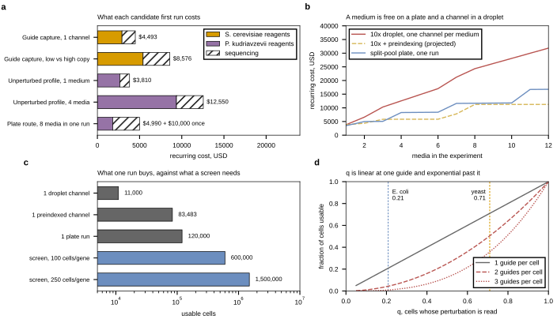

## 2026.09.15 - The bench plan, two hosts, two people

Typeset document: `notes-tex/024-perturb-seq-pilot/`. It is the plan that falls
out of [[experiments.024-perturb-seq-costing.method-review-and-costing]], which
prices a genome-scale screen and ranks what is unknown but does not say what to
run next month.

### What it settles

- **Two first runs, in parallel, one per host, $8,303 together.**
  *S. cerevisiae* spends its channel on the guide readout because the MAGIC
  CRISPRi library already exists and `q` (cells whose guide is readable) is the
  gate. *P. kudriavzevii* spends its channel on the assay itself because
  transformation efficiency puts a pooled library out of reach, so the run
  carries no guides and instead answers wall digestion, UMIs per cell and
  ribosomal fraction.
- **Media against readout was not a choice between them.** The environment axis
  belongs to the *P. kudriavzevii* track, where a single unperturbed condition
  under-uses a paid channel; the readout question belongs to the *S. cerevisiae*
  track, where the library exists. Media cannot multiply an assay that does not
  work yet.
- **Copy number: not early.** Copy number buys guide transcript per cell, not
  guides per cell (diversity comes from uptake events), the multi-plasmid state
  segregates within about a day, and the field uses low-copy vectors precisely
  to keep one guide per cell. The one version worth running now is a second
  channel on a higher-copy backbone purely to test whether `q` rises, which is a
  labeled hypothesis.
- **Nadal-Ribelles is carried as the cautionary case**, with the three checks it
  failed built into both designs: replicate one genotype across two independent
  wells with a per-batch wild-type reference, read the targeted gene's own
  transcript as a positive control, and report cells per label and label purity.

### Generating script

`experiments/024-perturb-seq-costing/scripts/pilot_options.py` composes the
committed cost model over pilot-sized designs. Two departures from Sec. 5 of the
costing review, both deliberate: sequencing is priced on the cheapest paired-end
configuration that holds the reads rather than on the largest flow cell (a pilot
does not fill a 25B lane, and a lane is indivisible), and the tiered 10x channel
price is respected, so a two-arm pilot is not twice a one-arm pilot. Writes
`results/pilot_options.json`, the document's `tables/t1-pilot-options.tex`, and
`pilot_options.svg`.

### Provenance notes

- The three knockout-expression figures in Sec. 3 are the 019 document's builds,
  committed here unchanged. Their scripts and results live on branch
  `multimodal-phenotype-retrospective` (PR #265), which is named in the section's
  `%% SOURCE:` header. Nothing in that section is entered by hand.
- `render_tex_tables.py` still writes to `notes-tex/microbe-perturb-seq/tables`,
  a path that stopped existing when that directory was renamed to
  `024-perturb-seq-costing`. `pilot_options.py` writes its own table path rather
  than inheriting that one. The stale `OUT` is worth fixing separately.
