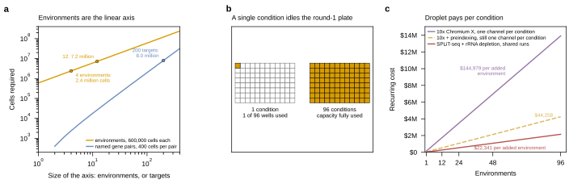

## 2026.08.25 - Fig. 17, environments as the other scaling axis

Draws Sec. 7.3 of [[experiments.024-perturb-seq-costing.method-review-and-costing]]. One row,
three panels, full Nature width.

- **(a) Environments are the linear axis.** Log axes, so the exponent is the
  slope. Environments cost 600,000 cells each and rise with slope one: 4 need
  2.4 million cells, 12 need 7.2 million. Covering every named pair of a
  T-target panel rises with slope two, so a 200-target panel already costs about
  what 12 environments cost and every further target costs more than the last.
- **(b) The round-1 plate is idle in a single-condition screen.** Split-pool
  spends round 1 on sample identity, so a pooled screen in one condition uses 1
  of 96 wells and the other 95 are bought and unused. Drawn as two 96-well grids
  rather than a bar, which has no label-collision surface.
- **(c) Droplet pays per condition.** Recurring cost against environments on the
  Sec. 5 cost model, at 600,000 usable cells per condition.

**Panel (c) reuses `cost_model.budget_for` rather than introducing a second cost
model.** `environment_cost` in
[[experiments.024-perturb-seq-costing.scripts.scaling_analysis]] composes it
along the environment axis, and the composition is where the platforms differ: a
droplet channel holds one condition and cannot be pooled across conditions, so
channel count is rounded up per condition and summed, while split-pool pools
every condition into the same runs and sublibraries and rounds up once over the
pooled total. Indexed libraries still share lanes in both.

**The check that the composition is right** is that at one environment it
returns the numbers Sec. 5 already publishes: $25,190 for depleted split-pool
and $45,764 for preindexed droplet.

**Preindexed droplet is a third series, added after review.** The first version
drew only un-preindexed 10x at $144,979 per added environment against
split-pool's $22,341, which overstates the case: Sec. 5.7 promotes preindexed
droplet to a co-equal candidate and it comes in at $44,258. Preindexing does not
escape the per-condition floor, since a channel still holds one condition, so it
lowers the slope without changing the shape.

## 2026.08.27 - Panel (b) redrawn: scifi preindexing gets the environment axis too

**The old panel (b) was wrong about how split-pool loads its round-1 plate.** It
drew a plate with 1 of 96 wells filled, captioned "1 condition, 1 of 96 wells
used", and the surrounding prose said the round-1 barcode space was idle. A
split-pool run loads the whole round-1 plate whatever the experiment is, because
round 1 is a barcode round before it is a sample round: it is one of the three
factors in the `96^R` space that `tab:barcode` prices. What a single-condition
screen leaves unused is the sample LABEL the well index also carries, not the
wells.

**And it left out the platform that has four times as many labels.** scifi
preindexing writes its round-1 barcode on a 384-well plate, and round1 is shared
by every cell from one well, so conditions preindexed into different wells are
pooled into shared droplet channels and separated afterwards by the well index.
The environment axis is free there for exactly the reason it is free in
split-pool.

The panel now draws that comparison: the two plates on ONE footprint, since a
96-well and a 384-well plate have the same physical footprint and differ only in
how finely it is divided, plus a single 10x channel for the platform with no
round-1 index at all. Every well is filled in both plates, which is the honest
state and also what makes the corrected claim visible.

**Using round-1 wells for conditions costs no barcode space, and that is the
non-obvious part.** Two cells collide when they share a FULL barcode. Pinning
conditions to round-1 wells partitions the space rather than shrinking it, and
with comparable cells per condition the marginal distribution over round-1 wells
stays uniform, so the collision rate is unchanged.

**Panel (c) changed with it.** `environment_cost` used to charge preindexed
droplet a per-condition channel floor, which contradicts the above: if the well
index labels the condition, conditions pool. It now costs preindexed droplet
with `budget_for` on the e-environment design, the same way split-pool is
costed. The effect is the rounding only, 690 pooled channels against 768 rounded
up per condition at 96 environments, and the marginal cost per added environment
moves from $44,258 to $42,498. The slope is set by cells, not by the floor, so
the remaining factor of two against split-pool's $22,341 is the per-cell gap of
Sec. 5 rather than an environment effect.

