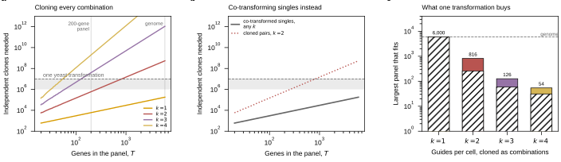

## 2026.08.24 - What one yeast transformation can actually cover

`experiments/024-perturb-seq-costing/scripts/plot_library_ceiling.py`

Sec. 4.7 stated the genome-scale conclusion as one arithmetic line. A reviewer
asked to see the whole surface, and the request was right: the interesting
content is WHERE the ceiling is crossed, not that it is crossed at the genome.

The two routes it keeps apart, because conflating them is what makes this
confusing:

- **Cloned combinations** need one clone per COMBINATION, so the requirement
  grows as `C(T, k)` and explodes. Pairs cap the panel at 258 genes at 1e6
  clones and 816 at 1e7; triples at 59 and 126.
- **Co-transformed singles** need one clone per GUIDE, so the requirement is
  `30T` and does not grow with `k` at all: 180,000 clones cover all 6,000 genes,
  inside one transformation, at any plex.

That contrast is the argument for route B of Sec. 7.1 and was previously only
implicit. Renders Fig. 12.

## 2026.08.28 - Panel letters were cropped, and the shaded band was unexplained

**Every panel letter shipped with its top sliced off, and nothing reported it.**
This was the one plot script in the experiment with no `assert_legible` call, and
it is the one figure that shipped clipped: `place_panel_letters` clamps a letter
to y = 0.985 and sets `va="bottom"`, so at 8 pt on a 52 mm-tall figure the glyph
runs to y = 1.039 and the canvas cuts it. The clamp is a backstop; the layout has
to reserve the room, which `top=0.90` did not. `plot_poisson_primer` already
carried that lesson in a comment and used `top=0.84`. Now `top=0.86` here.

**The fix is a check, not a nudge.** `figure_checks.check_inside_figure` tests
figure-level text against the canvas, which `check_inside_axes` structurally
cannot: a panel letter belongs to the figure and is placed deliberately outside
every axes box. A letter cropped at the top still reads as a letter at a glance,
which is why the eye misses it. Both scripts that had no legibility call
(`plot_library_ceiling`, `plot_poisson_primer`) now have one, and all ten plot
scripts pass.

**The shaded band said nothing.** Panels (a) and (b) both shade the transformation
range and only (a) labelled it, with free text that named the dashed RULE rather
than the band and that the k = 4 curve ran through. It is keyed now: a gray swatch
reading "one transformation, 1 to 10 million clones", in (a) as a second legend
and in (b) as a third entry in the existing one.

**One line, not two, and that is forced by the geometry.** Panel (a) is a fan of
straight lines on log axes, so every region wide enough for two lines of 5 pt text
has a curve crossing it. The single clear region is the horizontal strip below the
k = 1 curve, which is `30T` and so never falls below 600 over the plotted range:
the strip is the full width of the panel and about eight tenths of a decade tall,
which takes one line and not two.

The caption also described panel (c) as hatched. The hatch was replaced by two
shades on 2026.08.23 and the caption had not followed.

