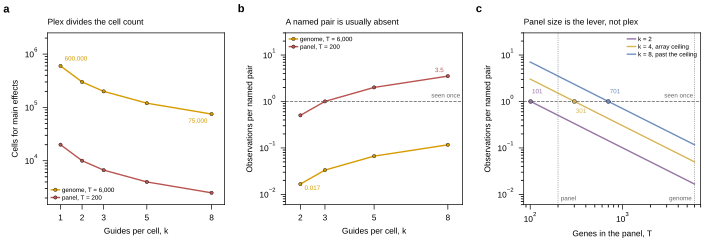

## 2026.08.25 - Fig. 16, whether a combination has to be seen twice

Draws Sec. 7.2 of [[experiments.024-perturb-seq-costing.method-review-and-costing]], which has
two opposite answers depending on which quantity is wanted. One row, three
panels, full Nature width.

- **(a) Plex divides the cell count.** Main effects need `floor * T / k` cells,
  because a cell carrying k guides reports on k genes. 600,000 cells at k=1
  against 75,000 at k=8 for the genome-scale library.
- **(b) A named pair is usually absent.** At that same budget the expected
  observations of one named pair is 0.017 at k=2 and 0.117 at k=8 for T=6,000.
  Fewer than one pair in eight is seen even once, so the joint transcriptome of
  a named pair is missing from the dataset rather than merely under-powered. The
  reference line at 1.0 is what makes the panel readable.
- **(c) Panel size is the lever, not plex.** The same quantity against T, swept
  continuously at k=2, 4, 8. Both levers enter quadratically, so on the
  arithmetic alone they are interchangeable; what separates them is that k is
  capped at two to four by array construction and T is free over a factor of
  thirty. The crossings sit at T=101, 301 and 701.

**Panel (c) imports `scaling_analysis.recovery` rather than reimplementing the
formula.** The discrete points in (a) and (b) come from
`results/scaling_analysis.json`, and the continuous sweep calls the same
function that wrote it, so the curve and `tab:recovery` cannot drift apart. The
crossing values come from `max_panel_for_one_observation`, added to
[[experiments.024-perturb-seq-costing.scripts.scaling_analysis]], which
bisects on that same function instead of inverting the closed form for the same
reason.

**Two color families, on purpose.** Panels (a) and (b) fix the library and sweep
plex, so their two series are the library sizes and take slots 0 and 1. Panel
(c) does the reverse, so its three series are plex values and take slots 2, 3
and 4. No color means two things.

## 2026.08.27 - Reference rules moved behind the data, here and across the figure set

The "seen once" rule in panels (b) and (c) is drawn after the series and shared
their default `zorder` of 2, so it won the tie and broke the panel curve at the
one place panel (b) is about, where that curve crosses one observation. Reference
rules now carry `zorder=1`: a rule is the backdrop a curve is read against, so
where the two cross it is the curve that has to survive.

Swept the rest of the figure set for the same pattern, with one distinction that
decides each case. On a LINE panel the rule goes behind the data. On a BAR or
histogram panel it stays on top, because a bar is opaque and a rule underneath it
is simply invisible. So `plot_compression` panel (d), `plot_library_ceiling` (a)
and (b), `plot_economics` (the cost-versus-depth and the twin-axis panels),
`plot_effect_size` and `design_equation` moved their rules behind; the
`n_genes` rule over the bars in `plot_compression` (a), the "additive" and median
rules over its histogram, and the cell-floor rule over the bars in
`plot_economics` (a) stayed where they were.

