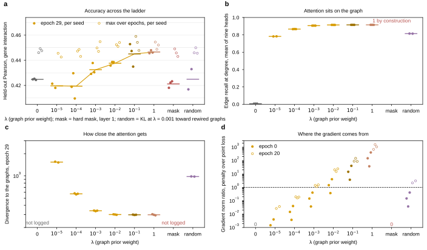
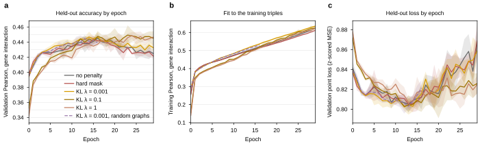
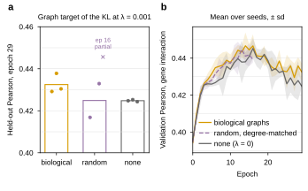

## 2026.09.26 - Soft prior or hard mask: the sweep read at three seeds per arm

Typeset document: `notes-tex/025-graph-reg-sweep/` (`make refresh` pulls W&B, refills the tables, redraws the figures, rebuilds). Readout: [[experiments.025-solid-growth.scripts.graph_reg_sweep_readout]]; figures: [[experiments.025-solid-growth.scripts.graph_reg_sweep_plots]]; launch record: [[experiments.025-solid-growth.scripts.delta_cgt]]; design mock-up `notes/assets/drawio/FigS-graph-regularization-sweep.gen.py`.

The hypothesis under test, as proposed: the graphs help, but only when the model is optimized through the KL divergence; imposing them as a hard mask does not help.

Every arm is `cgt_s0_r_kl_ctrl_013` (S0 triples, pinned 010 random split, learnable table, AdamW 2.5e-4 constant, 30 epochs, 4 x A40 on Delta `gpuA40x4`, 24 h clocks) with one key changed: lambda in {0, 1e-5, 1e-4, 1e-3, 1e-2, 1e-1, 1}, the hard mask (`cgt_s0_r_mask_028`), and the KL at 1e-3 toward degree-matched random rewirings (`cgt_s0_r_kl_rand_031`). Pulled 2026-09-27 02:25 UTC: three complete seeds everywhere except lambda 1e-5 (seeds 1 and 3; seed 2, job 22055161, has no run on W&B) and the random arm (seeds 1 and 2 complete, seed 3 at epoch 16, job 22056269 still running).

Held-out Pearson, mean +- sd over seeds (`results/graph_reg_sweep_summary.json`):

| arm | epoch 29 | max over epochs | train Pearson, ep 29 | edge recall at degree | divergence (val) |
|---|---|---|---|---|---|
| no penalty | 0.425 +- 0.000 | 0.448 +- 0.002 | 0.624 | 0.006 | not logged |
| KL 1e-5 (n = 2) | 0.420 +- 0.002 | 0.444 +- 0.002 | 0.657 | 0.782 | 1540 |
| KL 1e-4 | 0.419 +- 0.010 | 0.446 +- 0.003 | 0.663 | 0.866 | 571 |
| KL 1e-3 (control) | 0.432 +- 0.005 | 0.451 +- 0.004 | 0.636 | 0.906 | 337 |
| KL 1e-2 | 0.438 +- 0.002 | 0.453 +- 0.002 | 0.613 | 0.914 | 300 |
| KL 1e-1 | 0.445 +- 0.009 | 0.454 +- 0.006 | 0.625 | 0.915 | 297 |
| KL 1 | 0.447 +- 0.001 | 0.452 +- 0.003 | 0.624 | 0.915 | 298 |
| hard mask, layer 1 | 0.421 +- 0.003 | 0.446 +- 0.003 | 0.612 | 1 by construction | not logged |
| KL 1e-3, random graphs (n = 2) | 0.425 +- 0.011 | 0.447 +- 0.002 | 0.618 | 0.814 | 983 |

What it says:

- The mask is no penalty: 0.421 vs 0.425 at epoch 29 (below on all three seeds by 0.001 to 0.007), 0.446 vs 0.448 at the best epoch. No collapse under the constant-rate protocol; the earlier collapses (`7f1yrsq9`, `4qmgkcgn`) were under the cosine schedule with the other normalizer.
- The KL rises with lambda and does not peak inside the ladder: at epoch 29 every seed from 1e-3 up is above its no-penalty partner, by 0.021 to 0.023 at lambda 1. The mock-up's interior peak is not there; lambda 10 and 100 are unmeasured.
- The max-over-epochs reading compresses everything to 0.444 to 0.454. The prior moves the peak by at most 0.006 and moves its timing: no penalty peaks at epochs 15 to 16 and declines to 0.425 by 29; lambda 1 peaks at 23 to 26 and holds. Most of the fixed-epoch gain is resistance to the late decline.
- Support contraction is not what carries the accuracy: edge recall is 0.78 already at lambda 1e-5 and saturates at 0.915 from 1e-2, two decades below where accuracy is highest; the divergence floors at about 300 from 1e-2 up.
- Gradient budget (probe batch, before clipping): the penalty is 1.1x the point-loss gradient at 1e-3 and 680 to 1550x at lambda 1 by epoch 20; the trainer clips the total at 10. Hypothesis (untested): AdamW's per-parameter normalization makes the uniform rescale nearly invisible and the penalty gradient lands in the layer-1 projections, which is consistent with train Pearson at lambda 1 matching no penalty (0.624 vs 0.624).
- Random-graph control at 1e-3: 0.417 and 0.433 (seeds 1, 2) against 0.429 and 0.438 biological on the same seeds; the heads do learn the rewired graphs (recall 0.81, divergence 983). At 1e-3 the biological gain over no penalty is 0.005 to 0.013, inside two seeds' noise; the control has to be rerun at lambda 1 to decide biology vs conditioning.

Verdict on the hypothesis: the mask half holds on both readings; the "optimize through the KL" half holds on the fixed-epoch reading (+0.02 at lambda 1) and only weakly at the best epoch (+0.003 to +0.007); whether it is the biology of the graphs is untested at the lambda that matters.

W&B group pages (runs regrouped by arm with `graph_reg_sweep_readout.py --regroup`; project `torchcell_025-solid-growth_equivariant_cell_graph_transformer`, Delta gpuA40x4, 4 x A40 per run):

- no penalty: <https://wandb.ai/zhao-group/torchcell_025-solid-growth_equivariant_cell_graph_transformer/groups/s0_lambda0_30ep>
- KL 1e-5: <https://wandb.ai/zhao-group/torchcell_025-solid-growth_equivariant_cell_graph_transformer/groups/s0_lambda1e-5_30ep>
- KL 1e-4: <https://wandb.ai/zhao-group/torchcell_025-solid-growth_equivariant_cell_graph_transformer/groups/s0_lambda1e-4_30ep>
- KL 1e-3: <https://wandb.ai/zhao-group/torchcell_025-solid-growth_equivariant_cell_graph_transformer/groups/s0_control_30ep>
- KL 1e-2: <https://wandb.ai/zhao-group/torchcell_025-solid-growth_equivariant_cell_graph_transformer/groups/s0_lambda1e-2_30ep>
- KL 1e-1: <https://wandb.ai/zhao-group/torchcell_025-solid-growth_equivariant_cell_graph_transformer/groups/s0_lambda1e-1_30ep>
- KL 1: <https://wandb.ai/zhao-group/torchcell_025-solid-growth_equivariant_cell_graph_transformer/groups/s0_lambda1_30ep>
- hard mask: <https://wandb.ai/zhao-group/torchcell_025-solid-growth_equivariant_cell_graph_transformer/groups/s0_hardmask_30ep>
- random graphs: <https://wandb.ai/zhao-group/torchcell_025-solid-growth_equivariant_cell_graph_transformer/groups/s0_random_30ep>

Open: random-graph arm at lambda 1 (three seeds); lambda 10 and 100; the reason job 22055161 left no run; panels d and e of the mock-up from the Delta checkpoints; a per-parameter-group gradient probe.
