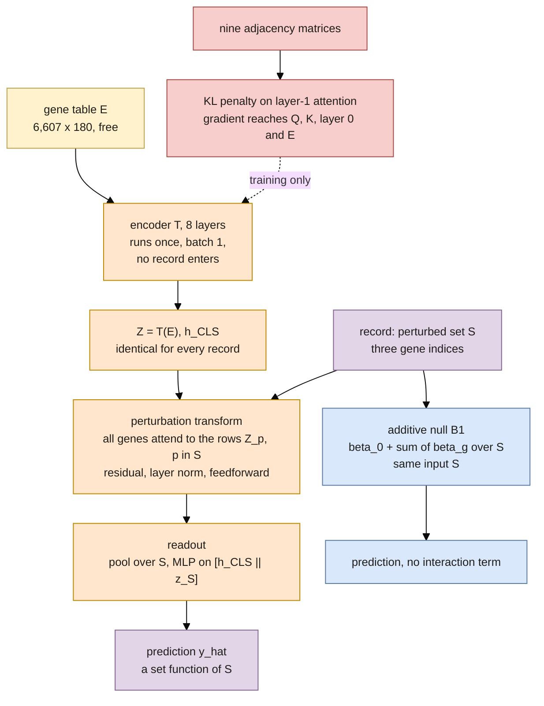

## 2026.09.15 - Where the strain enters, and where the graphs do

The forward pass of the 010 configuration as the additive-baselines document reads it: the encoder runs once on the wildtype gene table at batch size one, so its output is the same for every record; the only strain-dependent step is the perturbation transform, which reads the three perturbed gene rows; the nine graphs enter through the layer-1 attention penalty during training and never through the prediction function. Beside it, the additive null on the same input. Rendered by `make diagrams` in `notes-tex/025-additive-baselines/` through `mermaid_pdf.sh`, then scaled from mmdc's 600 pt page to 510 pt with Ghostscript, fonts kept. Colors follow the draw.io palette: yellow = parameters, orange = computation, purple = per-record input and output, red = training-only, blue = a null on the same input.

