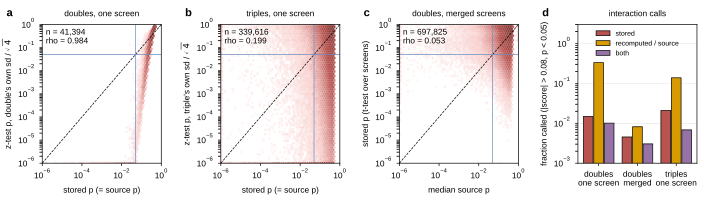
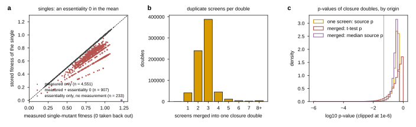

## 2026.09.18 - The S3 closure pool against its own definition

Typeset document: `notes-tex/025-s3-closure/` (build with `make mermaid && make plots && make`).
Analysis script: [[experiments.025-solid-growth.scripts.s3_closure_recompute]]. Figure a:
[[experiments.025-solid-growth.s3-closure.mermaid.pipeline]].

The question: S3 carries every term of the trigenic identity for every triple, so does the
fitness stored in the build reproduce the interaction stored in the build (strength), and does
anything stored reproduce the p-value (confidence)? Both answered against the raw source tables.

Measured (summary at `experiments/025-solid-growth/results/s3_closure_recompute_summary.json`):

- Within one source screen the identity is exact: Costanzo 2016 r 0.999 (1,227,294 rows on
  closure pairs), Kuzmin 2018 r 1.000, Kuzmin 2020 r 0.996 once the missing query fitness is
  set to 1.0, which is what the source scoring did on 99.6 percent of its digenic rows (H5).
- In the build: digenic r 0.445 (n 728,856), trigenic r 0.230 (n 352,505). Doubles with no
  essentiality-tainted single r 0.598; with one r 0.452 and intercept 0.116; restoring the
  measured mean of the single (k/(k-1)) gives r 0.491, intercept 0.014, rmse halved.
- Confidence: a single-screen digenic p is ranked by a two-sided normal test on the double's own
  colony SD over 4 colonies at rho 0.984 (n 41,394); propagating the singles' stored SD lowers
  it to 0.813. A trigenic p is not reproducible from anything stored (rho 0.199 on the triple's
  SD, 0.097 with every term propagated). A merged record's p is the deduplicator's t-test over
  the k duplicate scores (df k-1): against the median source p rho 0.053; 1,754 closure doubles
  and 406 triples are significant in every source and not in the build; 94.4 percent of closure
  doubles (697,825) and 12,914 triples are merged.
- Hazards counted: 1,140 singles carry an essentiality entry (233 with no measurement, touching
  no closure record); 907 measured singles were averaged with a 0 (stored median 0.679 vs measured
  0.843), touching 141,099 doubles and 78,707 triples; 3 records carry two fitness values (masked
  by the trainer); 691 closure doubles carry a SynthLethDB 0 in their mean.

Consequence for the S3 arm: the identity cannot be the mechanism by which fitness supervision
helps (its ceiling on the stored values is r 0.23, below the additive ridge's 0.40); every
p-value in a merged record is unlabeled; three build changes are listed in Section 6 of the
document (keep the essentiality 0 out of the mean, combine source p-values by a rule that reads
them, keep the screen identity on merged records).

