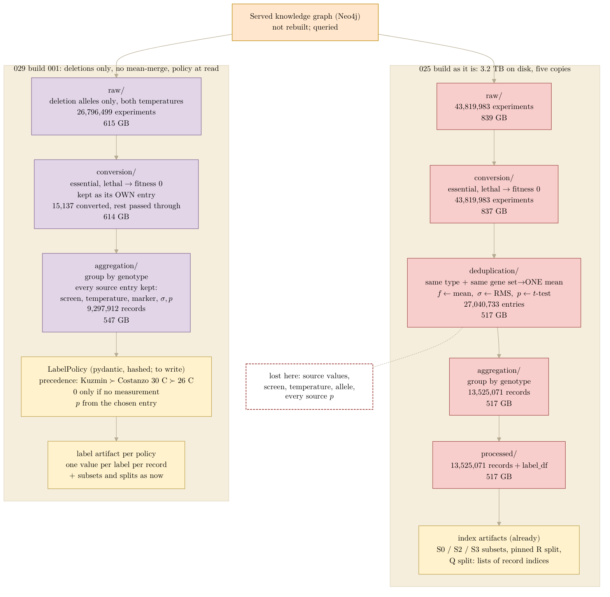

## 2026.09.18 - The 025 build stages as they are, and the label-policy alternative

Measured on `$DATA_ROOT/data/torchcell/experiments/025-solid-growth/001-full-build/` (LMDB entry
counts by `lmdb.stat`, sizes by `du`). The served knowledge graph is NOT rebuilt by any of this; a
build is one Cypher query over it followed by the three stages of
`paper/nature-biotech/figures/neo4j_cell-conversion-deduplication-aggregation.pdf`. Left: the
current pipeline, each stage a full LMDB copy. Right, as built on 2026-09-19 (slurm 2400, [[experiments.029-solid-growth-ko]]): the 029 build, the alternative discussed in
[[experiments.025-solid-growth.s3-closure]], which keeps the query, the conversion and the
genotype aggregation and drops only the mean-merge, moving the choice of value to a versioned
label policy applied at read time, the same way the S-subsets and the pinned splits are already
index artifacts over the processed LMDB.

