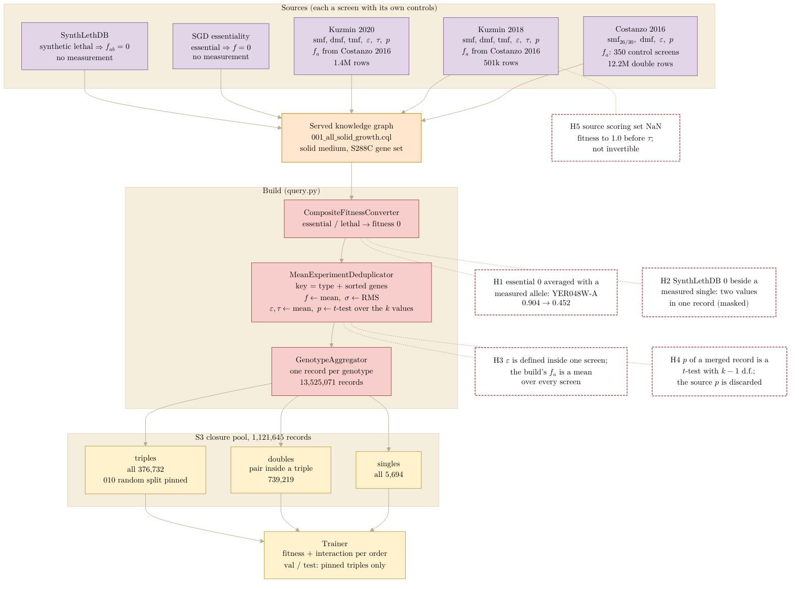

## 2026.09.18 - How the S3 closure pool is built, and where a join can go wrong

Figure a of [[experiments.025-solid-growth.s3-closure]]. Rendered with
`bash notes/assets/publish/scripts/mermaid_pdf.sh notes/experiments.025-solid-growth.s3-closure.mermaid.pipeline.md`
to `notes/assets/pdf-output/experiments.025-solid-growth.s3-closure.mermaid.pipeline.pdf`, which
`make figures` in `notes-tex/025-s3-closure/` copies to `figures/s3_closure_pipeline.pdf`.
Same palette rule as [[torchcell.models.equivariant_cell_graph_transformer.mermaid.type-i-ii]]:
purple sources, orange query, red processing, yellow training pool; hazards are red-bordered notes
numbered H1 to H5 and discussed in the document.

