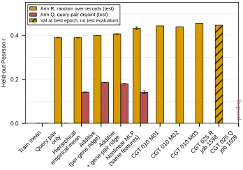
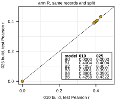

## 2026.09.09 - The 010 Additive Ladder Refit on the 025 Build, Both Transformer Arms

Fits the six baselines of
[[experiments.010-kuzmin-tmi.scripts.additive_baseline_gene_interaction]] (imported,
not copied) on the 376,732 trigenic records of the 025 build under the two splits the
transformer arms read from the committed index artifacts: R, 010's random-over-records
partition carried across by genotype identity (job 1598), and Q, the query-pair-disjoint
partition with 331 / 43 / 46 query pairs in train / val / test (job 1609). Per-record
gene names come from the recapitulation table; labels from `label_df.parquet` through
its `index` column.

Test Pearson, 025 build (`results/additive_baselines_025.csv`, B5 mean over three seeds):

| model | 025 arm R | 010 (same split) | 025 arm Q |
|---|---|---|---|
| B0 train mean | 0.000 | 0.000 | 0.000 |
| B1 additive per-gene ridge | 0.4004 | 0.4004 | 0.1853 |
| B2 additive plus pair ridge | 0.4057 | 0.4057 | 0.1800 |
| B3 hierarchical mean | 0.3901 | 0.3901 | 0.1420 |
| B4 query pair only | 0.3901 | 0.3901 | 0.0000 |
| B5 embedding MLP | 0.4322 +/- 0.0053 | 0.4258 +/- 0.0011 | 0.1413 +/- 0.0068 |

Arm R reproduces 010 to numerical precision for every closed-form model (largest
difference 3e-13), which is the end-to-end check that the 025 labels and the pinned
split are the 010 ones. B5 differs by +0.006 with a three-seed spread of 0.005; its fit is
stochastic and this run was on CPU where 010's was on GPU, so the same seed does not
give the same draw. Hypothesis (untested): the device is the whole of that difference.

Arm Q is the reference for job 1609: on the exact test split that run will report on,
the additive ridge reaches 0.185 and the nonlinear baseline 0.141. Transformer rows:
the three 010 checkpoints on arm R (0.443, 0.438, 0.455 test) and job 1598's validation
Pearson 0.4463 at epoch 14 (a max over 36 logged epochs, no test evaluation yet); arm Q
is pending job 1609.





Wall time 131 s on CPU. Rerun:

```bash
CUDA_VISIBLE_DEVICES="" python experiments/025-solid-growth/scripts/additive_baselines_025.py
python experiments/025-solid-growth/scripts/additive_baselines_025.py --plot-only
```
