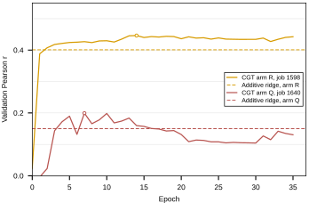

## 2026.09.09 - The 010 Additive Ladder Refit on the 025 Build, Both Transformer Arms

Fits the six baselines of
[[experiments.010-kuzmin-tmi.scripts.additive_baseline_gene_interaction]] (imported,
not copied) on the 376,732 trigenic records of the 025 build under the two splits the
transformer arms read from the committed index artifacts: R, 010's random-over-records
partition carried across by genotype identity (job 1598), and Q, the query-pair-disjoint
partition with 331 / 43 / 46 query pairs in train / val / test (job 1609). Per-record
gene names come from the recapitulation table; labels from `label_df.parquet` through
its `index` column.

Test Pearson, 025 build (`results/additive_baselines_025.csv`, B5 mean over three seeds):

| model | 025 arm R | 010 (same split) | 025 arm Q |
|---|---|---|---|
| B0 train mean | 0.000 | 0.000 | 0.000 |
| B1 additive per-gene ridge | 0.4004 | 0.4004 | 0.1853 |
| B2 additive plus pair ridge | 0.4057 | 0.4057 | 0.1800 |
| B3 hierarchical mean | 0.3901 | 0.3901 | 0.1420 |
| B4 query pair only | 0.3901 | 0.3901 | 0.0000 |
| B5 embedding MLP | 0.4322 +/- 0.0053 | 0.4258 +/- 0.0011 | 0.1413 +/- 0.0068 |

Arm R reproduces 010 to numerical precision for every closed-form model (largest
difference 3e-13), which is the end-to-end check that the 025 labels and the pinned
split are the 010 ones. B5 differs by +0.006 with a three-seed spread of 0.005; its fit is
stochastic and this run was on CPU where 010's was on GPU, so the same seed does not
give the same draw. Hypothesis (untested): the device is the whole of that difference.

Arm Q is the reference for job 1609: on the exact test split that run will report on,
the additive ridge reaches 0.185 and the nonlinear baseline 0.141. Transformer rows:
the three 010 checkpoints on arm R (0.443, 0.438, 0.455 test) and job 1598's validation
Pearson 0.4463 at epoch 14 (a max over 36 logged epochs, no test evaluation yet); arm Q
is pending job 1609.


Wall time 131 s on CPU. Rerun:

```bash
CUDA_VISIBLE_DEVICES="" python experiments/025-solid-growth/scripts/additive_baselines_025.py
python experiments/025-solid-growth/scripts/additive_baselines_025.py --plot-only
```

## 2026.09.09 - The parity panel leaves the report, the dataset check replaces it

Review point: the arm R against 010 parity scatter was Figure 6 of
`notes-tex/010-additive-baselines`, and it earns nothing a look at the dataset does not
already give. The record-level comparison is the direct evidence and it needs no model:
`label_parity_010_vs_025.py` matches all 376,732 triples by genotype, finds 376,526 labels
bit-identical, and bounds the remaining 206 at 5.6e-17 with a Pearson of 1. The split is
carried across by that same genotype identity, so B0 through B4, deterministic given labels
and split, must return the 010 numbers. Their agreement to 3e-13 measures floating point,
not reproducibility, and the report now says so instead of drawing it.

The panel is still generated here and embedded above as a working diagnostic. It is no
longer referenced by the document, so `make plots` stops converting it and
`notes-tex/010-additive-baselines/figures/additive_baselines_025_vs_010.pdf` was removed.

B5 is the only row where the two builds can differ. It differs by 0.006 against the 025
fit's own three-seed standard deviation of 0.005. The CPU-against-GPU hypothesis above is
still untested.

Error bars, also from that review: only B5 carries one in either ladder figure, the standard
deviation across its three seeds. B0 through B4 are single deterministic fits on a fixed
split and have nothing to average. The three transformer bars in the 010 ladder are plotted
individually because they are not seed replicates, the seed being fixed at 42, with M01 and
M02 differing only in run-to-run nondeterminism and M03 also changing the scheduler's first
cycle length. Both ladder captions now state this.

## 2026.09.10 - The disjoint arm has a number, and the report has its figures

Job 1640 (`cgt_s0_q_kl_004`, rank-0 run `327csnlk`) ran the arm Q disjoint split overnight
and was killed by the 12 hour wall clock partway through epoch 36. It read
`query_pair_disjoint_splits_025.json.gz` with `fit_on: train`, so it is on the same
partition these baselines are fit on.

Validation Pearson, arm Q, the only surface where the run has a number:

| Model | Validation Pearson |
| --- | --- |
| CGT job 1640, best epoch 7 | 0.1993 |
| CGT job 1640, last epoch 35 | 0.1306 |
| B5 embedding MLP, 3 seeds | 0.1573 |
| B1 additive ridge | 0.1499 |
| B2 additive plus pair | 0.1442 |
| B3 hierarchical mean | 0.1286 |

The best epoch clears every null, and the run does not stay there: it falls back through
the ridge near epoch 17. The 0.1993 is a maximum over 36 logged epochs and so is biased
upward, while the baselines are single fits, which is why the figures hatch it and the
report says it is not a test number. No test evaluation exists. The best-Pearson checkpoint
from epoch 7 does survive under
`$DATA_ROOT/models/checkpoints/gilahyper-1640_.../327csnlk-best-pearson-epoch=07-val`, so
one scoring pass would turn this into a real comparison against B1 0.185 and B5 0.141.

Two script changes support this. `job_1598_best_val` is replaced by `fetch_val_history`,
which pulls both arms' per-epoch validation Pearson and caches it to
`results/additive_baselines_025_arm_val_history.csv` so `--plot-only` redraws offline,
matching what `graph_penalty_vs_loss.py` does; `best_val` then reads either arm out of it.
`--plot-only` also rebuilds the transformer block of the summary from that cache rather
than trusting the stored JSON, which is what let the finished arm reach the figures with no
refit of the baselines.

New figure `additive_baselines_025_val_curves.svg`: both arms' validation Pearson per epoch
against each arm's own additive ridge, with the best epoch circled. The arms share build,
model and schedule, so the vertical gap is what the split costs. It is Figure 6 of the
report. The ladder figure now fills the arm Q transformer bar, hatched, in place of the
word pending.


