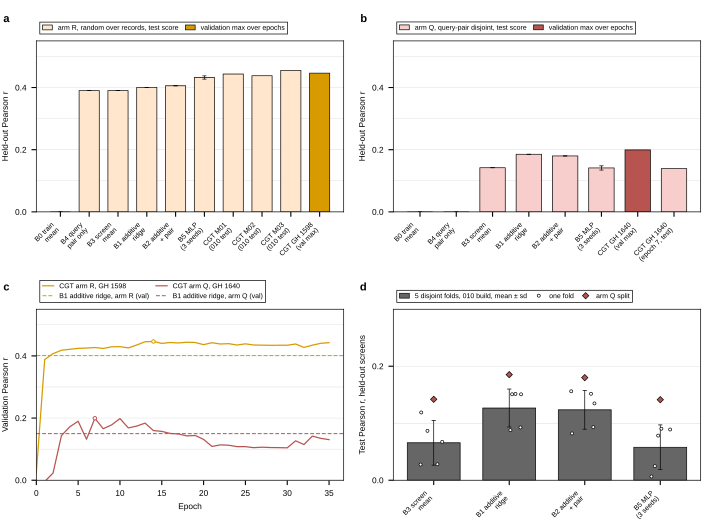
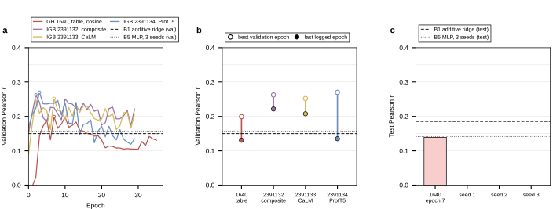

## 2026.09.11 - Panels and tables for the 025 additive-baselines document

`experiments/025-solid-growth/scripts/additive_baselines_025_panels.py` condenses the single plots of [[experiments.025-solid-growth.scripts.additive_baselines_025]] into the two multi-panel figures and three generated tables that `notes-tex/025-additive-baselines` reads. Nothing is refit: every cell comes from `results/additive_baselines_025.csv`, its summary json, the two cached W&B validation histories, the arm Q and arm R split artifacts, and 010's five-fold `query_pair_disjoint_cv.csv`. Tables are written to `notes-tex/025-additive-baselines/tables/` with a `%% SOURCE:` header, and the numbers the prose uses go to `results/additive_baselines_025_panels_summary.json`.

Figure 1, the ladder under both splits: a and b are the arm R and arm Q ladders (test, B5 with its three-seed sd, transformer validation maxima hatched), c is the per-epoch validation curve of the 010 configuration under each split against its additive null, d is the spread of the disjoint null across five held-out screen sets on the 010 build with the arm Q single split marked. Arm Q lies above every fold for B1 (0.185 against 0.088 to 0.151), B2, B3 and B5, so it is a comparatively easy draw of 46 screens.

Figure 2, every transformer run on arm Q: a per-epoch validation Pearson for GH 1640 (010 configuration, cosine) and the three IGB runs from the joint-fitness-head branch (constant lr 2.5e-4, perturbed CLS readout, fixed sequence embeddings: composite, CaLM, ProtT5), b best epoch to last epoch per run, c a placeholder with the arm Q test nulls drawn and empty slots for the epoch 7 checkpoint of 1640 and three seeds of `cgt_s0_q_kl_004`. Every run peaks between epoch 2 and 7 (0.199, 0.262, 0.252, 0.270) and declines; the composite and CaLM runs end above the 0.150 ridge null (0.222, 0.208), ProtT5 and 1640 end at 0.135 and 0.131. No run has a test score. The IGB histories are cached to `results/additive_baselines_025_disjoint_runs_history.csv`; delete it to refetch.

Runs:

<https://wandb.ai/zhao-group/torchcell_025-solid-growth_equivariant_cell_graph_transformer/runs/327csnlk>
<https://wandb.ai/zhao-group/torchcell_025-solid-growth_equivariant_cell_graph_transformer/runs/s1vx2zgw>
<https://wandb.ai/zhao-group/torchcell_025-solid-growth_equivariant_cell_graph_transformer/runs/8aa08xx0>
<https://wandb.ai/zhao-group/torchcell_025-solid-growth_equivariant_cell_graph_transformer/runs/pmkzwwzw>

Layout notes: `tight_layout(rect=(0, 0, 1, 0.965))` leaves the headroom `panel_label` needs, since the letters sit 12 pt above each axes box and the top row's were clipped without it. The placeholder note in 2c is placed in the band between the null lines and the legend so no line crosses text.

## 2026.09.12 - Revision pass and the arm Q gene-coverage table

The document was revised in four passes before its first Zotero publish: a numbers audit against the result files, a prose rewrite, a read of the rendered pages, and a rebuild check. The audit found three errors in the first version: job 1640 first clears its validation null in epoch 4, not 3 (epochs above the ridge are 4, 5 and 7 to 16); GH 1598's validation maximum of 0.446 sits 0.001 below the 010 checkpoints' 0.447 to 0.462 band, not inside it; and the 010 bootstrap margin is +0.038 to +0.055, not +0.04 to +0.055. The abstract had also called all six models nulls, which B5 is not.

The gene-coverage numbers for arm Q (which genes of a held-out record the training part has seen) had come from an ad hoc measurement in a session and not from a committed script, so `arm_q_gene_semantics()` was added to the panel script. It regroups S0 by query pair with the rule that built the split, asserts the 420 recurring pairs match the artifact, and writes `tables/t4-armq-genes.tex` plus an `arm_q_gene_semantics` block in the summary json. Reproduced: every array gene of validation (4,003 distinct) and test (1,182) occurs in training; 78 of 86 validation and 88 of 92 test query-pair genes do; 81.3 percent of validation and 91.4 percent of test records have all three genes in training; 739,315 distinct pairs, 420 recurring, 376,733 recurring-pair instances.

Table 5's two free-text columns are now fixed-width and ragged-right, which removes the stretched justification the first build showed.
