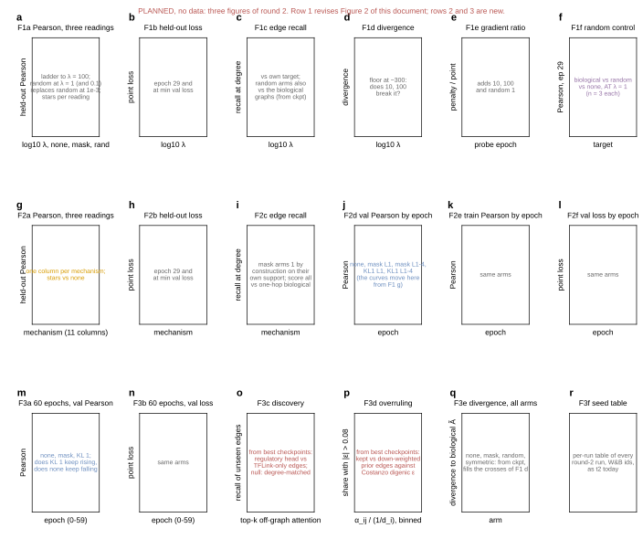

## 2026.09.27 - Round 2 of the graph-regularization study, planned

The single source of the round-2 design: a pydantic `Arm` list (question, name, override on `ctrl_013`, code change needed, seeds, epochs, planned panel), the budget at the measured 27 min/epoch on four A40s, `tables/t4-round2.tex` for the document, `results/graph_reg_round2_plan.json` for the launcher to read, and a wireframe of the three planned figures (`graph_reg_round2_mockup.svg`, no data). Nothing is measured; nothing is submitted until approved.

Revised the same night with a `round` column (1b finishes the current figure; 2 the mechanism figure; 3 budget and representation), the shifted placement [S S S M M S S S] in place of the all-8 mask, and the composite-embedding pair. Arms (55 runs, about 3,456 GPU-h; 1b 13 runs, 2 27, 3 15): random graphs at KL 1 and 0.1 (biology vs conditioning where the effect is); KL 10 and 100 (turnover); symmetric-target KL 1 and a directed mask (direction: the KL target is directed, the mask is symmetrized); two-hop mask (reach); mask and KL 1 on layers 1-2, 3-4 and 1-4 (placement, the encoder has 8 layers and the graphs enter layer 1 only); 60-epoch none / mask / KL 1 (budget, 48 h clock); composite embedding with and without KL 1 (representation); KL 1e-5 seed 2 (completion). The round-1 random arm ran the full 30 epochs on both complete seeds, so f is at matched budget. Three small model changes: `graph_regularization.symmetrize`, `attention_mask.symmetric=false`, `attention_mask.hops=2`.

Document: `notes-tex/025-graph-reg-sweep/sections/6-round2.tex`. Readings of round 1: [[experiments.025-solid-growth.graph-reg-sweep]].

Reordered 2026-09-27 after review around the study's two questions: round 1b (17 runs) = random graphs at KL 1 and 0.1 with five seeds, KL 10 and 100, the missing 1e-5 seed; round 2 (18 runs) = reach for both mechanisms, 2-hop and 3-hop mask and 2-hop and 3-hop KL targets on identical supports, plus the direction pair; round 3 (45 runs) = placement (optional), 60-epoch budget, composite pair, and hidden width 360 on table and composite with and without KL 1. 80 runs, about 4,800 GPU-h. Pre-launch check for reach: tabulate the support density of every graph at 1, 2 and 3 hops (the STRING channels are dense).

Implemented 2026-09-27 (same worktree): `khop_reach` plus four flags in the model (`graph_regularization.hops`, `.symmetrize`, `attention_mask.hops`, `.symmetric`; defaults reproduce every earlier run; 7 tests in `tests/torchcell/models/test_cgt_graph_entry.py`), configs `cgt_s0_r_kl_emb_040` (composite, no fitness head) and `cgt_s0_r_kl_emb_w360_041` (composite at 360, preprocessor h 644), and the plan now carries `config`, `overrides`, `hours` per arm and writes `scripts/delta_submit_round2.sh` (80 sbatch lines, six `after:+30` chains, round 1b first in every chain; `ROUNDS=` and `DRY=1`). All 26 distinct config-override sets compose under Hydra. Reach masks are directed after the density table ([[experiments.025-solid-growth.scripts.graph_reg_khop_density]]); real-size CPU smoke: [[experiments.025-solid-growth.scripts.graph_reg_flags_smoke]].

### Submitted 2026-09-27 03:47 CDT

All 80 runs queued on Delta from the detached worktree `/scratch/bbub/mjvolk3/torchcell.worktrees/025-graph-reg-round2` at ef4135f2 (created from `/projects/bbub/mjvolk3/torchcell`; the round-1 worktree `025-fitness-joint-head` at 14f92459 is untouched). Jobs 22461957 to 22462041, six `after:+30` lanes, lane heads 22461957 to 22461962 (the five random-graph seeds at KL 1 and the first at KL 0.1) pending on Priority, the other 74 on Dependency. Submission log on Delta: `experiments/025-solid-growth/slurm/output/round2_submit_20260927-0347.log` (sbatch line followed by the job id). Round 1b ids: 22461957/59/60/61/62 random KL 1 s1-5; 22461963-67 random KL 0.1 s1-5; 22461968-70 KL 10; 22461971-73 KL 100; 22461974 KL 1e-5 seed 2. The `delta_preflight_025.sh` run hung twice with no output (suspect the interpreter import from `/work/hdd` over Lustre, or the Taiga `df`); the paths it checks were verified directly by `ls` before submission. The GilaHyper real-size CPU smoke (job 2894) was still pending on Priority at submission; rounds 2 and 3 use the new flags and sit behind round 1b in every lane, so they can be cancelled by name (`025-r2-*`, `025-r3-*`) if the smoke fails.

### Audit of the 80 queued jobs, 2026-09-27 04:00 CDT

Requested before any lane head started ("we don't want to pay heavy price of getting one wrong"). Checked: every `submit` line composes under Hydra with the intended values (all 80; `+seed`, `+model.attention_mask.hops|symmetric`, `+model.graph_regularization.hops|symmetrize` append to keys absent from the configs, `model.hidden_channels`, `trainer.max_epochs`, `model.attention_mask.layers`, `graph_reg_layer` overwrite keys present); `learnable_embedding.size` follows `hidden_channels` (360 arms get a 360 table); the nine `025-r3-kl-1-layers-*` jobs are correct even though the model never reads `graph_reg_layer` directly, because each head's `regularized_heads.<graph>.layer` is an interpolation of it and the trainer resolves the config before it reaches the model (verified by composing with `resolve=True`: all nine heads read `[1, 2]`); the composite arms differ from `cgt_s0_r_kl_embfit_035` (which ran on IGB) only in the fitness head and lambda, and the four embedding stores (`calm.pt`, `species_upstream.pt`, `species_downstream.pt`, `prot_t5_xl_uniref50_all.pt`) exist under Delta's `data/scerevisiae`; the partition allows 48 h; the submission log maps every name to its id and job ids 22461958, 81, 82, 83 and 85 in the range belong to other users. Corrected reading of the chains: Slurm's `after:<id>+30` releases a job 30 minutes after the previous one STARTS (or is cancelled), not after it finishes, which is the stagger the round-1 submitter chose so that six 554 GB stage-ins do not begin on one Lustre path at once; so rounds 2 and 3 are not held behind round 1b for 14 h, they become eligible 30 minutes after their lane's previous job starts and then wait on Priority like everything else. The real-size flags smoke therefore also runs on Delta as a CPU job in the same worktree and environment (job 22462380, `bfjt-delta-cpu`, 16 CPUs, 64 GB, script `/scratch/bbub/mjvolk3/torchcell/experiments/025-solid-growth/slurm/delta_flags_smoke.sh`, log under `slurm/output/025-flags-smoke_22462380.out`), since GilaHyper's node is fully allocated on CPUs and job 2894 waits for a pack to finish. The readout (`graph_reg_sweep_readout.py`) now classifies the round-1b/2/3 arms from the run config (`hops`, `symmetrize`, regularized layers, mask `hops`/`symmetric`/`layers`, `hidden_channels`, `learnable_embedding.enabled`, `max_epochs`), pairs each arm against the no-penalty arm sharing its representation, width and budget, and selects the `graph_reg_round3` tag as well; without this, every round-2 KL 1 run would have been folded into the ladder's KL 1 arm.

### Real-size smoke: one script bug, one design defect, nine jobs replaced (04:30 to 05:15 CDT)

Both first smokes (GilaHyper 2894, Delta 22462380) died in the smoke script itself: `to_cell_data` refuses a multigraph without the `base` node graph that `Neo4jCellDataset` adds from the gene set (fixed in 9f1b89d57). The second GilaHyper run (job 2903) passed all twelve variants (finite losses, 28 to 54 s per variant, peak RSS 56 GB, `results/graph_reg_flags_smoke.json`), and its `target_rows_all_zero` diagnostic exposed a design defect the unit tests could not see: the trainer's cell graph gives every gene a self-loop (`add_remaining_gene_self_loops`, PyG `add_remaining_self_loops`, the dataset default and no 025 config overrides it), so the one-hop KL target of every round-1 run held a self entry in every row, while the k-hop and symmetrize paths cleared the whole diagonal, emptying 6,147 of 6,607 regulatory rows at two hops (physical 2,431, coexpression 508; symmetric regulatory 460). A two-hop arm would then have changed reach and self-loop handling at once. Fix in 961b4660d: the reach's diagonal is replaced by the one-hop diagonal (`hops=1` bit-identical; new test with two stored self-loops; 16 model tests pass). The mask keeps self-loops everywhere, so the mask arms were never affected. The nine affected jobs (KL 1 with 2-hop, 3-hop and symmetric targets, 22461984 and 22461986 to 22461993) were cancelled before any lane head started and resubmitted from a second detached worktree `/scratch/bbub/mjvolk3/torchcell.worktrees/025-graph-reg-round2b` at 961b4660d (the other 71 stay on `025-graph-reg-round2` at ef4135f2, whose model code differs only in this k-hop branch): 22463412, 22463414 to 22463418 (2-hop then 3-hop, seeds 1 to 3) and 22463419 to 22463421 (symmetric), each `after:<lane tail>+30`; log `slurm/output/round2_resubmit_20260927-0512.log`. Smokes at the fixed commit: GilaHyper 2904 and Delta 22463411 (CPU, from `025-graph-reg-round2b`); both passed all twelve variants with identical losses and zero empty target rows.

### 13:15 CDT: chains repaired after the cancellation, queue estimate

Cancelling the nine KL jobs satisfied the `after` dependency of their six successors (Slurm counts a cancellation as a start), so 22461994 to 22461999 (mask directed s1-3, mask layers 1-2 s1-3) were pending on Priority beside the round-1b heads. Re-chained with `scontrol update Dependency=after:<surviving lane predecessor>+30`: 94/95/96 after 22461978/79/80, 97/98/99 after 22461975/76/77. Queue is again 6 on Priority (the round-1b heads) and 74 on Dependency. No job had started by 13:13, nine and a half hours after submission: gpuA40x4 had 1,968 pending against 252 running, our priority 918 (age 195, fairshare 714), and Slurm's start estimate for the six heads was 2026-09-28 06:54 to 07:31.

## 2026.10.01 - Round 1b random arms landed: the biology carries the gain

The ten random-graph runs (KL 1 seeds 1 to 5, jobs 22461957/59/60/61/62; KL 0.1 seeds 1 to 5, jobs 22461963 to 22461967) finished all 30 epochs; the last, 22461966, ended between 11:26 and 16:35 CDT. The remaining round-1b jobs (KL 10 and 100, KL 1e-5 seed 2) and all of rounds 2 and 3 are still pending. `make refresh` refilled the tables and the figure with no readout change; the plot script needed `ARM_SHORT` entries for the two new random arms (panel e labels), dashed lines for every `random_*` arm, the c/d annotation moved to the middle random column, and the g/h/i random curve switched to the KL 1 random arm.

Readings (`graph_reg_sweep_summary.json`, pulled 2026-10-01 21:40 UTC). Random graphs at KL 0.1, five seeds: 0.430 +- 0.006 at epoch 29, 0.437 +- 0.003 max, 0.434 +- 0.004 at min loss; at KL 1: 0.427 +- 0.004, 0.435 +- 0.004, 0.430 +- 0.006. Biological minus random, paired on seeds 1 to 3: at 0.1, +0.017 at epoch 29 (t 14.5, p 0.005), +0.018 max (p 0.03), +0.019 min loss (p 0.06); at 1, +0.017 (t 8.8, p 0.013), +0.015 (p 0.014), +0.012 (p 0.26). Random minus no penalty: +0.003 / +0.004 at epoch 29 (p 0.52 / 0.16), -0.012 / -0.011 at max (p 0.026 / 0.007). Edge recall against the rewired graphs 0.822 at both lambdas (biological 0.915), divergence 902 / 904 (biological 297 / 298). So the epoch-29 gain of 0.02 is the biology, not the conditioning; at the peak a random target costs 0.011 against no penalty, and the biological gain there stays at most 0.006. Panel f title: "Biology beats random graphs by ~0.017 at lambda >= 0.1". Document sections 4 and 5 and the abstract rewritten; `make check` clean.

### 20:45 CDT: the dependency lanes were the bottleneck, cleared

Queue accounting (`~/qwait.py` on dt-login01, all users, 7 days): 4-GPU gpuA40x4 jobs with a limit of 20 h or more wait a median 23.6 h, the 12 h class 7.3 h; our own whole-node A40 jobs since mid-August a median 9.2 h. Yet 13 of 80 jobs had finished in 4.5 days, because `after:<id>+30` makes a job eligible only 30 minutes after its lane predecessor STARTS, so each lane advanced one job per queue wait: 64 of the 70 pending showed reason Dependency. Cleared in place, keeping ids and age priority, with `scontrol update JobId=<id> Dependency= StartTime=now+<k*20>minutes` in round order (1b, then 2, then 3; `~/unchain_025.sh`, log `~/unchain_025.log`); the queue read 53 None, 15 BeginTime, 2 Priority afterwards, and the last job becomes eligible about 21 h later. The stagger still spreads the 554 GB node-local stage-ins; it no longer serializes the campaign. `graph_reg_round2_plan.py` now writes the submitter with `--begin=now+<k*20>minutes` and no lanes (STAGGER_MINUTES). Rule recorded in the new skill `.claude/skills/submit-jobs/SKILL.md`: a dependency is only for a run that outlives the wall limit and continues from its checkpoint, and that continuation also resumes the W&B run.
