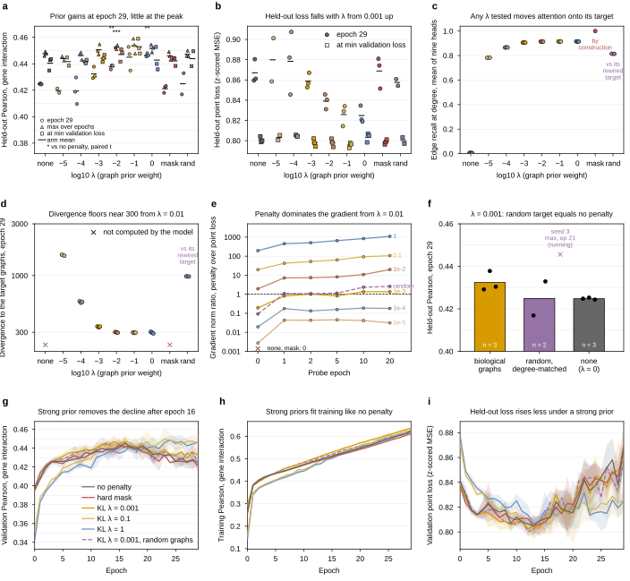

## 2026.09.26 - Figures of the sweep

Revised the same evening on review: every seed point filled with its arm's color and edged black (the repo's dot-plot convention), arm means as short black bars, x marks for quantities the model does not compute, filled bars, one light horizontal grid on every panel, tick labels rotated so the scientific notation does not collide, three readings by marker shape in (a) with paired-t stars, held-out loss ladder in (b), gradient ratio across the six probe epochs in (e), and finding-style titles (each checked against the tables in the document). One 3 x 3 full-width figure from the readout's CSVs into `$ASSET_IMAGES_DIR/025-solid-growth/` (true-size SVG + PNG, timestamped copy): `graph_reg_sweep`, panels (a) Pearson at epoch 29 across the ladder, (b) max over epochs, (c) edge recall at degree, (d) divergence, (e) gradient-norm ratio, (f) random-graph control at lambda 1e-3, (g) validation Pearson, (h) training Pearson and (i) validation point loss by epoch (complete seeds only, mean +- sd). One palette color per curve arm: no penalty gray, mask red, KL 1e-3 orange, KL 1e-1 yellow, KL 1 blue, random purple. Earlier three-figure layout (ladder, curves, control) retired 2026-09-26 on review. Tick labels are standalone mathtext (`$10^{-5}$`); prose labels spell lambda in decimals because Arial has no superscript minus or nabla glyph, and a missing glyph renders as a box in the PNG. The notes-tex document converts the SVGs with `make plots`.

Readings: [[experiments.025-solid-growth.graph-reg-sweep]].
