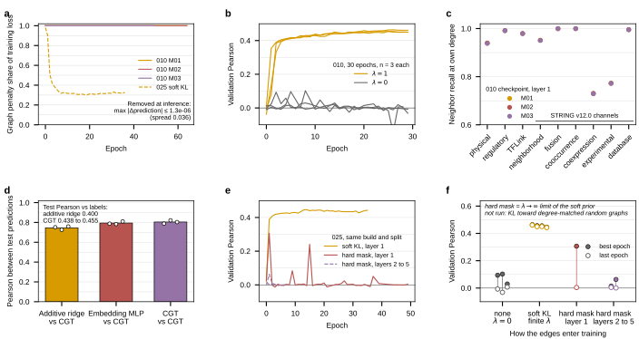

## 2026.09.08 - Draft figure: not what you learn, how you learn

Script: `experiments/025-solid-growth/scripts/graph_regularization_how_not_what.py`. It
freezes every pinned W&B run under
`experiments/025-solid-growth/results/graph_regularization_how_not_what/` so `--from-csv`
re-renders offline, and reads the 010 additive-baselines result files for panels a and d.
Candidate for the paper's placeholder Supplementary Figure `fig:graphreg-empirical`, which
sits beside Supplementary Note `note:graph-attention` (the proof that the hard mask is the
$\lambda \to \infty$ limit of the soft KL prior).

**The claim.** Nine gene-gene graphs enter the CGT only as a KL prior on layer 1. They never
reach the prediction, and they decide whether training happens.

- **a** Share of the training loss carried by the graph penalty. 010 checkpoints: 0.9999
  throughout (the x367 coefficient defect). 025 soft-KL arm at the intended coefficient:
  0.98 at epoch 0, 0.90 at epoch 1, settling at 0.31 to 0.33. Removing the penalty from a
  trained checkpoint at inference changes the max absolute test prediction by 0.9e-6 to
  1.3e-6 against a spread of 0.036 (`results/cgt_direct_scoring.csv`).
- **b** 010 matched 30-epoch pair. lambda = 1: best val Pearson 0.464 / 0.456 / 0.456
  (z9l5lesa, hl37p5kq, timffh8i). lambda = 0: 0.094 / 0.103 / 0.030 best, last -0.007 /
  -0.031 / +0.007 (outxo94i, vjfp4d83, 4js6ximz).
- **c** Neighbor recall at each gene's own degree, 0.73 to 1.00 on all nine graphs, three
  checkpoints (eval runs leodrxht, cvu2ryfw, 0psour3n). The heads did learn the edges.
- **d** Test-prediction agreement: CGT vs additive ridge 0.726 to 0.759; CGT vs embedding
  MLP 0.784 to 0.810; CGT vs CGT 0.788 to 0.821. Test Pearson vs labels: ridge 0.400, CGT
  0.438 to 0.455.
- **e** 025, same build (S0 = the 010 records) and the pinned 010 random split. Soft KL at
  layer 1 (job 1598): 0.446 at epoch 14, 0.443 at epoch 36. Hard mask at layer 1, placed
  exactly where 010 put its KL (job 1606): 0.307 at epoch 1, then the label mean for 50
  epochs (train transformed MSE 1.000). Hard mask on layers 2 to 5 (jobs 1602, 1607; both
  partial): never above 0.063.
- **f** The three regimes on one axis: lambda = 0 fails, finite lambda trains, the hard-mask
  limit fails. Accuracy peaks at intermediate lambda, which is the Note's second predicted
  signature, on three points rather than a sweep.

**What it does not separate.** Every arm that trains has a penalty term; every arm that
fails has none (the mask arms set `graph_reg_lambda: 0`). So the figure shows the edges as
a training signal are load-bearing and the edges as a constraint are not. Whether the
biology in the edges matters, or any comparable KL target would condition the optimizer,
needs the degree-matched random-graph control, which has not been run. Also n = 1 per 025
arm, the 025 mask arms kept the schedule tuned for the penalty, and 1607 is still running.

**Hypothesis (untested):** the penalty dominates the loss exactly in the first two epochs
(0.98, 0.90 in 025), which is the window in which the hard-mask arm transiently reaches
0.31 and then collapses; the soft term may be what carries the model through the phase
where the point loss alone drives it to the mean.
