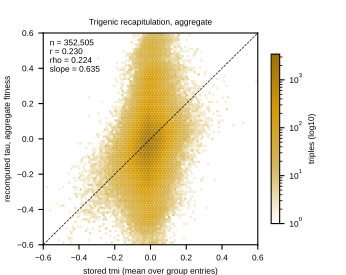
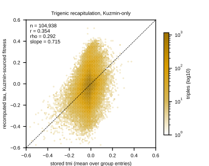
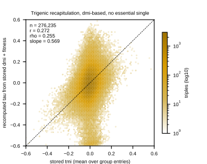
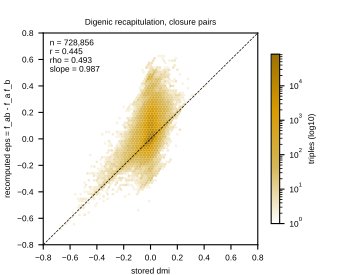
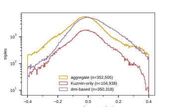

Script: `experiments/025-solid-growth/scripts/recapitulate_tmi_from_fitness.py`. Gate
analysis for the 025 training campaign ([[experiments.025-solid-growth.training-plan]]):
recompute each triple's trigenic interaction from the fitness values stored in the SAME
build,

    tau_abc = f_abc - f_ab*f_c - f_ac*f_b - f_bc*f_a + 2*f_a*f_b*f_c,

and compare against the stored tmi. If the dataset's own fitness cannot reproduce its own
tau labels, a model asked to route fitness supervision into interaction prediction is
being asked to learn an identity the data does not satisfy.

Two variants per triple: **aggregate** (fitness = mean over all of a group's fitness
entries, the target a per-entry MSE trains toward) and **kuzmin** (fitness restricted to
Kuzmin-sourced entries, the screen family that produced the tau labels). The digenic
identity eps_ab = f_ab - f_a*f_b is checked the same way on the closure pairs. Companion
check `label_parity_010_vs_025.py` compares the shared triples' label values across the
two builds by gene-set identity.

Outputs: `experiments/025-solid-growth/results/recapitulation_summary.json`,
per-triple table
`$DATA_ROOT/data/torchcell/experiments/025-solid-growth/recapitulation/recapitulation_per_triple.csv.gz`,
figures below.

## 2026.09.04 - Results: the identity holds in expectation but not in value

Run: local background, log `recap_run3.log`, generated 2026-09-04-09-32-08, full scan of
the 025 build (376,732 triples; 5,694 singles; 13,142,648 doubles scanned for closure).

**Coverage is not the problem.** 739,219 of 739,315 closure pairs (99.99%) have a double
record; 352,505 of 376,732 triples (93.6%) have full closure (all 3 singles + all 3
doubles + tmf present).

**Reconstruction is the problem.** Pearson r of recomputed tau against stored tmi:

| variant | n | r | rho | slope | rmse |
|---|---|---|---|---|---|
| aggregate fitness | 352,505 | 0.230 | 0.224 | 0.635 | 0.171 |
| aggregate, no essential single | 278,060 | 0.205 | 0.211 | 0.576 | 0.169 |
| Kuzmin-sourced fitness | 104,938 | 0.354 | 0.292 | 0.715 | 0.124 |
| Kuzmin-sourced, no essential single | 78,089 | 0.345 | 0.276 | 0.646 | 0.114 |
| stored dmi + fitness | 350,318 | 0.213 | 0.174 | 0.477 | 0.144 |
| stored dmi + fitness, no essential single | 276,235 | 0.272 | 0.255 | 0.569 | 0.125 |

Digenic identity on the closure pairs: r = 0.445, rho = 0.493, slope = 0.987, rmse =
0.072, median |residual| = 0.017 (n = 728,856).

Reading:

- The identity is present IN EXPECTATION: the digenic slope is 0.99 and every trigenic
  slope is 0.5-0.7 with near-zero intercepts. It fails IN VALUE: stored tmi has sd
  0.0633, while the recomputed tau carries rmse 0.11-0.17 against it, so propagated
  measurement error and cross-source normalization offsets are 2-3x the size of the
  signal being reconstructed. The attenuation is arithmetic-consistent: with independent
  error of the observed rmse, the expected r is 0.0633/sqrt(0.0633^2 + rmse^2) = 0.35
  (Kuzmin) and 0.35/0.23 observed.
- **Essentiality contamination is real but NOT the driver**: excluding the 54,707
  triples with an essentiality-tainted single moves r by <= 0.06 in either direction.
- **Using the stored dmi labels instead of recomputed products does not rescue it**
  (r 0.21-0.27): the dmi labels are internally consistent with the fitness identity only
  at r = 0.445 themselves.
- Positive calls do not survive reconstruction: at tau > +0.08 the recomputed values
  produce 62,166 positives against 18,740 stored, overlapping on 6,690 (recall 36%,
  3.3x inflation). Negative recall at tau < -0.08 is 58%.
- **The benchmark that frames it**: the additive per-gene ridge fit to tau labels scores
  test r = 0.400 on this corpus (random split), and the CGT 0.443-0.455. Plugging the
  dataset's own fitness into the exact defining equation scores 0.23-0.35. A model that
  never sees fitness already beats the physical identity evaluated on the stored values.

Consequence for the training campaign (decision rule in
[[experiments.025-solid-growth.training-plan]]): the "both poor" branch fires, with the
refinement that the failure is noise accumulation, not a sign/scale error. The mechanism
"the network reads tau off its fitness inputs" is capped near r 0.35 in this build and
cannot be the claim; whether fitness/dmi supervision improves the REPRESENTATION remains
open and is exactly what the S-ladder measures. The S6 zero-shot arm becomes more
informative, not less: beating the disjoint-split additive null (0.127) without trigenic
supervision would demonstrate transferable interaction structure that the noisy identity
alone cannot supply.

Companion check `label_parity_010_vs_025.py`: all 376,732 010 genotypes matched in 025
with gene_interaction labels IDENTICAL to float precision (max |diff| 5.6e-17); 010
carries NO fitness labels, so every fitness value in the S-arms is new signal relative
to 010 (`results/label_parity_010_vs_025.json`).

