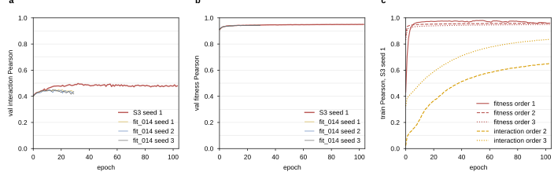

## 2026.09.18 - Readout of the S3 Closure Cell

`experiments/025-solid-growth/scripts/s3_closure_readout.py` reads the S3 closure training
cell and its S0 comparison arms out of W&B and writes the table, the summary and the figure
the 025-s3-closure document uses. It is modeled on
[[disjoint_embedding_readout|experiments.025-solid-growth.scripts.disjoint_embedding_readout]]
and follows the grouping convention of `disjoint_embedding_wandb_view.py`.

### Arms

| key | config tag | selector | budget |
|---|---|---|---|
| `s3_fit_031` | `cgt_s3_r_kl_fit_031` | -- | 130 |
| `s0_fit_014` | `cgt_s0_r_kl_fit_014` | -- | 30 |
| `s0_fit_015` | `cgt_s0_r_kl_fit_015` | -- | 30 |
| `s0_ctrl_013` | `cgt_s0_r_kl_ctrl_013` | `graph_reg_lambda == 1e-3` | 30 |
| `s0_lambda0` | `cgt_s0_r_kl_ctrl_013` | `graph_reg_lambda == 0` | 30 |

All five run on the 010 random split R and are evaluated on the pinned triples.

**Where the lambda-0 arm lives.** There is no `cgt_s0_r_kl_lambda0_*` config. The
graph-regularization ladder was run under the `cgt_s0_r_kl_ctrl_013` tag with the penalty
weight swept, so one tag holds three arms (lambda 0, 1e-3, 1e-2). The readout separates
them on the config value `model.graph_regularization.graph_reg_lambda`, which is also what
the run script mirrors into the `lambda_*` run tag. The 1e-2 point is not read here.

**Excluded runs.** `kj03xx8y`, `0kaadgdu`, `bekoxpor`, `ztfcxu37` are the abandoned partial
of S3 seed 1 and are dropped before anything is read. Their names are never rewritten.

**Rank 0.** Each job is four DDP runs and only rank 0 logs `val/`, so a rank-0 run is the
one whose history carries `val/gene_interaction/Pearson`. A job whose first validation epoch
has not finished carries that key nowhere, so for such a seed the run carrying the
rank-0-only gradient probe (`probe/grad_norm/point`) is reported instead, as a partial row
with zero validation epochs. History is read with `run.scan_history()`, which is unsampled;
`history()` subsamples and would move the window means.

### Scoring rule

The score of a run is the **mean of `val/gene_interaction/Pearson` over a fixed epoch
window**, declared before the run is read: epochs 10 to 29 for the 30-epoch S0 arms, the
same window `disjoint_embedding_readout.py` uses, and for the 130-epoch S3 cell that window
plus epochs 100 to 129. A window mean is written only when every epoch of the window is
present; a partial window reports its epoch count and no score, because a mean over
whichever epochs happened to finish is not the declared statistic. The arm score is the mean
across seeds of the per-seed window mean, with the sd across seeds.

The table also carries the value at the last logged epoch and, separately, the **max with
its epoch**. The max over noisy epochs is an upward-biased order statistic whose bias grows
with the number of epochs run. It is recorded for checkpoint selection only, under the
column name `val_gi_pearson_max_biased`, and is never reported as the score of an arm.

Partial runs are labeled `partial` and report the epochs they logged; a seed with no run
yet is simply absent, and the console prints the seeds it could not read.

### Outputs

- `experiments/025-solid-growth/results/s3_closure_readout.csv` one row per (config, seed,
  run): arm label, budget, epochs logged, complete flag, the window means with their epoch
  counts, last-epoch values, validation fitness Pearson at the same points, the biased max,
  and the per-order train metrics with their record counts at the last logged epoch. The
  record counts are read under both spellings, `train/n_records/<target>/order<k>` on the new
  runs and `train/n_records/order<k>` on the older ones.
- `experiments/025-solid-growth/results/s3_closure_readout_summary.json` per arm the mean and
  sd across seeds of the window-mean score, the seeds scored, and the paired S3 vs fit_014
  comparison on the seeds both arms scored.
- `notes-tex/025-s3-closure/tables/t5-training-readout.tex` one row per arm, best window mean
  bolded in the generator.
- `$ASSET_IMAGES_DIR/025-solid-growth/s3_closure_readout.svg|png` plus a timestamped copy.

### Figure



**Figure 1. S3 closure cell against its S0 baseline, by epoch.** (a) Validation interaction
Pearson, one line per S3 seed (thick) and per `cgt_s0_r_kl_fit_014` seed (thin). (b) The same
for validation fitness Pearson. (c) Per-order training Pearson for S3 seed 1: fitness orders
1, 2 and 3 in red and interaction orders 2 and 3 in orange, with order encoded by line style
(solid, dashed, dotted). Pearson axes run 0 to 1 with tenth gridlines, so the panels are read
on one scale. Panels with no logged epoch yet say so rather than showing an empty box.

### State on 2026.09.18

Run at 08:25 on the day the S3 cell started. The cell is **partial**: seed 1 (`yb4gjh51`,
the rank-0 run of the relaunched job) has logged 1 epoch and no validation epoch, so it has
no score, and seeds 2 and 3 are still queued with no runs. Every S3 number in the table is
therefore blank by design, and the paired S3 vs fit_014 comparison reports
`not computable`. The baselines that did finish, on the 10 to 29 window:

| arm | seeds scored/run | window mean |
|---|---|---|
| S0, joint fitness 1.0 (`fit_014`) | 3/3 | 0.4392 +- 0.0032 |
| S0 control, no fitness head (`ctrl_013`, lambda 1e-3) | 1/1 | 0.4381 |
| S0 control, graph reg lambda 0 | 2/3 | 0.4352 +- 0.0037 |
| S0, joint fitness 0.1 (`fit_015`) | 0/1 | run failed at epoch 9, no score |

The three scored arms sit within about 0.004 of one another with a seed sd of about 0.003,
so on this window they are not separated; that is a statement about these three arms at 30
epochs, not about the S3 cell, which has not been measured.

Example runs:

<https://wandb.ai/zhao-group/torchcell_025-solid-growth_equivariant_cell_graph_transformer/runs/yb4gjh51>

<https://wandb.ai/zhao-group/torchcell_025-solid-growth_equivariant_cell_graph_transformer/runs/b3n4ax4a>

<https://wandb.ai/zhao-group/torchcell_025-solid-growth_equivariant_cell_graph_transformer/groups/s3_fit_031>

### Run bookkeeping

The script also puts the S3 runs in the `s3_fit_031` W&B group and writes the `arm`, `seed_`,
`split` and `rank0` config keys the grouped Charts view reads. A run that already carries a
readable name keeps it, since the seed-1 job was relaunched and its two generations are
distinguished by name; only an autogenerated name is replaced, with
`s3_fit_031_seed<k>_rank0` for rank 0 and `s3_fit_031_seed<k>_rank<i>` for the others. The
step is idempotent: the second run of the script reported 0 runs changed.

```bash
python experiments/025-solid-growth/scripts/s3_closure_readout.py
```

Rerun it as seeds 2 and 3 land, and again when the cell reaches epoch 129, at which point
the 100 to 129 window fills and the paired comparison becomes computable.

## 2026.09.18 - Curated random-split view

`experiments/025-solid-growth/scripts/random_split_wandb_view.py` labels the R-split runs by
arm and seed (S3 closure, S0 joint fitness 1.0 and 0.1, control, lambda 0 and 1e-2 ladder,
hard mask), sets the W&B group to the arm, and overwrites saved view `vo1fa9efqdf` with six
ranked sections: interaction Pearson across arms (val, train and val together, train, MSE),
fitness the same way, per-order metrics, losses as train and val pairs, the operator and
gradient probe, bookkeeping. The curation rule itself is the `wandb-curate` skill
(`.claude/skills/wandb-curate/SKILL.md`). Rerun after every sync.
