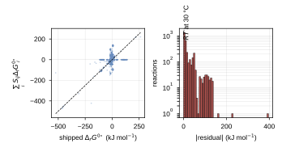
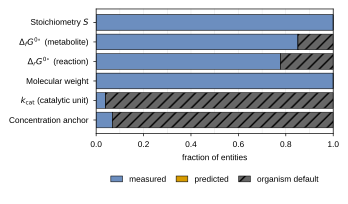
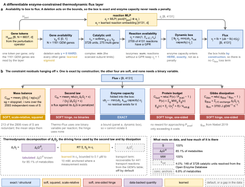
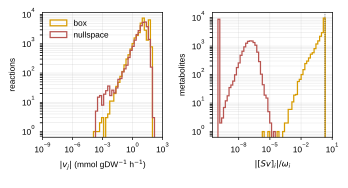
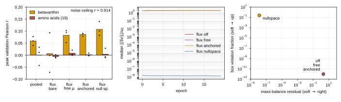

## 2026.09.01 - Build, reconstruction, and first diagnostic runs

Branch `feat/metabolism-flux-module`. Companions: [[plan.cgt-metabolism-flux-layer.2026.07.26]]
(the model specification this implements), [[plan.cgt-metabolism-flux-layer.explainer]]
(derivations), [[plan.cgt-metabolism.2026.07.25]] (Track A run log and noise ceilings).

### Why a flux layer at all, stated as a cost argument

The motivating suspicion is that the multimodal Cell Graph Transformer under-performs on
production phenotypes because it carries no representation of metabolism. Betaxanthin sits
at Pearson 0.128 against a replicate-based noise ceiling of 0.914, which is 14 % of what
the measurement supports.

Constraint-based modeling already answers "which flux vectors are possible", so the
question is why not simply use it. Two reasons, and both are about cost rather than
accuracy.

**A solver's cost is per genotype and does not amortize.** Merzbacher et al. (2025) sample
one flux cone per single deletion by Markov-chain Monte Carlo: 1,159 yeast deletions, 124
samples each, 4.43 GB. The pairwise extension is $\binom{1161}{2} = 673{,}380$ independent
random walks, roughly 2.6 TB, and their own Methods call the walk "computationally costly
because it requires running a random walk on a high-dimensional flux space that needs to
reach mixing time." An amortized model pays that cost once at training time, and a double
deletion is the same forward pass as a single.

**A program cannot learn.** A linear program has no use for a phenotype measurement. Adding
thermodynamics makes it worse rather than better: Smith et al. (2026), the *Thermo-Flux*
protocol, enforces the second law as $\Delta_r G_j \nu_j < 0$, which is bilinear, and
implements it with **one binary indicator per reaction** under a big-M pair. The result is
a mixed-integer program whose cost, in the authors' words, grows because "the number of
possible direction combinations scales exponentially with the number of reactions", with a
24 h wall-time cap per model on an HPC cluster.

So the design target is a layer that keeps the physics and drops the integers.

### The relaxation, term by term

Every hard constraint is either exact by construction or a smooth penalty. No binary
variables anywhere.

**Table 1. Every hard constraint, and how it is enforced here versus in a solver.** Thermo-Flux (Smith et al. 2026) realizes the second law with one binary indicator per reaction under a big-M pair, making the program mixed-integer. Two constraints are exact by construction here and cost nothing in the loss; the other four are smooth penalties and none needs an integer variable.

| constraint | Thermo-Flux / GECKO form | here |
| --- | --- | --- |
| box and directionality | $lb_j \le \nu_j \le ub_j$ | **exact**, sigmoid |
| enzyme capacity | $\nu_j \le k_{\mathrm{cat}}E$ | **exact**, folded into the box |
| mass balance | $S\nu = 0$ | soft, scale-relative |
| second law | $\Delta_r G_j \nu_j < 0$ + one binary per reaction | soft hinge, no binary |
| Gibbs dissipation | $g_{\mathrm{diss}} \le g_{\mathrm{lim}}$ | soft hinge |
| protein budget | $\sum_g \mathrm{MW}_g E_g \le P_{\mathrm{avail}}$ | soft hinge |

**Availability chain.** A deletion enters as a hard zero, not as a learned gate:

$$\gamma_g=\begin{cases}0,& g\ \text{deleted in}\ p\\ \sigma(w^{\top}h^{\mathrm{g}}_g),&\text{otherwise}\end{cases}
\qquad
c_u=-\tfrac1\beta\log\sum_{g\in C_u}e^{-\beta\gamma_g},
\qquad
c_j=\min\Big(1,\ \sum_{u:\rho(u)=j}c_u\Big)$$

A complex takes a softmin over its subunits, since the scarcest one limits it; isozymes
sum, since their capacities add. A reaction with no gene-protein-reaction rule keeps
$c_j=1$: an unannotated reaction is one nobody has assigned a gene to, not one no gene
catalyzes, and zeroing it would let a missing annotation delete a reaction.

**The dynamic box.** Availability and capacity scale the bounds, and the flux is written
inside them:

$$\bar v^{u}_j=\min\Big(v^u_j,\ c_j\!\!\sum_{u:\rho(u)=j}\!\!k_{\mathrm{cat},u}\bar E\Big),
\qquad
v_j=\bar v^{\ell}_j+\big(\bar v^{u}_j-\bar v^{\ell}_j\big)\,\sigma(z_j)$$

One line does four jobs for free. It enforces the box exactly; it enforces directionality
for the 2,463 irreversible reactions; it makes a deletion collapse the box to the single
point $0$, so the deletion bites through the parameterization rather than through a penalty
the data term could trade against; and it therefore contributes **no term to the loss**.

**Mass balance, scale-relative and rank-restricted.**

$$\omega_i(v)=\tfrac12\sum_j\lvert S_{ij}v_j\rvert,
\qquad
C_{\mathrm{bal}}=\frac{1}{\lvert\mathcal{M}^{\dagger}\rvert}\sum_{i\in\mathcal{M}^{\dagger}}\left(\frac{[Sv]_i}{\operatorname{sg}(\omega_i(v))+\epsilon}\right)^{2}$$

$\mathcal{M}^{\dagger}$ is the $\operatorname{rank}(S)=2{,}593$ independent rows; the other
213 are linear combinations whose residual is already determined, so penalizing them
weights some directions of the error several times over. $\operatorname{sg}$ is a
stop-gradient, without which the cheapest way to shrink the ratio is to carry no flux at
all.

**The second law, relaxed.**

$$C_{\mathrm{th}}=\frac{1}{|\mathcal{J}|}\sum_{j\in\mathcal{J}}
\frac{\operatorname{relu}\big(v_j\Delta_r G_j+\epsilon\big)}{\lvert v_j\rvert\lvert\Delta_r G_j\rvert+\epsilon}$$

$\mathcal{J}$ excludes exchange reactions, the biomass reaction, and water transport, which
are the exemptions Thermo-Flux's Box 2 specifies. Two details are not cosmetic. The
$\epsilon$ is needed because the paper's own big-M pair admits $v_j=\Delta_r G_j=0$ under
either value of the binary, so the strict inequality of its Eq. (10) is never actually
realized and a smooth version has to name its tolerance. The denominator makes the term a
dimensionless fraction of the available driving force: measured at initialization on a real
batch, the raw hinge is about 72 against a data loss of about 2, so an unnormalized term
does not regularize the model, it replaces it.

**Loop-freedom is free, and that is the whole trick.** $\Delta_r G$ is a difference of
potentials, so it sums to zero around any cycle and no cycle can run downhill everywhere.
Requiring $v_j\Delta_j\le0$ therefore forbids internal loops with no integer variables,
which is exactly the property that makes loopless flux balance analysis a mixed-integer
program.

**Enzyme demand and the budget.** Enzyme is a function of flux, never predicted:

$$E_g(v)=\sum_{j:\Pi_{gj}>0}\frac{\sqrt{v_j^{2}+\delta}}{k_{\mathrm{cat},gj}},
\qquad
P(v)=\sum_g \mathrm{MW}_g E_g(v),
\qquad
C_{\mathrm{bud}}=\operatorname{relu}\!\Big(\tfrac{P(v)}{P_{\mathrm{avail}}}-1\Big)$$

One-sided, with no reward for approaching the budget. With 1,538 free internal directions,
"use up your budget" is maximized by futile cycles, and enzyme-constrained flux balance
analysis never rewards protein usage either.

**Gibbs dissipation.** Following Niebel et al. (2019) via Thermo-Flux,

$$g_{\mathrm{diss}}=\sum_{j\in\text{exchange}}\Delta_r G_j\,v_j\ \le\ g_{\mathrm{lim}},
\qquad g_{\mathrm{lim}}=3700\ \mathrm{J\,gDW^{-1}\,h^{-1}}$$

implemented as $\operatorname{relu}(g_{\mathrm{diss}}/g_{\mathrm{lim}}-1)$. A squared excess
divided by $g_{\mathrm{lim}}^2$ evaluates to about $4\times10^4$ at initialization and its
gradient drives the whole model to NaN within one step, which is what the first run did.

### Thermodynamics: free versus anchored, and why the distinction is the experiment

Following Thermo-Flux Eq. (4), the in-cell reaction energy decomposes into three terms:

$$\Delta_r G_j=\underbrace{\Delta_r G'^{\circ}_j}_{\text{tabulated}}
+\underbrace{RT\sum_{i\neq \mathrm{H}^{+}}S_{ij}\ln c_i}_{\text{concentration}}
+\underbrace{\Delta_r G^{t}_j}_{\text{transport}}$$

**Free mode** learns an unconstrained potential $\mu_i$ and sets
$\Delta_j=\sum_i S_{ij}\mu_i$. It needs no data and still kills loops, but $\mu$ is
identified only up to an affine map, so it is not an energy and cannot be checked against
anything.

**Anchored mode** takes $\Delta_r G'^{\circ}_j=\sum_i S_{ij}\Delta_f G'^{\circ}_i$ from the
genome-scale model's own shipped table, learns $\ln c_i$ squashed into the physiological
window $[0.1\ \mu\mathrm{M},\ 10\ \mathrm{mM}]$ that Thermo-Flux uses by default, and
conditions it on the genotype. Now the potential has units, the sign of $\Delta_r G_j$ is a
physical claim, and the learned part is a concentration that 191 measured yeast values can
be compared against. Anchoring is what turns the thermodynamic term from a regularizer into
a measurement, and the free-versus-anchored contrast is the experiment that says whether
the tabulated energies carry information beyond the structural loop-freedom any potential
gives.

**Uncertainty is a latent, and this maps a solver step onto a gradient step.** Thermo-Flux
carries correlated uncertainty as $\Delta_rG^{\circ,\mathrm{error}}=Qm$ with
$m\sim\mathcal{N}(0,1)$ and $Q$ the square-root covariance from eQuilibrator, and its Box 3
*infers* $m$ by regression against measured concentrations and fluxes. That inference is
what a latent variable does, so here $m$ is a learned per-reaction offset under a Gaussian
prior, fit by gradient descent instead of by a mixed-integer regression.

$Q$ itself is not available: eQuilibrator is not installed and the shipped table is point
values with no covariance, so the offset is isotropic rather than correlated. That is a real
gap, recorded rather than approximated. The covariance would enter as one matrix multiply.

### The exactness budget, and why it is a fifth arm rather than a footnote

Exactness has to be spent on one constraint or the other, and which one matters is
empirical:

**Table 2. The exactness budget: which constraint each parameterization satisfies exactly.** Exactness can be spent on the bounds or on mass balance, never both. The null-space head is also 2.7 times narrower, since it emits a latent of dimension 1,538 rather than one value per reaction.

| parameterization | $Sv=0$ | box and directionality | head width |
| --- | --- | --- | --- |
| box, $v=\bar v^{\ell}+(\bar v^{u}-\bar v^{\ell})\sigma(z)$ | soft, one weight | **exact** | 4,131 |
| null space, $v=\mathcal{N}z$ with $S\mathcal{N}=0$ | **exact** | soft, one weight | **1,538** |

The null-space basis was computed by singular value decomposition and verified:
$\mathcal{N}$ is $4131\times1538$ and $\max\lvert S\mathcal{N}\rvert = 5.3\times10^{-7}$, at
float32 precision. The nullity of 1,538 matches the specification note exactly. The
null-space head is also 2.7 times narrower, which is a real secondary benefit.

Merzbacher hit this from the other side and reported it: their deep models failed, which
they attribute to "the fluxes being linearly correlated through $Sv=0$." Those correlations
are the constraint, which is the argument for putting the distribution on a latent rather
than on per-reaction marginals.

### The reconstruction: what the layer actually rests on

Everything below is measured by `experiments/026-metabolism-flux/scripts/gem_audit.py`,
which writes `results/gem_audit.json` and both figures. The audit exists because the failure
mode of a constrained model is silent: a capacity constraint built on one organism-wide
turnover number is a uniform rescaling of the flux box, not an enzyme constraint, and
nothing in a loss curve distinguishes the two.

**The network.** yeast-GEM 9.0.2, loaded through cobrapy from the sha256-pinned checkout at
`$DATA_ROOT/data/torchcell/yeast-GEM/yeast-GEM-9.0.2`.

**Table 3. yeast-GEM 9.0.2 as constraint tensors, measured by `gem_audit.py`.** The last row is the reason enzyme constraints are not optional: ten non-default bounds in 4,131 reactions means the stock model carries essentially no magnitude information, so turnover is the only quantity that can set a scale.

| quantity | value |
| --- | ---: |
| metabolites x reactions | 2,806 x 4,131 |
| nonzeros in $S$ (density) | 15,567 (0.134 %) |
| $\operatorname{rank}(S)$ | 2,593 |
| nullity | 1,538 |
| redundant balance rows | 213 |
| reversible / irreversible | 1,668 / 2,463 |
| exchange reactions | 274 |
| reactions with a gene-protein-reaction rule | 2,709 |
| catalytic units (AND-terms), of which multi-gene | 3,728 / 275 |
| genes | 1,161 |
| **bounds that are not the $\pm1000$ default** | **10** |

That last row is the reason enzyme constraints are not optional. Ten non-default bounds in
4,131 reactions means the stock model carries essentially no magnitude information, so
$k_{\mathrm{cat}}$ is the only thing that can set a scale.

**Thermodynamics, and a provenance trap worth naming.** The energies are in
`data/databases/model_metDeltaG.csv` and `model_rxnDeltaG.csv`, which the model's own
`code/missingFields/loadDeltaG.m` uses to populate its `metDeltaG` / `rxnDeltaG` fields.
They are **absent from the SBML**, so a model loaded through `cobra.io.read_sbml_model` has
no thermodynamics at all, which is why nothing in torchcell had read them before.

**The file uses two missing-value conventions and only one of them is obvious.** Most gaps
are the sentinel `10000000`; a further 51 metabolites and 120 reactions are the literal
string `NaN`. Filtering only the sentinel leaves the NaNs, which propagate through every
sum: a reaction touching one gets a NaN standard energy, its hinge contributes NaN to the
loss, and the run produces NaN gradients while the coverage number still reads a healthy
87 %. Rejecting both reproduces the model's own curation counts.

**Table 4. The two missing-value conventions in the shipped thermodynamic tables, and what filtering only one of them costs.** A sentinel-only filter leaves literal NaN values that propagate through every sum and produce NaN gradients, while the reported coverage still reads a healthy 87 percent. Rejecting both reproduces the model's own curation counts.

| entity | sentinel-only filter | sentinel + NaN | the difference |
| --- | ---: | ---: | --- |
| metabolites | 2,440 (87.0 %) | **2,389 (85.1 %)** | 51 literal NaN |
| reactions | 3,330 (80.6 %) | **3,210 (77.7 %)** | 120 literal NaN |

**The two shipped tables do not agree with each other.** Summing the metabolite table over
$S$ gives a standard reaction energy for the 3,505 reactions all of whose participants are
known; comparing those against the shipped reaction column on the 3,204 reactions where both
exist gives a median absolute residual of **9.53 kJ/mol**, 95th percentile **97.3**, maximum
**396.1**. At 30 °C, $RT = 2.52$ kJ/mol, so the median disagreement is about $3.8\,RT$, a
factor of roughly 45 in equilibrium constant. The two columns were produced by different
routes and are not interchangeable.



**Figure 1. The two shipped thermodynamic tables do not agree, and the disagreement has structure.** Left, the standard reaction energy recomputed by summing formation energies over the stoichiometry against the value shipped in the reaction table, on the 3,204 reactions where both exist; the dashed line is equality. The horizontal arm, where the recomputed value is exactly zero, is entirely transport reactions. Right, the absolute residual, with the thermal energy $RT$ at 30 degrees Celsius marked; the median disagreement of 9.53 kJ/mol is about $3.8\,RT$, a factor of roughly 45 in equilibrium constant.

**The disagreement is a cross, not a cloud, and one arm of it is the transport term.** The
scatter has a horizontal arm where the recomputed value is exactly zero while the shipped
value ranges over $\pm150$ kJ/mol, and a vertical arm with the opposite pattern. Testing the
obvious hypothesis:

**Table 5. The disagreement between the two shipped energy tables is a cross, and one arm of it is the transport term.** Summing formation energies over a transport reaction cancels exactly, because the same species appears on both sides, so a transport reaction's whole standard energy is its transport term. Every reaction in the first row is multi-compartment and none in the second is.

| pattern | n | multi-compartment |
| --- | ---: | ---: |
| recomputed $=0$, shipped $>5$ kJ/mol | 441 | **441 of 441** |
| shipped $=0$, recomputed $>5$ kJ/mol | 321 | **0 of 321** |

Summing formation energies over a transport reaction cancels exactly, because the same
species sits on both sides: $\sum_i S_{ij}\Delta_f G'^{\circ}_i = 0$. So a transport
reaction's entire standard energy **is** its transport term, and the shipped column carries
the driving force the metabolite sum structurally cannot.

This both explains the gap and closes it. The transport term
$\Delta_r G^{t}_j = -N_H RT\ln(10)\Delta\mathrm{pH} - Fq\Delta\Phi$ cannot be computed from
scratch without eQuilibrator species distributions, but it does not have to be: it can be
**read off the model's own curation** for exactly the reactions whose recomputed energy is
degenerate. `FluxLayerConfig.use_shipped_transport_delta_g` does this, populating 874
nonzero transport terms out of 1,099 qualifying reactions. It is off by default and off in
every arm reported below, because it changes what the thermodynamic term asserts rather than
tuning it, so it belongs in a named arm rather than in a silent default.

**What it does not fix.** The 2,021 single-compartment reactions still disagree by a median
10.2 kJ/mol, about $4\,RT$, and transport explains none of that. The anchored mode
recomputes from the metabolite table and masks any reaction with an unknown participant,
which is the more conservative of the two routes, and the residual disagreement is an open
provenance question about the genome-scale model rather than about this layer.

**Kinetics, and this is the headline gap.** Molecular weight resolves completely; turnover
does not.

**Table 6. What each parameter class rests on, measured against yeast-GEM 9.0.2.** Molecular weight resolves completely and turnover almost not at all. The 4.0 percent is the binding constraint on the entire enzyme layer, and it is measured in the best-curated eukaryote available.

| parameter | source | coverage |
| --- | --- | ---: |
| molecular weight | SwissProt table shipped with the model | **1,161 / 1,161 (100 %)**, median 50.1 kDa |
| $k_{\mathrm{cat}}$ | Open Enzyme Database, *S. cerevisiae* slice | **148 / 3,728 catalytic units (4.0 %)** |
| measured concentration | YMDB table shipped with the model | 191 / 2,806 metabolites (6.8 %) |
| $\Delta_f G'^{\circ}$ | model's own table | 2,389 / 2,806 (85.1 %) |



**Figure 2. What each parameter class rests on: measurement, prediction, or an organism default.** Stoichiometry and molecular weight are complete and formation energies cover most metabolites, but turnover is resolved for only 4.0 percent of catalytic units from the Open Enzyme Database and nothing is predicted yet. A capacity constraint built on a default turnover is a uniform rescaling of the flux box rather than an enzyme constraint, and no loss curve distinguishes the two.

**Four percent, in the best-curated eukaryote there is.** The entire Open Enzyme Database
*S. cerevisiae* slice is 1,126 rows against 1,161 metabolic genes and 4,131 reactions. The
remaining 96 % of catalytic units currently take an organism default of 10.3 s$^{-1}$, which
is the median of the values that did resolve rather than a literature constant, and which is
tagged `organism_default` per unit so a "published only" ablation is a filter rather than a
re-run. This number is the argument for sequence-based prediction, and it is not a yeast
problem, it is a floor: any other yeast or bacterial chassis has less.

**A join bug found by hit rate, worth recording as a method.** The SwissProt table's
`gene_id` column is an **alias list**, not a standard-plus-systematic pair. `RAM2 YKL019W`
is two tokens, but `ERG20 BOT3 FDS1 FPP1 YJL167W J0525` is six with the systematic name
fifth, and token counts across the file run from 1 to 11. Taking the last token matched 430
of 1,161 genes; taking the first matched 38; selecting the token that matches a systematic
open-reading-frame pattern matched 1,161 of 1,161. Nothing errored in any of the three
cases. The check that caught it was joining against a known key set and looking at the hit
rate, not inspecting the first few rows. It also moved measured $k_{\mathrm{cat}}$ coverage
from 1.3 % to 4.0 %, so the 4 % above is the post-fix number.

**A reproducibility check that passed.** Re-fetching the Open Enzyme Database slice today
produced a file byte-identical to the July 2026 capture, sha256
`0e4aca9e0872e5b19b7c325dc83c64cc43c9f2fba0d535d417e10a925e683398`, 1,126 records. Thirty-seven
days, no drift.

**The gaps, stated rather than approximated.** The uncertainty covariance $Q$ is
unavailable, so the Thermo-Flux error latent is isotropic rather than correlated. The
transport term was a gap too and is now recoverable, as the delta-G section above shows.
Both are recorded in `FluxLayer.coverage_report()` so a run cannot report feasibility
without also reporting what it did not model.

### Closing the deferred metabolite-identifier gap

All 19 Mülleder amino acids resolve to cytosolic yeast-GEM species, which is what the
loader deferred as `target_metabolite_ids`: alanine `s_0955` through valine `s_1056`,
tyrosine at `s_1051`. That mapping is what lets the metabolome head be mechanistic rather
than another projection, since the model reads its own predicted turnover at exactly the
species that were measured.

### Porting to another organism, and why kinetics is the only real barrier

The constraint layer is a pure function of a genome-scale model. There is no yeast constant
in `torchcell/metabolism/constraints.py` or `flux_layer.py`; the organism-specific surface
is a model, a compartment table, and two scalars.

**Table 7. The organism-specific surface of the constraint layer.** Every row but the last is a lookup. Formation energies are chemistry and transfer unchanged; turnover and affinity do not, which is why the parameter layer is a resolution policy rather than a table.

| ingredient | organism-specific? | where it comes from |
| --- | --- | --- |
| $S$, bounds, gene-protein-reaction rules | yes | the new organism's model |
| $\Delta_f G'^{\circ}$ | **no**, this is chemistry | a shared thermodynamic table |
| molecular weight | yes, but trivially | the proteome |
| compartment pH, ionic strength, $\Delta\Phi$ | yes | Thermo-Flux Table 1 gives values for *E. coli*, *S. cerevisiae* and *Arabidopsis* |
| $P_{\mathrm{avail}}$, $g_{\mathrm{lim}}$ | yes, two scalars | literature |
| $k_{\mathrm{cat}}$, $K_M$ | **yes, and this is the barrier** | see below |

Everything except the last row is a lookup. The last row is 4 % covered in *S. cerevisiae*
and worse everywhere else, which is why the parameter layer is written as a **policy** with
a per-value provenance tag rather than as a table.

**Resolution order, and database-first is a correctness requirement rather than a
preference.** A predictor trained on BRENDA will reproduce values it memorized, so using a
prediction where a measurement exists both discards information and inflates any apparent
agreement between the two.

1. **experimental**: BRENDA and the Open Enzyme Database, joined on UniProt accession and
   substrate, selected at the assay temperature nearest the phenotype's 30 °C;
2. **predicted**: a sequence-based model fills the gap;
3. **organism default**: reported as coverage, never presented as a measurement.

**The three predictors, registered by capability rather than hardcoded.**

**Table 8. The three sequence-based kinetic predictors the parameter layer is built around.** RealKcat is the one that closes the affinity gap, which matters because promiscuity is a $K_M$ effect: Wu et al. (2026) measured underground reactions at roughly twice the $K_M$ with indistinguishable $k_{\mathrm{cat}}$, so a turnover-only model routes promiscuous flux at full native capacity for free.

| predictor | inputs | emits |
| --- | --- | --- |
| KcatNet | protein sequence + substrate SMILES | $k_{\mathrm{cat}}$ |
| RealKcat | protein sequence + substrate SMILES | $k_{\mathrm{cat}}$ **and** $K_M$ |
| DEKP | sequence + optional structure file, graph network over pretrained language models | $k_{\mathrm{cat}}$ |

RealKcat is the one that closes the affinity gap, and affinity is what makes promiscuity
cost something: Wu et al. (2026) measured underground reactions at about 2x higher $K_M$
with **indistinguishable** $k_{\mathrm{cat}}$, so a $k_{\mathrm{cat}}$-only model routes
promiscuous flux at full native capacity for free. DEKP is the right choice when a predicted
structure exists and the sequence is far from anything in the training set, which is the
usual situation for a novel chassis.

`KcatPredictor` is a protocol with a registry, so a run records **which predictor produced
which value**. Wiring an actual checkpoint in is deliberately a separate, GPU-bearing step
and is not done here. Note that GECKO 3.0 reports doing the same thing, "incorporates deep
learning-predicted enzyme kinetics" to cover organisms lacking experimental data, so this is
the field's converged answer rather than a novel one.

**Carrying uncertainty rather than a point value** is the intended next step and is already
shaped for it: a predicted $k_{\mathrm{cat}}$ that is too low forbids feasible flux and one
that is too high is vacuous, so the predictor's posterior quantile $q$ belongs in the box.
$q=0.1$ means the model may use only capacity it is confident exists, $q=0.5$ is the usual
point estimate, and resampling $q$ per forward pass makes the box itself stochastic, which
composes with the amortized-sampler framing.

### Always emit fluxes, or sample on demand? One switch, and it is not architectural

The question of whether the forward pass should always output fluxes or be sampled when
needed turns out not to be a fork in the architecture. Both are the same layer with
`FluxLayerConfig.stochastic` flipped, because the box is applied identically either way.

**Table 9. Deterministic versus stochastic flux head.** Both are the same layer with one configuration flag flipped, because the box applies identically either way. The flux is always produced, since the phenotype heads read it; what the flag changes is whether repeated calls on one genotype vary.

| | deterministic head | stochastic head |
| --- | --- | --- |
| $z_j$ | emitted by the reaction network | drawn from $q_\phi(z\mid H_{\mathrm{pert}})$ |
| $v$ is | one point **selected** by the objective's implicit preference | a random variable supported on the feasible set |
| cost | one forward pass | $S$ forward passes for $S$ draws |
| what it replaces | parsimonious flux balance analysis | Markov-chain flux sampling |

The flux is always produced, since the phenotype heads read it. What `stochastic` changes is
whether repeated calls on one genotype vary. So the practical policy is to train
deterministic, which is cheaper and better conditioned, and to sample only where a
distribution is the deliverable: reporting an interval, propagating kinetic-parameter
uncertainty, or scoring a design whose label does not exist yet.

**The trap, and it is the reason the latent is shared.** A per-reaction marginal
distribution is not a distribution over flux vectors. $Sv=0$ constrains the joint, so
drawing each $v_j$ from an independent marginal almost surely violates it. Sampling one
latent and mapping it to all 4,131 coordinates at once is what keeps them coupled, and it is
the same point Merzbacher reached from the other direction when their deep models failed
"attributed to the fluxes being linearly correlated through $Sv=0$."

**Flux variability analysis is the reference, and it is label-free.** Running it on the wild
type at 90 % of optimum, by `scripts/fva_reference.py`:

**Table 10. Wild-type flux variability analysis at 90 percent of optimum, the reference an amortized sampler is scored against.** The licensed set excludes reactions the constraints leave free over the full range, where narrowing would mean nothing. The count of 2,818 reproduces the specification note's independently derived figure exactly.

| quantity | value |
| --- | ---: |
| wild-type growth | 0.0858 h$^{-1}$ |
| blocked reactions, width 0 | 1,286 |
| **width $\le$ 1, the licensed set** | **2,818** |
| width $\le$ 10 | 3,671 |
| width $\ge$ 1000, i.e. unconstrained | 452 |
| median width | 0.118 |

The 2,818 figure reproduces the specification note's independently derived count exactly.
Restricting the comparison to that set matters: a reaction FVA leaves free over the full
$\pm1000$ range is not one where narrowing means anything, it is one the constraints say
nothing about. The evaluation is then
$\mathrm{width}_{\mathrm{FVA}}(j) - \mathrm{width}_{\text{posterior}}(j)$ per licensed
reaction, which needs no phenotype label and can therefore be run on double deletions where
no production measurement exists.



**Figure 3. The flux layer, from gene tokens to a feasible flux vector and its residuals.** (a) A deletion sets gene availability to zero as a hard fact, not a learned gate; complexes take a softmin over subunits and isozymes sum, and enzyme capacity enters the bounds rather than the loss, so the box holds by construction and contributes no loss term. (b) Five residuals hang off the flux. One is exact and the other four are smooth penalties, none requiring a binary variable. The insets give the three-term decomposition of the reaction driving force and the fraction of each input that is measured rather than defaulted.

The embedded file is `metabolism-flux-layer.vector.svg`, not draw.io's own SVG export.
draw.io writes its labels as HTML `foreignObject` elements, which `rsvg-convert` cannot
draw, so the note-to-PDF path renders that export with every label truncated and a "Text
is not SVG, cannot display" overlay, and exits 0. Round-tripping draw.io's PDF export
through `pdftocairo -svg` outlines the text into paths, which renders identically
everywhere and stays zoomable. `notes/assets/publish/scripts/drawio_vector_svg.sh` does
this and fails loudly if any `foreignObject` survives.

### The diagnostic experiment

Two phenotypes, both single-deletion panels, both already built into the
`fig6_pigment_transfer` dataset at 4,930 aggregated genotypes.

**Table 11. The two phenotypes, both single-deletion panels already built into the `fig6_pigment_transfer` dataset.** Betaxanthin has a replicate-based ceiling and the amino-acid panel has none, since Mülleder reports one replicate per strain with no standard error.

| phenotype | source | n | shape | ceiling |
| --- | --- | ---: | --- | --- |
| betaxanthin | Cachera 2023, CRI-SPA corrected fluorescence | 4,735 | scalar, population-centered | $r = 0.914$ |
| amino acids | Mülleder 2016, intracellular mM | 4,678 | vector(19) | none, $n_{\text{rep}} = 1$ |

**The heads are mechanistic in the flux arms and pooled in the baseline**, which is what
makes the comparison mean anything.

- `mulleder19` reads the model's own turnover at the 19 measured species:
  $\hat y_k = a_k\log(1+\omega_{i_k}(v)) + b_k$. Turnover is not concentration, and the
  per-metabolite affine is where that gap is admitted: a steady-state model has no residence
  time in it, so the claim is monotone, not calibrated, and the metric to read is a
  correlation rather than an error in mM. The affine is per metabolite because the 19 pools
  differ by orders of magnitude and one shared slope would let the largest set the scale.
- `betaxanthin` is a product the network does not contain, since its route is a heterologous
  cassette and no column of $S$ carries it. What the network does carry is the precursor
  supply, so the head reads
  $\hat y = w^{\top}v + u^{\top}\log(1+\omega_{\mathcal{P}}(v)) + b$ with $\mathcal{P}$ the
  named aromatic precursors including cytosolic tyrosine. The dense $w^{\top}v$ term is kept
  alongside so the precursor claim can be ablated against an unrestricted read of the same
  flux vector rather than assumed.

**The metabolome head has almost no capacity, and that is deliberate.** It holds 38
parameters, two per measured amino acid, against the pooled baseline's multilayer
perceptron. Any correlation it achieves therefore comes from the flux vector rather than
from the head, which is what makes it a test of the flux layer instead of a test of a
readout. The cost is that a null result is ambiguous between "the flux carries no signal"
and "an affine in $\log\omega$ is the wrong link function", and only the first of those is
about metabolism. Reading the pooled arm alongside is what separates them.

**Five arms, each changing one thing relative to the one above**, so a difference is
attributable. Three seeds each, identical splits within a seed.

**Table 12. The five arms, each changing exactly one thing relative to the arm above it.** `pooled` to `flux_off` asks whether routing a prediction through a stoichiometric network helps at all; `flux_free` to `flux_anchored` asks whether the measured energies add anything beyond the loop-freedom any potential gives; `flux_anchored` to `flux_nullspace` is the exactness budget.

| arm | what it adds |
| --- | --- |
| `pooled` | baseline: the existing multilayer perceptron over pooled gene tokens |
| `flux_off` | flux layer, availability chain, mass balance. No thermodynamics, no $k_{\mathrm{cat}}$ |
| `flux_free` | + learned potential, so loop-freedom without tabulated energies |
| `flux_anchored` | + tabulated $\Delta_f G'^{\circ}$, enzyme capacity, budget, dissipation |
| `flux_nullspace` | the same, with the exactness budget spent on $Sv=0$ instead of the box |

`pooled` to `flux_off` asks whether routing the prediction through a stoichiometric network
helps at all. `flux_free` to `flux_anchored` asks whether the measured energies carry
information beyond the structural loop-freedom any potential gives. `flux_anchored` to
`flux_nullspace` is the exactness budget.

**Loss weighting had to be set from a measurement, not chosen.** At initialization on a real
batch the unweighted constraint sum is about 255 against a data loss of about 2, so at
weight 1 the model spends every parameter on feasibility and none on the phenotype. Two
terms were also reformulated rather than merely down-weighted, because their raw forms are
not dimensionless: the second-law hinge is now divided by the available driving force, and
the dissipation excess is a ratio rather than a square. The squared form evaluated to about
$4\times10^{4}$ at initialization and drove the first run to NaN within one step.

### The sharpest result so far: a sigmoid box cannot reach a sparse flux vector

In every box-parameterized arm the mass-balance diagnostic
$\operatorname{median}_i\lvert[Sv]_i\rvert/\omega_i$ sits at **1.99** and does not move over
training, while the second-law violation fraction falls steadily from 0.373 to 0.257 over
the same epochs. The thermodynamic penalty is working and the balance penalty is not, and
the reason is structural rather than a matter of weight.

**2.0 is the maximum that statistic can take.** With $\omega_i = \tfrac12\sum_j\lvert
S_{ij}v_j\rvert$, a metabolite that is only produced and never consumed gives
$\lvert[Sv]_i\rvert = 2\omega_i$ exactly. A median of 1.99 says the median metabolite is
completely unbalanced.

**The mechanism is the parameterization.** For the 2,463 irreversible reactions
$v^{\ell}_j = 0$, so $v_j = 0$ requires $\sigma(z_j) = 0$, that is $z_j \to -\infty$. **Zero
flux is an asymptote of the parameterization, not a point in it.** A real parsimonious flux
solution is overwhelmingly sparse, so balanced solutions live exactly where a sigmoid box
cannot go, and the optimizer's only route there is to drive thousands of logits to large
negative values against weight decay.

Measured by `scripts/box_zero_reachability.py` on the real network at initialization:

**Table 13. Flux magnitude and mass balance under both parameterizations, at initialization on the real network.** Zero flux is an asymptote of a sigmoid box, so balanced solutions live where that parameterization cannot go. The null-space form is 70 times more likely to produce a near-zero flux without being asked.

| quantity | box | null space |
| --- | ---: | ---: |
| median $\lvert[Sv]_i\rvert/\omega_i$ | 1.27 | **2.8e-08** |
| metabolites at the maximum imbalance of 2 | 29.4 % | 0 % |
| metabolites below ratio 0.1 | 8.0 % | 100 % |
| fluxes below $10^{-4}$ mmol gDW$^{-1}$ h$^{-1}$ | **0.17 %** | 11.9 % |
| median $\lvert v_j\rvert$, mmol gDW$^{-1}$ h$^{-1}$ | 11.0 | 9.0 |
| box violation fraction | **0 %** | 37.0 % |



**Figure 4. Why a sigmoid box cannot produce a sparse, mass-balanced flux vector.** Left, the distribution of flux magnitudes at initialization; the null-space form reaches near-zero fluxes that the box does not, because zero flux is an asymptote of the sigmoid rather than a point in its range. Right, the mass-balance residual as a fraction of metabolite turnover. The box arm piles up against the dotted line at 2.0, which is the maximum the statistic can take and means the median metabolite is completely unbalanced, while the null-space arm sits eight orders of magnitude lower at float32 round-off.

The right panel is the whole argument in one picture. The box arm's balance residuals pile
up against the dotted line at 2.0, the maximum the statistic can take, while the null-space
arm sits eight orders of magnitude lower at float32 round-off.

To put a reaction at $10^{-6}$ of its upper bound the logit must reach $-13.8$; at
$10^{-9}$, $-20.7$. Doing that for the roughly 88 % of reactions that should carry no flux
means driving about 3,600 logits to $-14$ or beyond while weight decay pulls them back. The
null-space parameterization is not merely exact on mass balance, it is also **70 times more
likely to produce a near-zero flux** without being asked, because sparsity is not fighting
the parameterization there.

**The same cause shows up in the dissipation term.** At the end of the anchored run the
Gibbs dissipation rate is $5.54\times10^{5}$ J gDW$^{-1}$ h$^{-1}$ against Niebel's limit of
$3.7\times10^{3}$, a 150-fold excess, because $g_{\mathrm{diss}}$ sums
$\Delta_r G_j v_j$ over exchange reactions and the box keeps every one of them running near
half capacity. Two of the four soft constraints are therefore failing for one structural
reason rather than for two independent ones, which is worth knowing before either weight is
touched.

**What is working.** The second-law hinge falls from 0.373 to 0.266 over 20 epochs, and the
protein budget is satisfied with room to spare at 0.26 % of $P_{\mathrm{avail}}$. Neither of
those depends on driving fluxes to zero, which is consistent with the diagnosis.

**The design consequence.** If the box is kept, it needs an explicit zero rather than a
heavier penalty: a gate, a hard-concrete mask, or a shifted sigmoid with a flat region at
the lower bound. That is a specific, testable next change, and it is the thing this
diagnostic bought that a loss curve alone would not have.

### Media: the FBA layer works, the ontology objects do not reach it yet

The question of whether the `Media` schema maps onto exchange bounds now has a measured
answer, from `torchcell/metabolism/media.py` and `scripts/media_schema_audit.py`. The
mapping resolves each media component to an exchange reaction through the model's own
annotations, and reports coverage rather than silently dropping anything.

**The four recipes work.** All 271 exchange reactions are indexed, every component resolves,
and every medium supports growth.

**Table 14. The four media recipes mapped onto exchange bounds, with growth under each.** Every component of every medium resolves to an exchange reaction, and each medium supports growth. Pairwise differences confirm the four collapse to one real axis, the 20 amino acids, plus one or two nucleobases.

| medium | components | resolved | unresolved | growth, h$^{-1}$ |
| --- | ---: | ---: | ---: | ---: |
| SM | 25 | 25 | 0 | 0.314 |
| SC | 47 | 47 | 0 | 0.543 |
| SC-URA | 46 | 46 | 0 | 0.539 |
| YPD-approx | 45 | 45 | 0 | 0.535 |

The pairwise differences confirm the prediction that our four media collapse to one real
axis: SM against SC differs by 22 exchanges, the 20 amino acids plus adenine and uracil,
while SC against SC-URA differs by exactly one, uracil. No bound ever differs in magnitude,
only in presence.

**The sourcing error is confirmed and costs a factor of three.** Suthers et al. set
supplements to a fixed 0.165 mmol gDW$^{-1}$ h$^{-1}$, which is 5 % of their *default* 3.3
glucose uptake, and their own runs at glucose 10.0 do not rescale. Our older code computes
`glucose_rate * 0.05`, giving 0.5 at glucose 10.0, or **3.03x the sourced value**. The
growth consequence on SC is 1.194 h$^{-1}$ sourced against 1.652 rescaled. The new module
follows the source.

**The ontology objects do not reach any of this, and that is the finding.** All four
datasets emit a name-only `Media` with **zero components**, so each maps to zero bounds and
an infeasible model with every exchange closed:

**Table 15. What the four datasets actually emit for their growth medium.** Each is a name-only object with zero components, so it maps to zero bounds and an infeasible model with every exchange closed. The join from a dataset to a medium is currently a name string, not a component list.

| loader | line | emitted |
| --- | --- | --- |
| `cachera2023.py` | 321 | `Media(name="SC", state="solid", is_synthetic=True)` |
| `ozaydin2013.py` | 361 | `Media(name="SC-URA", state="solid", is_synthetic=True)` |
| `mulleder2016.py` | 241 | `Media(name="SM", state="solid", is_synthetic=True)` |
| `ohya2005.py` | 317 | `Media(name="YPD", state="liquid", is_synthetic=False)` |

So the join from a dataset to a medium is currently **a name string**, not a component
list. Pushing all eight hand-written media from the library through the same mapping gives
growth 0.0 for seven and infeasible for the eighth, and `SM` has no ontology object at all.

**What the schema is missing, precisely.** A bound is a rate and a `Concentration` is an
amount per volume, so the conversion needs fields that do not exist:

1. no molar mass or formula on `Compound`, so `2.0 percent_w/v` glucose cannot become mM;
2. no culture physiology (biomass density, volume, batch versus chemostat, dilution rate),
   so the uptake magnitude has to come from a model convention rather than from the record;
3. no aeration or atmosphere field, and oxygen is the single largest determinant of yeast
   flux;
4. water is never a recipe line, so the solvent must be injected by the adapter;
5. `composition_deferred` hides the entire mineral and vitamin base, so one unresolvable
   "yeast nitrogen base" line stands in for about 14 salts and 9 vitamins;
6. `Compound.chebi_id` is `None` on every component in the library, so the annotation join
   the design note names as the key currently carries 0 of 163 resolutions. The channel
   itself works: 47 of 47 SC components round-trip from the model's own ChEBI ids alone;
7. no transportability flag, so agar, canavanine, G418 and peptone are excluded by role
   inference rather than by a declared property.

Three of the four loaders also record `state="solid"` for plate screens while the recipes
are liquid, and Ohya correctly records `is_synthetic=False` against the recipe's `True`.
That last disagreement is the honest signal that YPD-approx is a stand-in rather than YPD,
which is why it is named that way.

### Literature captured for this work

**Table 16. Literature captured for this work.** Nothing was written to Zotero. The closed-access GECKO 3.0 protocol is recorded as a provenance gap with every attempted retrieval route and its exact failure, plus a manual recipe.

| key | status |
| --- | --- |
| `smithThermofluxGenerationAnalysis2026a` | already mirrored, read in full; the source for the second-law relaxation, the exemption set, the three-term decomposition, and the dissipation limit |
| `fangReconstructingOrganismsSilico2020` | **newly mirrored**, full text via an open-access author manuscript, MinerU OCR, sha256-pinned manifest |
| `chenReconstructionSimulationAnalysis2024` | **documented provenance gap.** GECKO 3.0 is closed access; ten retrieval routes tried and recorded with their exact failures, plus a manual recipe. Abstract only |

Nothing was written to Zotero. The GECKO 3.0 abstract does confirm the direction taken here:
it "incorporates deep learning-predicted enzyme kinetics" to cover organisms lacking
experimental $k_{\mathrm{cat}}$, so the predictor tier is the field's converged answer.

Fang et al. is worth one line beyond the mirror: their review names enzyme complex
stoichiometry and $k_{\mathrm{cat}}$ as **the two bottlenecks** in metabolic and expression
model reconstruction, and calls systems-level $k_{\mathrm{cat}}$ elucidation an open area.
The 4.0 % coverage measured here is that bottleneck with a number on it.

### Reproducing everything

Every command runs from the worktree root with `PYTHONPATH=$PWD` and the torchcell
environment interpreter. Scripts live in `experiments/026-metabolism-flux/scripts/` and
outputs land in the sibling `results/`, so only the bare names vary:

```bash
PYTHONPATH=$PWD ~/miniconda3/envs/torchcell/bin/python \
    experiments/026-metabolism-flux/scripts/<script>
```

**Table 20. Every artifact in this note and the committed script that regenerates it.** All commands run from the worktree root with `PYTHONPATH=$PWD` and the torchcell environment interpreter; script paths are relative to `experiments/026-metabolism-flux/`.

| step | script | writes |
| --- | --- | --- |
| parameter audit | `gem_audit.py` | `gem_audit.json`, Figure 2, Figure 1 |
| media audit | `media_schema_audit.py` | `media_schema_audit.json` |
| FVA baseline | `fva_reference.py` | `fva_wildtype.csv`, `fva_census.json` |
| box reachability | `box_zero_reachability.py` | `box_zero_reachability.json`, Figure 4 |
| the arm sweep | `train_flux.py --arms ... --seeds 42,7,1234` | `flux_arms_gpu{0,1}.json` |
| figures + summary | `plot_flux_arms.py` | `flux_arms_summary.json`, Figure 5 |
| flux sampling | `flux_sampling_demo.py` | `flux_sampling_demo.json` |
| diagram vector | `drawio_vector_svg.sh` (in `notes/assets/publish/scripts/`) | Figure 3 |

Tests: `pytest tests/torchcell/metabolism/test_flux_layer.py` (13 property tests, one
requiring the yeast-GEM checkout). They assert the claims rather than the outputs: the box
holds exactly, a deletion zeros its reaction, an unannotated reaction is never deleted, the
null space balances mass to machine precision, no residual is NaN or out of scale, and the
gradient reaches the gene tokens.

### Results: five arms, three seeds, 20 epochs

Peak validation Pearson, identical splits within a seed. Betaxanthin's replicate-based
noise ceiling is 0.914, so every number here is between 1 % and 12 % of what the
measurement supports.

**Table 17. Peak validation Pearson per arm, three seeds, identical splits within a seed.** Betaxanthin's noise ceiling is 0.914, so every value is between 1 and 12 percent of what the measurement supports. No between-arm mean difference clears the seed spread; the only comparison that separates is the variance, and that is post-hoc.

| arm | betaxanthin per seed | mean | sd | amino acids, mean |
| --- | --- | ---: | ---: | ---: |
| `pooled` | 0.041, 0.077, 0.059 | 0.059 | 0.018 | +0.001 |
| `flux_off` | -0.001, 0.093, -0.071 | **0.007** | **0.083** | -0.006 |
| `flux_free` | 0.102, 0.095, 0.053 | 0.083 | 0.027 | +0.008 |
| `flux_anchored` | 0.079, 0.090, 0.091 | 0.087 | **0.007** | +0.002 |
| `flux_nullspace` | 0.140, 0.100, 0.083 | **0.108** | 0.029 | +0.004 |



**Figure 5. Five arms, three seeds, 20 epochs.** (a) Peak validation Pearson, with each seed drawn as a point rather than an error bar, because three seeds do not describe a distribution. No between-arm mean difference on betaxanthin clears the seed spread, and the amino-acid panel is null in every arm including the pooled baseline. (b) The mass-balance residual over training, where the three box arms overlie each other at the maximum and the null-space arm sits at round-off. (c) The exactness budget: the box arms occupy one corner and the null-space arm the other, and neither reaches the origin.

**On betaxanthin, no arm-to-arm difference clears the noise.** The largest gap is
`flux_nullspace` over `pooled` at +0.049 against a difference standard error of 0.020, so
2.4 standard errors at three seeds. `flux_anchored` over `pooled` is +0.028 at 2.5. Both are
suggestive and neither is a result: the 019 replicate study established that gaps below
about 0.04 are noise on this substrate, and one of these two is below that line while the
other sits on it. **They are reported as trends and nothing is claimed from them.**

**The one comparison that does separate is a variance, not a mean.** `flux_anchored` has a
seed spread of 0.0065 against `flux_off`'s 0.0826, a variance ratio of 161. Under an F test
at two and two degrees of freedom that clears the 1 % level, and unlike the mean
differences it is a large effect measured on a quantity three seeds can actually estimate.
The honest caveat is that it is **post-hoc**, being the largest of ten pairwise variance
ratios, so a Bonferroni-corrected threshold would want about 199 rather than 161. Read it as
strong-but-not-confirmed.

**The ordering it suggests is worth stating even though the means do not separate.** A bare
flux layer with no thermodynamics and no enzyme constraints is the worst and by far the
least stable arm, below the pooled baseline it replaces. Adding a potential recovers it, and
adding the tabulated energies plus enzyme capacity makes it reproducible. **Routing a
prediction through a stoichiometric network is not what helps; constraining that network
is.** That is a testable claim and the next round should test it, because it is exactly the
claim these three seeds cannot settle.

**The amino-acid panel is a clean null across every arm**, including the pooled baseline.
Arm means run from -0.006 to +0.008 while individual seeds swing between -0.043 and +0.033,
so the between-arm differences are an order of magnitude smaller than the within-arm spread.
Two readings remain open and this experiment does not separate them: the flux vector may
carry no information about amino-acid pools, or an affine in $\log\omega$ may be the wrong
link function for a 38-parameter head. Only the first is a statement about metabolism. What
can be said is that the pooled multilayer perceptron does no better, so the mechanistic head
is not losing to a readout with more capacity.

**Feasibility behaved exactly as the parameterization analysis predicted**, which is the
part of this experiment that did work as designed:

**Table 18. Feasibility at the end of training, which behaved exactly as the parameterization analysis predicted.** The three box arms sit at one corner and the null-space arm at the other, and neither reaches the origin. The null-space arm's second-law violation near 0.5 shows that spending exactness on mass balance costs the thermodynamic term as well as the bounds.

| arm | mass balance | box violation | second-law violation |
| --- | ---: | ---: | ---: |
| `flux_off` | 1.97 | 0 | term disabled |
| `flux_free` | 1.96 | 0 | 0.199 |
| `flux_anchored` | 1.98 | 0 | 0.266 |
| `flux_nullspace` | **1.4e-08** | **0.27** | 0.45 |

The three box arms sit at one corner and the null-space arm at the other, and neither
reaches the origin. The null-space arm's second-law violation of 0.45 is near the 0.5 of a
coin flip, so spending exactness on mass balance costs the thermodynamic term as well as the
bounds.

**A metric defect found and fixed mid-sweep.** The null-space arm returned `nan` for
betaxanthin in 8 of 20 epochs at one seed and exactly `0.0` in 3 more. Both are the same
event: the head collapsed onto a near-constant prediction, and an absolute variance floor of
1e-12 sits in the middle of the residual spread such a collapse leaves, so the same failure
was reported two different ways and neither said what happened. The guard is now relative to
the target's spread, non-finite pairs are excluded and counted, and the whole arm was re-run
under the corrected metric. **The numbers in the table above are the corrected ones.** The
lesson generalizes past this experiment: a collapse detector with an absolute threshold does
not detect collapses.

### Amortized flux sampling, and what the width comparison does and does not show

`scripts/flux_sampling_demo.py` trains the anchored arm with a stochastic head for 12
epochs, then draws 128 flux vectors for each of 32 genotypes. Every draw is one forward
pass and every draw lands inside its genotype's box, so no rejection step is involved.

**Table 19. Amortized flux sampling against the flux-variability reference.** The narrowing is not evidence that data added information: a collapsed sampler emits zero-width intervals and would score 100 percent here. The missing half of the evaluation is coverage, the fraction of held-out observations falling inside the predicted interval.

| quantity | value |
| --- | ---: |
| FVA-licensed reactions, width in $(0, 1]$ | 1,532 |
| reactions where the model interval is narrower | 868 (56.7 %) |
| median model interval width | 0.0081 |
| median FVA interval width | 0.1114 |

The 1,532 is the 2,818 reactions of width $\le 1$ minus the 1,286 blocked ones, which is a
consistency check on the whole pipeline rather than a new number.

**The narrowing is not evidence that the data added information, and it must not be read
that way.** A sampler that has collapsed produces a zero-width interval and would score
100 % on this comparison. With 12 epochs and a betaxanthin correlation of 0.036 this model
is barely trained, so a median width 14 times narrower than FVA's is at least as consistent
with an under-dispersed posterior as with a genuine reduction in uncertainty. **The missing
half of the evaluation is calibration**: the fraction of held-out observations falling
inside the predicted interval. Width without coverage is not information, and running the
coverage check is the first thing to do before this number is quoted anywhere.

What the demonstration does establish is the mechanism and its cost. A flux distribution
per genotype is 128 forward passes rather than a Markov chain run to mixing, a double
deletion is the same forward pass as a single, and the comparison needs no phenotype label,
so it can be run on genotypes whose production has never been measured.

### Next changes, in the order they should happen

1. **Give the box an explicit zero.** The reachability measurement says a sigmoid box cannot
   produce a sparse flux vector, and that is the single largest structural defect. A gate, a
   hard-concrete mask, or a shifted sigmoid with a flat region at the lower bound are the
   three candidates; the diagnostic to score them against already exists.
1b. **Add the calibration half of the sampler evaluation.** Interval width alone is
   satisfied by a collapsed posterior, so the coverage fraction has to be reported beside
   it before any narrowing is described as information gained.
1c. **Re-run the arms at more seeds and more epochs.** Every mean difference here is inside
   the noise, and the specific claim worth testing is the one the variances suggest: that
   constraining a flux layer, not merely having one, is what makes it work.
2. **Run the transport-term arm.** `use_shipped_transport_delta_g` is implemented and
   tested but was off in every arm reported here, so whether recovering 874 transport
   driving forces changes the thermodynamic term's behavior is currently unmeasured.
3. **Wire one $k_{\mathrm{cat}}$ predictor.** 4.0 % coverage is the binding constraint on
   the enzyme layer, and RealKcat is the one that also closes $K_M$. The provenance tag
   makes the published-only ablation free once the values exist.
4. **Give the loaders component-bearing `Media` objects.** The mapping works and the recipes
   grow; the join is a name string. Populating `Compound.chebi_id` alone would switch the
   annotation channel from 0 to 47 of 47 resolutions on SC.
5. **Compare against Flux Cone Learning as a distribution over flux vectors, not as a
   classification score.** The earlier plan was to reproduce their 3-class accuracy on
   their 811 metabolic genes, and that is the wrong comparison: it scores a downstream
   classifier rather than the flux, and their own reported margin over the majority class
   is 2.6 points. The meaningful comparison uses the samples they already released.
   Merzbacher's cones are mirrored at `databases/fcl/paper_merzbacher_2025/` from Zenodo
   `10.5281/zenodo.15761895`: 1,159 single deletions, 124 samples per cone, 143,716 samples
   by 4,130 fluxes. So fit one of our models, draw from the stochastic head on the same
   deletions, and ask whether the two flux-vector distributions agree at all, per reaction
   and per genotype. That is a direct comparison against an existing dataset and it needs
   no phenotype label. **State the caveat every time:** their chains target a uniform
   distribution over the feasible polytope and ours targets whatever the data and priors
   induce, so agreement is informative and disagreement is not automatically a failure.

### What is not claimed

The runs are short, small, and diagnostic: 20 epochs, hidden dimension 32, two transformer
layers, learnable gene embeddings, three seeds. **They do not establish that a flux layer
improves production prediction.** Every between-arm mean difference on betaxanthin is inside
the seed spread, the amino-acid panel is null everywhere, and the sampler's interval
narrowing has no calibration check behind it yet.

For scale, the previous round reached 0.128 on betaxanthin with 80 epochs and ESM2 features;
these arms reach 0.108 at a quarter of the epochs with learnable embeddings, which says the
setups are comparable and says nothing about the flux layer. The ceiling is 0.914.

What the work does establish is structural and was measured rather than argued: what the
constraint layer rests on, where the parameterizations trade exactness, why a sigmoid box
cannot balance mass, where the two shipped thermodynamic tables disagree and why, and that
the media ontology does not yet reach the flux layer.
