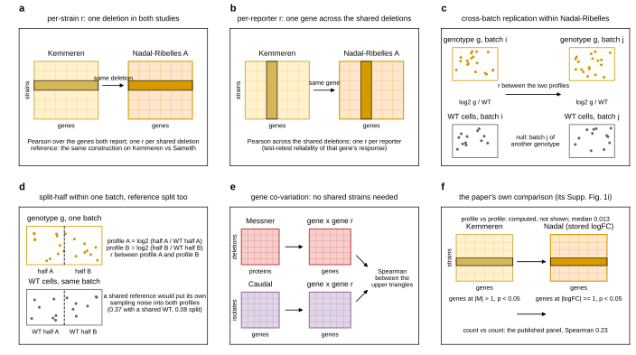

## 2026.09.12 - Schematic of every comparison design

Script: `experiments/028-knockout-expression/scripts/comparison_designs.py`. Drawn so the
document can say, for each number in the cross-study subsection, what is held fixed and
what one number is computed from: per-strain r, per-reporter r, cross-batch replication
(per-batch WT reference), split-half with the WT reference split, gene co-variation
(no shared strains, which is what admits Caudal), and the paper's own Supp. Fig. 1i
against the profile Spearman its script computes and does not show. Paired with the
comparisons table in the 019 expression document
(`notes-tex/019-simb-multimodal-expression/sections/2-readouts.tex`,
`tab:cross-study-comparisons`).

