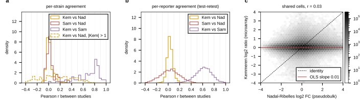

## 2026.09.11 - Do Kemmeren, Sameith and Nadal-Ribelles measure the same knockout response?

Script: `experiments/028-knockout-expression/scripts/cross_study_ko_expression.py`, reading
the three local LMDB builds (`microarray_kemmeren2014`, `sm_microarray_sameith2015`,
`nadal_ribelles_perturbseq2025`, control records only). Results in
`experiments/028-knockout-expression/results/cross_study_ko_expression.json`.

**Coverage.** Single deletions: Kemmeren 1,484, Sameith 82, Nadal-Ribelles control 3,039
ORFs from 3,091 records (51 ORFs have two replacement strains, averaged). Shared: Kemmeren
and Nadal 914, Sameith and Nadal 44, all three 44; union 3,609 deletions. Reporters after
sentinel removal: 5,416 shared by all three.

**The stored Nadal-Ribelles values carry a sentinel, not a fold change, in one cell of
five.** The loader stores scanpy `logfoldchanges` from a Wilcoxon `rank_genes_groups`
run; that statistic is log2((expm1(mean_group) + 1e-9) / (expm1(mean_rest) + 1e-9)), which
returns +-23 to +-33 whenever one group's mean is zero. Measured: 20.3% of all control
cells have |log2 FC| > 20, 22.6% of genes carry it in more than half of their records,
55.7% in more than a tenth. The overall log2 sd is 10.1 with them and 0.88 without; the
microarrays sit at 0.18 to 0.23. The script drops |log2 FC| >= 20 as absent. The paper
itself applied an independent filter at mean normalized counts of 1.27 before calling
DE (Methods), and its only comparison to Kemmeren is a count of genes with p < 0.05
over 837 shared genotypes, never a profile correlation.

**Agreement, after sentinel removal (all Pearson):**

| pair | shared deletions | per-strain r, median [IQR] | per-reporter r, median [IQR] | mean sqrt(r) ceiling | strong responders (|a| > 1): median r, sign agreement |
|---|--:|---|---|--:|---|
| Kemmeren vs Sameith | 82 | 0.744 [0.549, 0.827] | 0.620 [0.521, 0.710] | 0.775 | 0.604, 0.93 (n 65) |
| Kemmeren vs Nadal | 914 | 0.003 [-0.020, 0.032] | 0.030 [0.001, 0.063] | 0.163 | 0.104, 0.60 (n 368) |
| Sameith vs Nadal | 44 | 0.012 [-0.017, 0.054] | 0.034 [-0.082, 0.144] | 0.204 | 0.165, 0.62 (n 17) |

Kemmeren against Sameith reproduces the campaign's ceiling exactly (per-reporter 0.62,
sqrt 0.775, `expression_ceiling_replicate.py`), so the method is right. Against
Nadal-Ribelles the whole-profile agreement is zero at 914 shared deletions, and on the
reporters where Kemmeren's effect exceeds one log2 unit it is weak but real: median r
0.10, sign agreement 0.60 against 0.50 for chance and 0.93 for the microarray pair. The
mapping is correct: `bc_YAL012W` (cys3) carries MET14 +3.7, MET3 +3.7, MET6 +3.0, MUP1
+2.4 and CYS3 itself -1.1, the sulfur-pathway induction the deletion is known for. The
scale is not comparable either: the OLS slope of Kemmeren on Nadal is 0.006 (cell r
0.026), against 0.82 (r 0.70) for Kemmeren on Sameith.

**What this means for a pooled panel.** Not measured, stated as the two readings the
numbers admit: either the per-genotype pseudobulk is far noisier than a microarray
replicate (the paper reports many genotypes with tens of cells), or the Wilcoxon
`logfoldchanges` is the wrong statistic to store, or both. What separates them is a
fold change recomputed from the single-cell object (`seus_split.RData`, 43 GB, on
Zenodo, not in the raw mirror) as a pseudobulk mean log-normalized difference with a
pseudocount and the paper's mean-count filter, then this script again. Until then the
Nadal-Ribelles values cannot be pooled with the microarray panels as one target: they
share no scale and, on the deletions both measured, almost no ordering. What they can be
pooled with is a second environment of the same strains (the NaCl records), which is a
different question.

## 2026.09.11 - Nine-panel figure, and what the agreement tracks

The figure is now 3 x 3 (values / agreement / what agreement tracks), filled histograms
with black edges, Kemmeren vs Nadal-Ribelles as the pair of interest and Kemmeren vs
Sameith as the same-platform reference. Panel statistics are recorded under
`figure_stats` in the results JSON.

- **Scale (a-c).** Sentinel-free log2 sd: Kemmeren 0.23, Sameith 0.18, Nadal-Ribelles 0.89.
  The per-strain profile sd is bimodal for Nadal-Ribelles with a mode at 0.86 against 0.19
  and 0.15 for the microarrays, so the sentinel cut at |20| does not put the remaining
  values on the microarray scale; the scanpy ratio-of-means inflation is continuous in the
  gene's mean count, not a step at zero.
- **Agreement (d-f).** As in the previous section: per-strain median 0.003 (914), per-reporter
  0.030, slope 0.006, versus 0.744 / 0.620 / 0.82 for Kemmeren vs Sameith.
- **What it tracks (g-i).** Per-strain agreement rises with the strain's Kemmeren effect
  size (Spearman 0.37) and per-reporter agreement with the reporter's Kemmeren variance
  (0.29), and it does NOT track the number of cells behind the pseudobulk (Spearman 0.02;
  median 92 cells per genotype, range about 10 to 600). An undersampled pseudobulk would
  agree better where more cells were pooled; this one does not, which points at the stored
  statistic rather than at the sampling. Hypothesis until the recompute is measured.

The Seurat split object (`seus_split.RData`, 5.9 GB, md5 `65bb56ef...` per the Zenodo
record) and the paper's DE scripts (`DEGs_summary.R`, `DEG.Rdata`, `summary.genotypes_Rev.R`,
`Figures_Rev.R`) plus the Kemmeren table they used (`deleteome_all_mutants_controls.txt`)
are being added to the raw mirror `$DATA_ROOT/torchcell-raw/nadalRibelles2025/` for the
recompute; an R + Seurat 5.3.0 conda env (`r-seurat`) reads the object.

## 2026.09.12 - Legends off the histograms

Panels a, b (log density: headroom 3e3 and 30), c (1.7x), e (1.9x) and f (1.8x) have
headroom so the framed legends clear the histogram tops. Author feedback 2026.09.12.

## 2026.09.12 - Density map on the palette

Panel d's hexbin uses a white-to-orange colormap built from `PLOT_PALETTE[0]` instead
of Greys, so the figure carries palette colors only.
