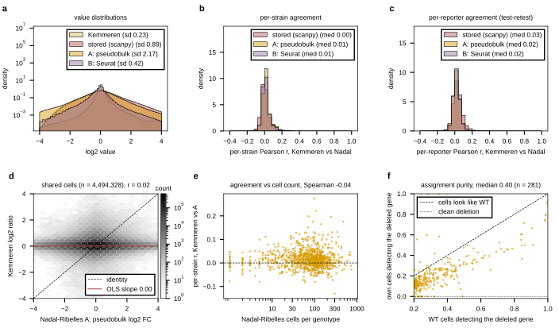

## 2026.09.11 - Recomputed fold changes do not recover agreement; the assignment does not allow it

Script: `experiments/028-knockout-expression/scripts/cross_study_recomputed.py`; results
`experiments/028-knockout-expression/results/cross_study_recomputed.json`. Scores the
stored values and the three recomputed statistics of
[[experiments.028-knockout-expression.scripts.nadal_pseudobulk_recompute]] against Kemmeren
with the measurements of [[experiments.028-knockout-expression.scripts.cross_study_ko_expression]].

| Nadal-Ribelles version | shared deletions | per-strain r, median | per-reporter r, median | strong responders r, sign agreement | slope of Kemmeren on it | sd |
|---|--:|--:|--:|---|--:|--:|
| stored (scanpy, sentinels removed) | 914 | 0.003 | 0.030 | 0.10, 0.60 | 0.006 | 0.88 |
| A pseudobulk CPM ratio | 1,002 | 0.013 | 0.019 | 0.06, 0.54 | 0.002 | 2.06 |
| B Seurat avg_log2FC | 1,002 | 0.008 | 0.020 | 0.03, 0.41 | 0.010 | 0.41 |
| C scanpy formula (check) | 1,002 | 0.011 | 0.012 | 0.00, 0.41 | 0.000 | 11.2 |

Per-strain agreement does not track cell count for any version (Spearman -0.04 to 0.02).
Gene names in the object are the paper's common names; 526 of 6,951 do not resolve to an
R64 ORF and are dropped; 110 ORFs have a replacement strain, averaged.

The statistic is therefore not the cause. The cause is the cell-to-genotype assignment:
about 40% of a genotype's cells are true deletion cells and the rest express the deleted
gene like WT ([[experiments.028-knockout-expression.scripts.nadal_assignment_purity]],
panel f). A pseudobulk that is 60% other genotypes carries a 0.4-weighted copy of the
true response on top of a near-WT background, which matches every observation: whole
profiles correlate at zero, strong effects survive at 0.06 to 0.10, the slope of Kemmeren
on the pseudobulk is near zero, and more cells do not help.

What would make the panel usable is a per-cell purity filter or a re-assignment from
the raw barcode reads, neither of which the released object supports (it carries only
the consensus label). As released, the Nadal-Ribelles control panel cannot be pooled with
the microarrays as a knockout-expression target; it remains a valid single-cell
heterogeneity resource (the dispersion scalar the loader carries), which is a different
target.

## 2026.09.12 - Panel a: Kemmeren filled, more headroom

Kemmeren is now a filled histogram in the palette yellow (it was a black outline that
read as white against the fills), the Nadal versions keep red / orange / purple as in
nadal_identify_deletion.py, and the log-density headroom is 3e6 so the legend sits two
decades above the tallest bin.

## 2026.09.12 - Density map on the palette

Panel d's hexbin uses a white-to-orange colormap built from `PLOT_PALETTE[0]` instead
of Greys, so the figure carries palette colors only.
