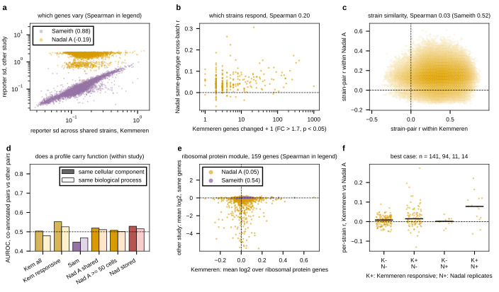

## 2026.09.12 - Agreement at levels a per-gene correlation misses

Script: `experiments/028-knockout-expression/scripts/cross_study_structure.py`. Six
tests on the 1,002 deletions shared by Kemmeren and Nadal A (pseudobulk), with Kemmeren
against Sameith (82 shared) as the same-platform reference. Results in
`experiments/028-knockout-expression/results/cross_study_structure.json`.

- **Which genes vary** (sd of a reporter across the shared strains): Kemmeren vs Sameith
  Spearman 0.88; Kemmeren vs Nadal A -0.19, and Nadal's per-gene sd tracks depth
  (Spearman -0.50 with WT CPM), partial on depth -0.07. Nadal's gene variability is
  sampling noise, not response.
- **Which strains respond**: Kemmeren's changed-gene count (FC > 1.7, p < 0.05, WT-variable
  genes excluded) against Nadal's same-genotype cross-batch r: Spearman 0.20 (n 260,
  p 0.001). Small and real: strains with a strong Kemmeren phenotype replicate slightly
  better across Nadal batches.
- **Strain similarity** (strain x strain correlation within each study, upper triangles
  compared): Kemmeren vs Sameith 0.52 with the top 1% Kemmeren pairs ranking at AUROC 0.73
  in Sameith; Kemmeren vs Nadal A 0.03, AUROC 0.50.
- **GO co-annotation within a study** (term size 5 to 100 genes genome-wide, is_a
  propagated; AUROC of pair correlation, co-annotated vs other pairs): Kemmeren
  responsive strains 0.55 (cellular component) and 0.53 (process), Kemmeren all strains
  0.50 / 0.48 (nonresponsive profiles are noise and dilute it); Nadal A 0.51 to 0.52,
  Nadal stored 0.53 (p 4e-10). A small function signal exists in Nadal, of the order of
  Kemmeren's with its nonresponders included.
- **Ribosomal protein module** (159 genes from cytosolic ribosomal subunit terms): mean
  log2 per strain, Kemmeren vs Sameith Spearman 0.54; Kemmeren vs Nadal A 0.05 (n.s.);
  Kemmeren RP vs the authors' own per-cell iESR score averaged per genotype -0.11
  (p 6e-4, the expected sign: RP down with ESR up), vs percRibo +0.09 (p 0.004). The
  slow-growth axis is faintly shared.
- **Best case**: per-strain Kemmeren-vs-Nadal r restricted to deletions Kemmeren calls
  responsive AND whose Nadal profile replicates across batches (r >= 0.10): n 14, median
  0.078, 1 of 14 above 0.2 (YHR077C nmd2 0.22, YGR122W 0.17). The other strata: 0.001 to
  0.014.
