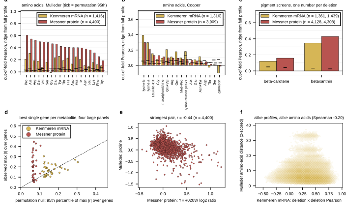

## 2026.09.16 - Does a deletion's expression or protein profile carry its metabolic phenotype?

Script: `experiments/028-knockout-expression/scripts/expression_metabolic_yko_correlation.py`. Results: `experiments/028-knockout-expression/results/expression_metabolic_yko_correlation.json`.

The knockout collection is the bridge. Kemmeren 2014 (mRNA, 1,484 deletions) and Messner 2023 (protein, 4,549 deletions after averaging duplicate ORFs) profile the same single-gene deletions that the metabolic screens score. Three reads on the deletions each pair shares: per metabolite, the strongest single gene against a strain-permutation null of the same maximum; per metabolite, out-of-fold Pearson of a ridge from the whole profile (5 folds, alpha by an inner split, 20 label permutations for the null); and a Mantel read, the Spearman between deletion x deletion profile similarity and deletion x deletion amino-acid distance (99 permutations). Amino acids are log2; Cachera's corrected fluorescence and Ozaydin's colony score are used as stored. Messner proteins measured in fewer than 95% of the shared deletions are dropped, the rest mean-imputed.

Figure: a, b, out-of-fold ridge Pearson per amino acid, mRNA in yellow, protein in red, black tick the permutation 95th percentile of the same statistic. c, the pigment screens. d, the strongest single gene per metabolite against the permutation null of that maximum, the four large panels. e, the strongest pair, prolyl-tRNA synthetase protein (YHR020W) against proline. f, deletion x deletion mRNA-profile Pearson against amino-acid distance over 1.0 million Kemmeren pairs.

**Both profiles carry the amino-acid phenotype, protein far more than mRNA.** Ridge out-of-fold Pearson on the 19 Mulleder amino acids: median 0.41 from the Messner proteome (4,400 shared deletions, 19 of 19 above the permutation 95th percentile of about 0.03 to 0.08), median 0.18 from Kemmeren mRNA (1,416 shared, 18 of 19 above). The best amino acids from protein are proline 0.61, alanine 0.55, arginine 0.52, glutamine 0.50; from mRNA alanine 0.31, tyrosine 0.26, methionine 0.25. Cooper 2010 repeats the pattern at lower strength (median 0.08 protein, 0.10 mRNA; lysine peaks 0.30 to 0.39). The pigment screens: betaxanthin 0.43 from protein and 0.35 from mRNA (null 0.03); the beta-carotene colony score 0.16 and 0.12 (null 0.04 to 0.05). Zelezniak 2018 and da Silveira 2014 share under 125 deletions with either source and read null (median ridge r about 0, in the JSON only).

**The single genes behind the strongest reads are pathway enzymes.** Proline from protein: YHR020W (prolyl-tRNA synthetase, r -0.44), ARO2 (-0.41), THR1 (-0.41). Alanine: ALT1 (alanine aminotransferase, +0.38), ILV2 (+0.34), SER1 (+0.33). Glutamine: KRS1 (-0.41), ARG7 (-0.39). Arginine: TSL1, LSP1, TPS2 (-0.29 each). From mRNA, alanine's top reporter is ALT2 (-0.22) and glutamate's top is a stress reporter set. Betaxanthin from protein: COX13 (-0.25), DLD1 (+0.22), ATP7 (-0.22), the respiratory signature already seen in the Cachera hits ([[cachera-betaxanthin-top-hits-are-respiratory]]).

**The best-single-gene statistic is fragile; the ridge and the FDR count are the numbers.** The permutation null of the maximum |r| over thousands of genes sits at 0.11 to 0.30 for Kemmeren and 0.06 to 0.10 for Messner (panel d), and several Kemmeren metabolites have hundreds of genes past BH-FDR 5% while their maximum sits below its null (methionine: 3,012 genes past FDR, max |r| 0.25 against null 0.30). Heavy-tailed metabolite values are the likely cause (hypothesis, untested); Spearman would be the fix if the univariate read is ever needed on its own.

**Structure read.** Alike transcriptomes go with alike amino-acid profiles: Mantel Spearman -0.196 over 1.0 million Kemmeren deletion pairs (null 95th percentile 0.033), and -0.150 on Cooper (282 deletions with every peak). From protein the same read is -0.046 on Mulleder (9.7 million pairs, null 0.003) and null on Cooper (+0.002). The proteome predicts individual amino acids better yet its whole-profile similarity tracks the amino-acid profile less; hypothesis (untested): most Messner deletions barely move the proteome, so pairwise profile Pearson among them is noise, while the ridge reads the few informative proteins.

**Caveat, unmeasured.** Mulleder 2016 and Messner 2023 are from the same laboratory on the same prototrophic knockout collection. Shared plate layout or batch structure could contribute to the protein-to-amino-acid read; the enzyme identities of the top proteins argue for biology, but a plate-aware permutation has not been run.

**What this says for the model.** The metabolic-module head would sit on exactly this information: an encoder that predicts the Messner proteome carries most of what a ridge needs for the amino-acid pools. Whether the encoder's hidden state carries it is not measured; the test is the same ridge from the v14 encoder's cell vector to the Mulleder amino acids on the same deletions.
