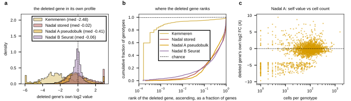

## 2026.09.11 - Can the deleted gene be read off its own profile?

Script: `experiments/028-knockout-expression/scripts/nadal_identify_deletion.py`; results
`experiments/028-knockout-expression/results/nadal_identify_deletion.json` and the
per-genotype table `nadal_identify_deletion_per_genotype.csv`.

A deletion removes its own transcript, so in a clean knockout profile the deleted gene is
the most reduced gene or close to it. This needs no second study and tests the gene
mapping and the cell-to-genotype assignment together. For every single-deletion genotype,
the deleted gene's own value and its ascending rank among all genes of the profile:

| profile | genotypes with the gene measured | own value, median | own value < -1 | rank 1 | bottom 10 | bottom 1% | median rank percentile |
|---|--:|--:|--:|--:|--:|--:|--:|
| Kemmeren 2014 | 1,479 / 1,484 | -2.48 | 85.5% | 59.5% | 89.4% | 93.4% | 0.0 |
| Nadal stored (scanpy, sentinels dropped) | 2,292 / 3,039 | -0.02 | 21.1% | 0.4% | 1.8% | 3.8% | 44.7 |
| Nadal A pseudobulk CPM ratio | 2,448 / 3,395 | -0.41 | 31.2% | 0.1% | 0.7% | 2.0% | 35.1 |
| Nadal B Seurat avg_log2FC | 3,207 / 3,395 | -0.06 | 4.0% | 0.8% | 3.6% | 8.2% | 47.1 |

In Kemmeren the deleted gene is the single most reduced gene in 60% of strains and in
the bottom 1% in 93%. In Nadal-Ribelles it is at rank 1 in under 1% of genotypes and in
the bottom 1% in 2 to 8%, with a median rank near the middle of the profile (35th to 47th
percentile; chance is 50). The deleted gene cannot be identified from a Nadal-Ribelles
profile, under any of the three statistics.

By cells per genotype (Nadal A): the bottom-1% rate is 2.0% at under 30 cells, 3.0% at
30 to 100, 1.3% at 100 to 300 and 0% above 300 (n 403 / 939 / 1,011 / 95). More cells do
not help; the strongly negative own values at low cell counts (median -4.2 under 30 cells)
are the pseudocount floor of a near-empty pseudobulk, not a detected deletion.

This is the same finding as the purity measurement
([[experiments.028-knockout-expression.scripts.nadal_assignment_purity]]) from the other
side: if the labeled cells were the genotype, the deleted gene would be at the bottom of
the profile as it is in every microarray strain; it sits in the middle, so most of the
labeled cells are not that genotype.

## 2026.09.12 - Legend moved off the curves

Panel b's legend sits at the lower left (bbox 0.10, 0.17), right of Kemmeren's jump to 0.6
at rank 1 and above the Nadal curves, which stay under 0.05 until rank fraction 0.01.
Author feedback 2026.09.11 and .12 (twice covering data); verified on the rendered PNG.
