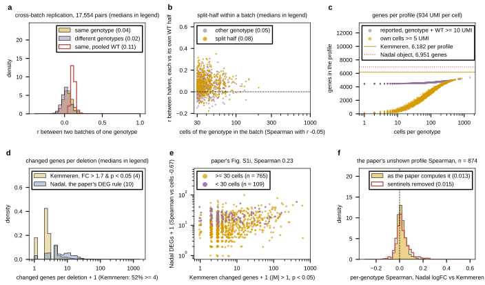

## 2026.09.12 - Replication, coverage and the paper's own comparison, drawn

Script: `experiments/028-knockout-expression/scripts/nadal_replication_coverage.py`, from
the tables of [[experiments.028-knockout-expression.scripts.nadal_batch_replication]] and
[[experiments.028-knockout-expression.scripts.nadal_paper_deleteome_comparison]]. Results
in `experiments/028-knockout-expression/results/nadal_replication_coverage.json`.

- a: same-genotype cross-batch r 0.043 vs 0.022 for different genotypes (17,554 pairs);
  with a pooled WT reference both 0.11 (the batch effect as a common component).
- b: split-half within a batch, WT split too: 0.080 vs 0.051 null (786 genotype-batches).
- c: coverage. A genotype's own cells put >= 5 UMI on a median 2,826 of 6,951 genes
  (120 under 10 cells, 942 at 10 to 30, 2,558 at 30 to 100, 3,785 at 100 to 300, 4,810
  above 300); the recompute reports 4,601 because the 500 WT cells satisfy the
  summed-UMI rule alone. Kemmeren: 6,182 reporters in every profile. Per cell: median
  934 UMI, 492 genes.
- d: Kemmeren responsive 52% (>= 4 genes at FC > 1.7, p < 0.05, WT-variable excluded),
  median 4 changed genes; Nadal's paper DEG count median 10, Spearman -0.67 with cells
  (a sentinel artifact).
- e: the paper's Supplementary Fig. 1i, Spearman 0.23 over 874 (0.26 with cells
  partialled out).
- f: the profile Spearman the paper computed and did not show: median 0.013.
