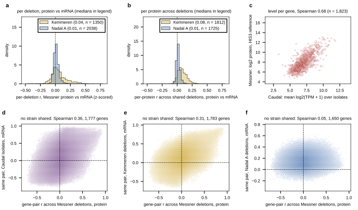

## 2026.09.12 - Messner proteome against three expression panels

Script: `experiments/028-knockout-expression/scripts/proteome_expression_covariation.py`.
Asked whether the Messner 2023 knockout proteome (4,549 deletion ORFs x 1,830 proteins,
log2 over the 388-replicate HIS3 reference) agrees with expression, and with which panel.
The earlier EDA
([[experiments.019-simb-multimodal.proteome-expression-eda]]) did Kemmeren from the
served graph; this reruns it from the LMDBs and adds Nadal A and Caudal. Results in
`experiments/028-knockout-expression/results/proteome_expression_covariation.json`.

Strain-aligned (the same deletion in both, z-scored per gene across strains):

| pair | shared strains | per-deletion r (median, IQR) | per-protein r across deletions (median) | proteins with r > 0.3 |
|---|---|---|---|---|
| Messner vs Kemmeren | 1,350 | 0.036 (-0.02 to 0.12) | 0.075 | 1.4% |
| Messner vs Nadal A | 2,038 | 0.011 (-0.01 to 0.04) | 0.012 | 0% |

The Kemmeren numbers reproduce the July EDA (0.04 / 0.08). Nadal is a third of that.

Gene-aligned (gene x gene co-variation across the strains of one panel, 1,650 to 1,799
Messner proteins, Spearman between the two matrices' upper triangles; Caudal is natural
isolates, so this is the only comparison it admits):

| pair | Spearman | median r in B for the top 1% pairs of A, vs the rest |
|---|---|---|
| Messner vs Caudal | 0.36 | 0.48 vs 0.07 |
| Messner vs Kemmeren | 0.31 | 0.38 vs 0.13 |
| Kemmeren vs Caudal | 0.48 | 0.61 vs 0.07 |
| Messner vs Nadal A | 0.05 | 0.15 vs 0.13 |
| Kemmeren vs Nadal A | 0.11 | 0.15 vs 0.13 |
| Caudal vs Nadal A | 0.08 | 0.22 vs 0.13 |

Abundance level per gene (HIS3 protein vs Caudal mean log2 TPM): Spearman 0.68 over 1,823
genes, the usual mRNA-protein level agreement.

Reading: three independent panels (protein across deletions, mRNA across deletions, mRNA
across natural isolates) agree pairwise on which genes co-vary, at 0.31 to 0.48, across
platform, perturbation type and medium (SM for Messner, SC for Kemmeren). Nadal A agrees with
none of them (0.05 to 0.11), and its strain-level agreement with the proteome is a third
of Kemmeren's already-weak 0.04. "Caudal" was read as the Caudal 2024 pan-transcriptome
(the user's dictation); if Nadal was meant, the strain-aligned row covers it.
