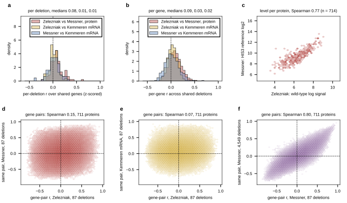

## 2026.09.13 - A second knockout proteome against Messner and against Kemmeren

Zelezniak 2018 (Ralser lab, SWATH, SM medium, 726 proteins, 97 kinase deletions, three
replicates against a 12-replicate wild type; stored values are the SVA-adjusted log
signal). Messner 2023 (same lab, one measurement per strain over the HIS3 reference)
covers 89 of the 97, Kemmeren 94, all three 87. Values are log ratios over each study's
own wild type, z-scored per gene across the shared strains.

| comparison | shared deletions | per deletion, median r | per gene, median r |
|---|---|---|---|
| Zelezniak vs Messner, protein vs protein | 89 | 0.08 | 0.09 (7% above 0.3) |
| Zelezniak protein vs Kemmeren mRNA | 94 | 0.01 | 0.03 |
| Messner protein vs Kemmeren mRNA, same 87 | 87 | 0.01 | 0.02 |

Gene co-variation on the 711 shared proteins across the 87 strains: Zelezniak vs Messner
0.15, Zelezniak vs Kemmeren 0.07, Messner vs Kemmeren 0.22; Messner's own 87-strain matrix
against its full 4,549-strain matrix 0.80, so 87 strains do reproduce a panel's own
structure, and the 0.15 is between-study disagreement, not strain count. Abundance level
(the two wild types) Spearman 0.77 over 714 proteins.

Reading: the two proteomes agree on how much each protein is made (0.77) and barely on
what a kinase deletion does to it (0.08 per deletion). Hypothesis, untested: Zelezniak's
SVA adjustment removed variation shared with Messner, or most kinase deletions move the
proteome too little for either study to measure the same small change; the right tail of
a (deletions at r 0.3 to 0.65) would be the responsive ones. Either way a knockout
proteome has not been shown to replicate itself here any better than the transcriptome
replicates across platforms (Kemmeren vs Sameith, same lab and platform, is 0.74).

Results: `experiments/028-knockout-expression/results/proteome_replication_zelezniak.json`.
Related: [[experiments.028-knockout-expression.scripts.proteome_expression_covariation]],
[[experiments.028-knockout-expression.scripts.gene_covariation_all]].

## 2026.09.13 - Method differences between the two proteomes (verbatim reread)

Both papers reread from the mirror (`messnerProteomicLandscapeGenomewide2023/paper.md`,
`zelezniakMachineLearningPredicts2018/paper.md`; the 2018 SI is not mirrored). Same parent
library (Euroscarf MATa + pHLUM prototrophy, Mülleder 2012), independent stocks, no
cross-check stated in either paper; neither paper compares itself to the other.

| | Zelezniak 2018 | Messner 2023 |
|---|---|---|
| culture | 10 ml overnight, 30 ml main culture from OD600 0.2 | 200 µl 96-well 19.75 h, then 160 µl into 1,440 µl deep-well + glass bead, 1,000 rpm, 8 h |
| harvest | per strain "at an OD600 1.5 +/- 0.1, before the cultures enter the diauxic shift", cold methanol quench | fixed 8 h after 1/10 dilution, no OD stated; 748 of 4,678 strains are slow growers (< 0.8) |
| replicates | 3 biological; ~12 WT; QC every 8-12 injections over 4 months | 1 ("Strains were not measured in replicates"); 388 WT + 389 QC over 57 plates, 2 instruments, 12 months |
| reference | parental pHLUM wild type | his3Δ::kanMX complemented by heterologous HIS3 |
| MS | SWATH, TripleTOF 5600, Spectronaut 8, fractionated library; 726 proteins released | variable-window DIA, TripleTOF 6600, 19-min gradient, DIA-NN 1.7.12; 1,850 proteins after filtering |
| batch correction | SVA, one surrogate variable at the peptide level, 50% least-variable peptides as controls | plate-median scalar only |
| roll-up | geometric mean of correlation-selected peptide groups | MaxLFQ |
| growth confound | "less than 10% of the total proteome changes in our kinase knockout strains could be explained by changes in growth rate" | random forest on the proteome predicts growth R^2 0.68; slow growers have broad profiles |
| own reproducibility | median protein CV 19%; vs microarrays of the same kinase KOs, median per-strain r 0.12 | CV 8.1% QC, 11.3% WT, 16.2% KO; 29 KOs re-made in the SGA background: per-deletion Spearman -0.19 to 0.72 |
| strain QC | 10 KOs validated by mating | 91% of 960 testable KOs lack the product; 44 still express it; 92 aneuploid strains (dbf2 = chr VIII gain, a kinase in the 2018 set) |

Ranked hypotheses (untested): single-replicate noise at 16% CV; clock-timed vs OD-timed
harvest on the growth axis; SVA removing genotype-correlated structure; stock drift (too
few strains to move a median); pipelines and reference (mostly a strain-independent
offset); medium (both SM, 2% glucose, no supplements) least. Messner's own 29-strain
cross-background replicate already shows per-strain agreement is weak within the lab.
