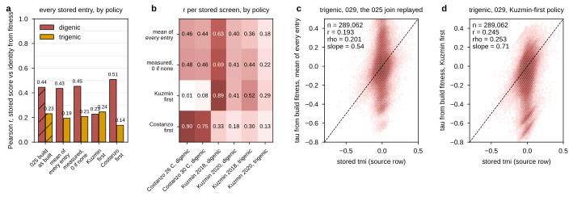

## 2026.09.19 - The identity under label policies on build 001

`closure_recompute.py` (stages `scan`, `analyze`) reads the 029 processed LMDB directly: the
triples (299,146 gene sets, 309,122 entries), every double whose pair lies inside a triple
(586,431 of 8,993,101, found by a byte regex on the gene names before the JSON is parsed), and
the 5,665 singles. With no merge stage a record carries every source entry, so `entries.parquet`
is a long table (one row per entry: dataset, temperature, marker, value, sd, n, p) and the
identity is scored under four label policies (mean of every entry, measured entries with the
converted 0 only when nothing else exists, Kuzmin first, Costanzo first) against every stored
interaction entry, overall and per stored screen. `closure_plots.py` writes the figure and the
two tables of section 7 of `notes-tex/025-s3-closure`. Scan 22 min on 48 processes (reads about
500 GB from /db), analyze about 2 min.

| policy | digenic r (all entries) | trigenic r (all) | trigenic r, Kuzmin 2018 | Costanzo 30 C digenic r |
|---|---|---|---|---|
| 025 build as built | 0.445 | 0.230 | | |
| mean of every entry | 0.435 | 0.193 | 0.362 | 0.440 |
| measured, 0 only if none | 0.453 | 0.207 | 0.441 | 0.465 |
| Kuzmin first | 0.227 | 0.245 | 0.517 | 0.076 |
| Costanzo first | 0.508 | 0.137 | 0.302 | 0.754 |

Each screen's stored score is reproduced by its own fitness and by little else; Kuzmin 2020 stays
at 0.41 digenic / 0.29 trigenic under every policy (scored with a unit query fitness, H5). The
pinned 010 val/test triples survive at 29,842 / 29,641 of 37,673 (79 percent). Results in
`experiments/029-solid-growth-ko/results/closure_recompute_summary.json`,
`closure_policy_stats.csv`, `pinned_triple_survival.json`.

