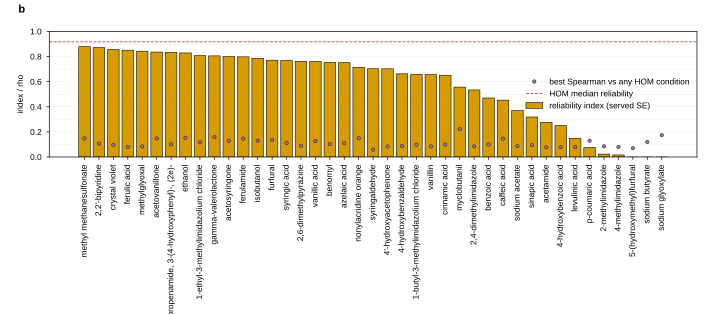
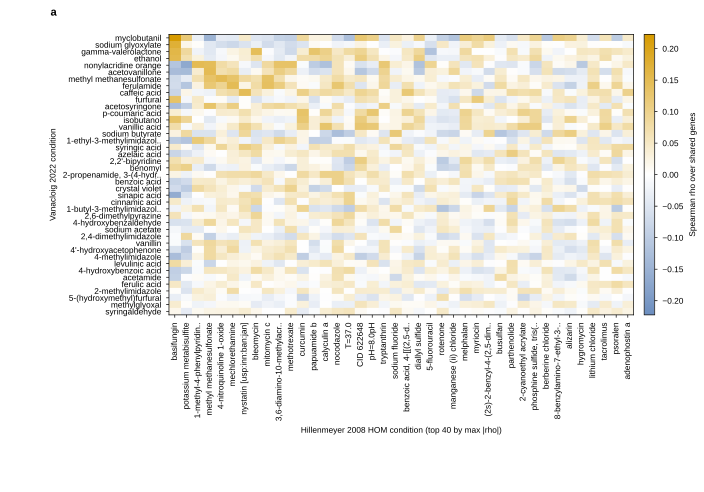
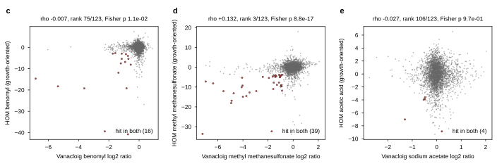

## 2026.09.25 - Vanacloig 2022 and Hillenmeyer 2008 as a training pair for inhibitor tolerance

**Why these two.** Vanacloig-Pedros 2022 is the one genome-wide screen in the graph that
doses the industrial inhibitor panel (furfural, 5-HMF, the phenolic aldehydes and acids,
levulinic acid, ionic liquids, ethanol, isobutanol) at a matched IC30. Isobutanol is dosed
nowhere else as a stress, so this dataset is the only tolerance signal the isobutanol
metabolism work can train on. Hillenmeyer 2008 is the only other genome-wide environment
response compendium of comparable size, and its homozygous (HOM) arm is the same
perturbation class, a KanMX deletion. The question for a joint model is what Hillenmeyer
can add to Vanacloig, and along which axes the two disagree so that an environment
encoding has to carry them.

Everything below is measured on the DEV-tree LMDB builds through the loaders, so every
number is a served record, not a raw-matrix value. Three scripts:
[[experiments.031-env-chemgen-inhibitor-tolerance.scripts.flatten_records]] flattens the
stores to parquet,
[[experiments.031-env-chemgen-inhibitor-tolerance.scripts.dataset_axes_comparison]]
writes the axis table and the overlaps, and
[[experiments.031-env-chemgen-inhibitor-tolerance.scripts.cross_dataset_similarity]]
measures the shared response structure. Result files are under
`experiments/031-env-chemgen-inhibitor-tolerance/results/`; the full axis table is
`axes_table.md` and the overlaps are `overlap.md`.

### Size and the cell axis

| axis | Vanacloig 2022 | Hillenmeyer 2008 HOM | Hillenmeyer 2008 HET |
|---|---|---|---|
| records | 143,218 | 1,088,620 | 2,698,797 |
| distinct queried genes | 3,598 | 4,675 | 5,825 |
| genes per genotype | 4 | 1 | 1 |
| constant background | pdr1 (YGL013C), pdr3 (YBL005W), snq2 (YDR011W) | none | none |
| perturbation type | barcoded KanMX deletion + 2 marker deletions + NatMX deletion | KanMX deletion | engineered copy number 2 to 1 |
| reference strain | S288C | homozygous diploid deletion collection (Giaever 2002) | heterozygous diploid deletion collection (Giaever 2002) |
| ploidy | haploid | diploid | diploid |

The Vanacloig genotype is never a single deletion. Every strain is the queried deletion
on top of the pdr1 pdr3 snq2 drug-sensitized host, which the loader stores as three
constant background perturbations, so the served record is a quadruple mutant. A model
that reads the genotype as a gene set sees four genes per Vanacloig strain and one per
Hillenmeyer strain, and the three background genes are absent from the queried set (the
strains carrying them were built on that background, so they are not screened). The
cell representation therefore differs on ploidy, on the background, and on the
perturbation class all at once, before any environment is considered.

### The environment axis

| axis | Vanacloig 2022 | Hillenmeyer 2008 HOM | Hillenmeyer 2008 HET |
|---|---|---|---|
| medium | SynBase (SynH3- minus acetamide, sodium acetate, cellobiose; MSG for ammonium sulfate) | YPD 86%; SC and 13 SC dropouts 8%; SD 5%; YP glycerol 1% | YPD 99%; SD 1%; YP glycerol 0.4% |
| synthetic medium | yes | 13% of records | 1% of records |
| state | liquid | liquid | liquid |
| pH | 5.0 (HCl), on every record | 7.5 or 8.0 on 2% of records, otherwise unstated | unstated |
| temperature | 30 C on every record | unstated on 98% (a typed provenance gap); 23, 25, 37 C arms | unstated on 99%; 20, 23, 37 C arms |
| aerobicity | anaerobic | aerobic | aerobic |
| duration | 48 h, 6.5 generations | 5 to 20 generations, 60% at 20 | 5 to 20 generations, 93% at 20 |
| distinct compounds (InChIKey) | 41 | 116 | 302 |
| distinct environments (compound, dose, physical, T, duration, screen) | 41 | 257 | 474 |
| small molecules per record | always 1 | 0 on 18%, 2 on 1% | 0 on 2%, 2 on 5% |
| dose basis | IC30 (39 compounds); fixed for benomyl and MMS | numeric dose on 98% | numeric dose on 98% |
| screens | none (one pool, four batches paired to their own controls) | 13 control sets | 10 control sets |

Two axes are constant within each dataset and different between them: Vanacloig is
anaerobic in a defined synthetic hydrolysate mimic at pH 5, Hillenmeyer is aerobic in
YPD. Neither varies inside its own dataset, so nothing in a joint model can learn the
effect of oxygen or of the base medium from these two alone; they are dataset identity in
disguise. Temperature is a typed provenance gap on 98% of Hillenmeyer records. Duration
is in generations on both sides but on different scales (6.5 vs mostly 20).

Dose is the third asymmetry. Vanacloig records an IC30 basis with no molar value for 39
of its 41 compounds, while Hillenmeyer records a numeric dose on 98% of records, so a
dose feature is a different kind of number in the two sources.

### The readout axis

| axis | Vanacloig 2022 | Hillenmeyer 2008 HOM | Hillenmeyer 2008 HET |
|---|---|---|---|
| measurement type | log2 ratio | z-score | log2 ratio |
| assay type | pooled competitive growth, barcode | same | same |
| sign | negative = defect | positive = defect | positive = defect |
| n_samples | 3 on every record | 1 on 65%, 2 on 24%, 3 to 5 on 10% | 1 on 76%, 2 on 17% |
| uncertainty | sample SD on every record | sample SD on 35% | sample SD on 24% |
| response median [5th, 95th pct] | -0.045 [-1.115, 0.535] | 0.013 [-2.312, 3.826] | 0.035 [-0.453, 0.759] |
| SE median | 0.138 | 0.344 | 0.096 |

The two Hillenmeyer arms carry different statistics (a log2 ratio for HET, a z-score for
HOM) and the sign convention is opposite to Vanacloig's, so the label must be per
dataset, or reduced to a sign or a rank, before anything is pooled.

### Overlap

| what | pair | shared |
|---|---|---|
| queried genes | Vanacloig and HOM | 3,550 of 3,598 Vanacloig genes (Jaccard 0.75) |
| queried genes | Vanacloig and HET | 3,577 of 3,598 (Jaccard 0.61) |
| queried genes | all three | 3,533 |
| compounds (InChIKey) | Vanacloig and HOM | 2: benomyl, methyl methanesulfonate |
| compounds (InChIKey) | Vanacloig and HET | 2: benomyl, ferulic acid |
| compounds (InChIKey) | HOM and HET | 99 |

Genes overlap almost completely and compounds almost not at all. Sodium acetate
(Vanacloig) and acetic acid (Hillenmeyer) are different compound entities in the graph
and do not join; the same holds for sodium butyrate against any butyric acid record
elsewhere. Benomyl is dosed at 10 ug/mL on both sides. Hillenmeyer's ferulic acid is
3.95 uM in the HET arm only; Vanacloig's is at IC30.

### Reliability of each dataset with itself

`reliability = 1 - mean(SE^2) / var(response)` per condition, over genes, using the
served SE. It is the share of across-gene variance that replicate noise cannot explain,
and the ceiling for any correlation with another dataset.

| dataset | conditions with a served SE | median | 25th pct | conditions below 0.1 |
|---|---|---|---|---|
| Vanacloig 2022 | 41 | 0.703 | 0.370 | sodium glyoxylate, sodium butyrate, 5-HMF, 4-methylimidazole, 2-methylimidazole, p-coumaric acid |
| Hillenmeyer HOM | 45 | 0.917 | 0.774 | levodopa |
| Hillenmeyer HET | 61 | 0.844 | 0.659 | 3,5-dinitrobenzamide, rotenone, hexestrol |

Six Vanacloig compounds carry no measurable across-gene signal at this dose, and 5-HMF
is one of them (index -0.054, so the replicate noise exceeds the spread between genes).
The compounds that matter for the isobutanol work are well measured: isobutanol 0.786,
ethanol 0.828, furfural 0.771, ferulic acid 0.850, methyl methanesulfonate 0.879.
Vanillin is 0.656 and sodium acetate 0.370.

Panel b. Reliability index per Vanacloig condition (bars) against the best Spearman that
condition reaches with any HOM condition (markers) and the HOM median (dashed).
Generated by `experiments/031-env-chemgen-inhibitor-tolerance/scripts/cross_dataset_similarity.py`.

### What Hillenmeyer shares with Vanacloig

Both matrices are oriented so that negative is a defect, Hillenmeyer's doses and
generation counts are averaged within a compound, and every Vanacloig condition is
correlated with every partner condition over the shared genes.

| statistic | HOM (123 conditions) | HET (307 conditions) |
|---|---|---|
| cross Spearman, median | 0.011 | 0.003 |
| cross Spearman, 95th percentile | 0.076 | 0.052 |
| cross Spearman, maximum | 0.222 (myclobutanil vs basifungin) | 0.183 (myclobutanil vs tris(4-methylphenyl)phosphine sulfide) |
| per-gene mean response across conditions, Spearman | 0.138 (n = 3,550) | 0.036 (n = 3,577) |
| gene-gene similarity agreement (Mantel Spearman) | 0.056, null -0.001 +/- 0.008 (1,351 genes) | 0.024, null -0.001 +/- 0.007 (1,422 genes) |

The shared structure is real (the Mantel statistic is seven null standard deviations
out for HOM) and small. HOM carries about four times the shared structure that HET
does on every statistic, which is the expected direction: HOM is the same perturbation
class as Vanacloig, HET is a dosage halving that includes essential genes.

Panel a. Spearman between each Vanacloig condition (rows) and the 40 HOM conditions with
the largest absolute correlation to any row (columns), over the 3,550 shared genes.
Generated by `experiments/031-env-chemgen-inhibitor-tolerance/scripts/cross_dataset_similarity.py`.

**The shared compounds behave differently from one another.** Hit = the bottom 5% of
genes in a condition (172 genes); 8.6 are expected to overlap by chance.

| Vanacloig vs partner | rho | rank of the true match | hit overlap | Fisher p |
|---|---|---|---|---|
| MMS vs MMS (HOM) | 0.132 | 3 of 123 | 39 | 8.8e-17 |
| benomyl vs benomyl (HOM) | -0.007 | 75 of 123 | 16 | 0.011 |
| sodium acetate vs acetic acid (HOM) | -0.027 | 106 of 123 | 4 | 0.97 |
| benomyl vs benomyl (HET) | 0.024 | 30 of 307 | 5 | 0.94 |
| ferulic acid vs ferulic acid (HET) | 0.005 | 109 of 307 | 8 | 0.63 |

MMS transfers: its HOM match ranks third of 123, and its best match, 4-nitroquinoline
1-oxide, is another DNA-damaging agent. Benomyl transfers at the hit level only, and not
at all into HET. The acetate salt against the free acid does not transfer, and neither
does ferulic acid at 3.95 uM against ferulic acid at IC30. Hypothesis (untested): the
acetate result is the dose form, a salt at pH 5 in SynBase against the free acid in YPD,
and the ferulic acid result is the dose, 3.95 uM being far below an IC30.

Panels c to e. Shared-gene responses for the three HOM pairs, bottom-5% hits in both
datasets in red. Generated by
`experiments/031-env-chemgen-inhibitor-tolerance/scripts/cross_dataset_similarity.py`.

**The best matches group by chemistry even without a shared compound.** In HOM, ethanol,
isobutanol, furfural, gamma-valerolactone, sodium glyoxylate and myclobutanil all match
basifungin best, with myriocin second for furfural and glyoxylate. Acetovanillone,
acetosyringone and the phenolic amides match MMS and mechlorethamine best. Hypothesis
(untested): the solvent-like inhibitors share a membrane or sphingolipid stress profile
and the aldehyde and ketone phenolics share a DNA-damage profile. The full ranking is in
`top_matches_hom.csv` and `top_matches_het.csv`.

### What this means for the model

- **HOM is the partner, not HET.** It is the same perturbation class, it shares 3,550 of
  Vanacloig's 3,598 genes, and it carries four times HET's shared structure. HET adds
  essential genes Vanacloig cannot query, which is a different use.
- **What HOM can contribute is a gene-level prior.** The per-gene mean response
  correlates at 0.138 and the gene-gene co-response structure agrees above the null, so
  which genes are generally sensitive and which genes move together is partly shared.
  Compound-matched transfer is available for exactly one compound, MMS.
- **The two datasets are separated by constant axes** (oxygen, base medium, pH, ploidy,
  the pdr1 pdr3 snq2 background, the dose basis, the statistic). An environment encoding
  that carries medium composition, aerobicity, temperature, duration and the dosed
  compound will represent those differences, but with no within-dataset variation on
  oxygen or medium the model cannot learn their effect; it can only learn a dataset
  offset. That is fine for prediction within Vanacloig and is the honest scope.
- **Evaluate within Vanacloig, held out by compound**, so the score isolates the model
  from the modality and medium changes. Report the reliability index alongside every
  per-compound score, because six compounds have none to predict and 5-HMF is one of
  them. For the isobutanol target the ceiling is 0.786.
- **Lian 2019** stays the external check for furfural only, restricted to round 1 CRISPRd
  (about 21,000 guide records over about 5,200 genes before the ORF drop), because the
  a and i modes have no deletion analog and rounds 2 and 3 carry integrated backgrounds.
  Furfural's reliability in Vanacloig is 0.771, so there is signal to transfer.

### Next

1. A training config under `experiments/031-env-chemgen-inhibitor-tolerance/conf/` that
   queries Vanacloig alone, then Vanacloig plus HOM, with the compound-held-out split and
   the per-compound reliability reported next to every score.
2. Environment encoding in two stages as planned: one dosed compound per record first,
   then the medium components and dropouts as the same compound entities, so SynBase and
   YPD enter as sets of molecules rather than as names.
3. The metabolism arm is a later ablation on the same split: add it and check that the
   held-out compound score does not fall.
