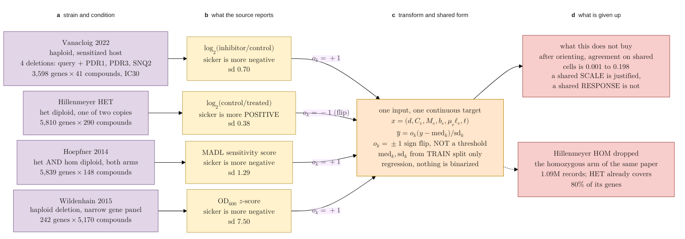

## 2026.09.27 - One row per dataset: what it measures, what it reports, how it joins

Four rows, one per kept dataset, read left to right through four labeled layers. The layers
carry the color, so the caption can refer to them by letter instead of by hue:

| layer | color | what it holds |
|---|---|---|
| **a** | purple | the STRAIN and the CONDITION, which is what the record is |
| **b** | yellow | what the SOURCE REPORTS, its own readout in its own units and sign |
| **c** | orange | the TRANSFORM applied to reach the shared target, and the shared form itself |
| **d** | red | what is given up, and what the shared form does not buy |

The layer letters are bold lowercase in plain HTML rather than KaTeX, because KaTeX renders
`\textbf` in its own math font and the repo standard asks for bold Arial, matching the
matplotlib panel letters.

The flow is a to b to c: a record is a strain in a condition, the source reports it on its own
scale, and two per-source scalars map that onto a common target. d hangs off c and is
commentary, not a step.

**The orientation factor `o_k` is a sign flip on a continuous number.** It is NOT a threshold
and NOT a class label. Three sources already store a sick strain as negative and take
`o_k = +1`; the two Hillenmeyer arms store it as positive and take `o_k = -1`. After the flip,
a more negative value means a sicker strain in every dataset. Nothing is binarized anywhere in
this diagram or in the pipeline it describes; the task is regression on a real number.

**MADL** is the median absolute deviation logarithmic score, Hoepfner's per-experiment
readout: a strain's log abundance ratio minus the median over all strains in the sample,
divided by that set's median absolute deviation.

**HOM is the homozygous arm of Hillenmeyer 2008**, its homozygous-diploid deletion collection,
released as its own file with its own readout. It is dropped; its heterozygous sibling HET is
kept and already covers 80 percent of its genes.

Per-dataset numbers are in the companion table (t11 of
`notes-tex/031-unified-representation`). Keeping counts out of the boxes is what lets the
diagram render at a readable size across the text block.

Mermaid escapes a literal `<` into `&lt;` before KaTeX sees it, which prints as `lt;`. The
comparisons below are written `\lt` and `\gt` for that reason.

Render with
`bash notes/assets/publish/scripts/mermaid_pdf.sh notes/experiments.031-env-chemgen-inhibitor-tolerance.mermaid.dataset-unification.md`.

**What the diagram asserts, and the evidence.**

- The four rows map onto ONE input tuple and ONE continuous target with no per-source input
  branch. The only per-source objects are a sign, a scale and a token.
- The sign is not a convenience. As served, Hillenmeyer HET and Hoepfner correlate at -0.118
  over 170,837 shared (gene, compound) cells, and Hillenmeyer HOM and Hoepfner at -0.198 over
  100,276. Pooling without orienting trains on contradictory labels at that scale.
- Standardizing uses the TRAIN split's statistics per source, never the full dataset, so no
  held-out value informs the scale.
- Layer D is the honest limit. After orienting, the best cross-dataset agreement on shared
  cells is 0.198 and the median is 0.068, so these datasets agree about a gene's general
  fragility far more than about its response to a particular compound. That is why the
  expected gain is a gene prior and a wider compound space rather than more labels.

**A note on how this file was nearly lost.** `dendron-cli note write` on an EXISTING note
replaces it with a bare frontmatter stub. It is for new notes only; an existing note is edited
in place.
